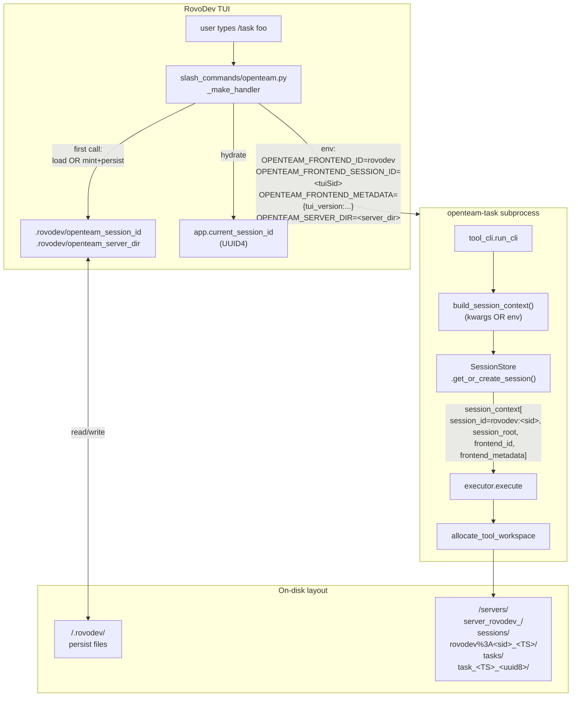

# Unified Frontend Session Protocol — INTEGRATED v2

**File:** `openteam-unified-frontend-session-INTEGRATED-v2.md`
**Status:** v2 — integration of three reviewer plans, ready for review
**Date:** 2026-05-17 (post-Round-9 audit pattern)
**Supersedes (integrates):**
- `.claude/plans/eager-roaming-clock.md` (Plan A, 122 LOC — minimal proposal)
- `.cursor/plans/unified-frontend-session_2eab10b8.plan.md` (Plan B, 495 LOC — per-workspace persistence model)
- `_dev/_plan/openteam_rovodev_integration/openteam-unified-frontend-session-protocol-v1.md` (Plan C, 549 LOC — full protocol)

**Effort:** ~12 hours focused work for ship-ready v1 (phases 0–8).

---

## 0. TL;DR

The user proposed: each RovoDev TUI session should map to a dedicated OpenTeam server-side session via a frontend-prefixed external session ID (e.g. `rovodev-<id>`). My investigation across three independent plans verified the gap is real and the proposal is sound.

This integrated v2 plan takes the **best of all three**:

| Element | Source | Why |
|---|---|---|
| **Protocol fields** (`frontend_id` + `frontend_session_id` + `frontend_metadata`) | Plan C | Provenance/audit; pluggable for N frontends |
| **Colon delimiter** (`rovodev:<id>` not `rovodev-<id>`) | Plan C | RovoDev session ids are UUID4 (contain hyphens); first-hyphen-wins parse is fragile |
| **Adapter pattern** (TUI sends only its own id; OpenTeam adapter sets `frontend_id="rovodev"`) | Plan C | Minimises RovoDev-side change; new frontends are 1-line additions on OpenTeam side |
| **MCP + slash + WS coverage** | Plan C | All three invocation paths into OpenTeam, not just one |
| **Windows colon-escaping** (`:` → `%3A` at on-disk leaf only) | Plan C | Cross-platform without breaking the in-memory id |
| **Per-workspace TUI session persistence** (`<workspace>/.rovodev/openteam_session_id`) | Plan B | Restart TUI in same workspace → same OpenTeam session → conversation continuity |
| **Per-workspace synthetic server dir** (`server_rovodev_<wsuuid>/`) | Plan B | Isolation prevents `sessions_index.json` write races across TUI workspaces |
| **Prefix whitelist** (`{rovodev, ui, mcp, slack, session}`) | Plan B + new | Security-via-reduction; rejects `frontend_id=../etc/passwd` at the boundary |
| **`--new-session` CLI flag** | Plan B | Explicit opt-out for "I want a fresh session" |
| **CI preflight: whitelist immutability** | Plan B | Documents intentional vs accidental expansion |
| **Clean backward-compat table** | Plan A | Reader can see "is my path affected?" at a glance |
| **Server-dir resolution rule per entry point** | NEW (gap all three missed) | Concrete spec for MCP standalone, TUI subprocess, WS — eliminates Plan C's handwave |

**Net delta:** ~280 LOC across 8 files + ~20 tests + 1 CI preflight + docs.

---

## 1. The gap (verified)

### 1.1 Today's three code paths

| Path | session_context shape | Workspace location |
|---|---|---|
| **React UI → WS** (`manager_websocket_routes.py:213-217`) | `{interactive, task_id, session_id, session_root}` | Under session ✅ (`<server>/sessions/<sid>/tasks/`) |
| **RovoDev TUI → subprocess** (`tool_cli.py:114`) | **`{}` (literally empty)** | Standalone `<runtime>/tasks/<tool>/` ❌ |
| **MCP server → in-process** (`mcp_server/context.py:17-23`) | `{"task_id": "mcp-<uuid8>", "interactive": None}` (no session_id) | Standalone `<runtime>/tasks/<tool>/` ❌ |

### 1.2 What you cannot do today (concrete losses)

1. **Conversation/session continuity across RovoDev tool calls.** Two consecutive `/task` in the same TUI session land in two unrelated orphan workspaces.
2. **Nested workspace allocation.** The workspace-allocation v5.3 plan ships Path B (`<session>/tasks/<tool>_*/`) — but only the WS path feeds it `session_root`.
3. **UI visibility of RovoDev runs.** Open the React UI: you cannot see RovoDev-launched tasks. They're invisible to the same backend.
4. **Session export / archive.** UI sessions can be tarred via `_runtime/.../sessions/<sid>/`. RovoDev outputs are scattered and not included.
5. **Multi-frontend pluggability.** When Frontend #3 arrives (VS Code, Slack, etc.) it must reinvent its own backend-binding.

### 1.3 Evidence (file:line — all three plans verified)

| Claim | Source |
|---|---|
| UI uses `session-<unix>-<hex6>` minted server-side | `src/openteam/server/services/session_store.py:168` |
| WS captures `sid` at init handshake | `src/openteam/server/routes/manager_websocket_routes.py:502-513` |
| MCP wrapper builds fresh `task_id = "mcp-<uuid8>"` per call (no session_id) | `src/openteam/mcp_server/context.py:17-23` |
| Slash subprocess: `session_context: dict[str, Any] = {}` hard-coded | `src/openteam/server/services/tool_cli.py:114` |
| RovoDev TUI has `current_session_id: var[str]` — just doesn't propagate | `cli-rovodev-tui/src/rovodev_tui/app.py:403` |
| RovoDev session id format: `str(uuid4())` (UUID4) | `cli-rovodev/src/rovodev/commands/acp/agent.py:164` |
| No `frontend_id` / `client_type` / `origin` anywhere in OpenTeam | `grep -rn "frontend\|client_type\|origin" src/openteam/server/` → 0 hits |
| `OPENTEAM_TASK_ID` env was deliberately removed in graph-view-v4 Round-7/8 (proven dead) | `rovodev-tui-graph-view-v4.md:139` |

---

## 2. Design goals (priority order)

1. **Minimise RovoDev-side change.** RovoDev sends ONE thing (its own `current_session_id`); OpenTeam owns the rest. (Plan C goal #1, user-stated.)
2. **OpenTeam treats every session uniformly** regardless of which frontend created it. Downstream code (workspace allocation, persistence, UI listing, export) is frontend-agnostic.
3. **Backward compatibility is total.** UI keeps working unchanged. Pre-protocol RovoDev/MCP calls still work via ephemeral session fallback.
4. **Pluggable for N future frontends.** Adding a frontend = 1-line addition to the prefix whitelist + 1 hardcoded `frontend_id` string in its OpenTeam adapter.
5. **Per-workspace continuity on TUI side.** TUI restart in same workspace reuses the same OpenTeam session.
6. **Auditable provenance.** Given an OpenTeam session id, you can immediately tell which frontend created it and what its native id was.
7. **No new dependencies in either repo.**
8. **POSIX-first, Windows-tolerant.** `:` in dir names is escaped at the leaf only on Windows; in-memory ids are uniform.

---

## 3. The protocol

### 3.1 Canonical session-id format

```
openteam_session_id := <frontend_id> ":" <frontend_session_id>
                     | <legacy_session_id>                          # backward-compat (UI today)

frontend_id          := from whitelist {"rovodev", "ui", "mcp", "slack", "session"}
                        (regex: ^[a-z][a-z0-9_-]{0,31}$ — used for format validation only;
                         whitelist is the real boundary)
frontend_session_id  := ^[A-Za-z0-9_:.\-]{1,128}$
                        (rejects "/", "\\", "..", "\x00" — path-traversal-safe)
```

Examples:
- `rovodev:550e8400-e29b-41d4-a716-446655440000` (RovoDev UUID4)
- `mcp:claude-desktop-abc123` (MCP per-client)
- `ui:session-1717238400-a1b2c3` (post-migration React UI)
- `session-1717238400-a1b2c3` (legacy bare UI id; accepted via `session` whitelist entry)

### 3.2 Why colon (`:`) not hyphen (`-`) — Plan C's argument, integrated

RovoDev session ids are UUID4 (`550e8400-e29b-41d4-...`) which CONTAIN hyphens. With `-` delimiter, `rovodev-550e8400-e29b-...` requires "first hyphen wins" splitting — fragile and ambiguous. Colon is unambiguous via `.split(":", 1)` because UUID4 never contains `:`.

| Delimiter | UUID4 safe? | URL safe? | Filesystem safe? | Verdict |
|---|---|---|---|---|
| `-` | ❌ ambiguous | ✅ | ✅ | reject |
| `:` | ✅ | ⚠️ percent-encode | ⚠️ Windows escape | **accept** (§7.9 handles both) |
| `/` | ✅ | ❌ path | ❌ path | reject |
| `.` | ✅ | ✅ | ⚠️ extension | discouraged |

### 3.3 Where the prefix is applied (adapter pattern)

**RovoDev sets only its own session id; OpenTeam adds the prefix.**

```
RovoDev sends:                              "550e8400-e29b-41d4-a716-446655440000"
OpenTeam adapter prepends:                  "rovodev:" + that
SessionStore stores:                        "rovodev:550e8400-e29b-41d4-a716-446655440000"
                                            ▲ added by openteam.mcp_server.context.py
                                              + openteam.server.services.tool_cli.py
```

This means RovoDev does NOT need to know it's called "rovodev" by OpenTeam. The frontend name lives **once**, in the OpenTeam-side adapter that knows it's serving RovoDev.

### 3.4 Protocol surface (4 new fields)

| Field | Owner | Carrier | Default | Purpose |
|---|---|---|---|---|
| `frontend_session_id` | Frontend client | MCP kwarg `frontend_session_id: str \| None`; slash env `OPENTEAM_FRONTEND_SESSION_ID`; WS init JSON `{"frontend_session_id": "..."}` | None → ephemeral | Frontend's own native session id |
| `frontend_id` | OpenTeam adapter (hardcoded per adapter) | Slash env `OPENTEAM_FRONTEND_ID` (set by TUI handler to `"rovodev"`); MCP wrapper hard-codes `"rovodev"`; WS route hard-codes `"ui"` | n/a — always set | Names originating frontend |
| `openteam_session_id` | OpenTeam (composed) | `f"{frontend_id}:{frontend_session_id}"` OR ephemeral `mcp-<uuid8>` fallback | server-generated | Canonical id used everywhere downstream |
| `frontend_metadata` | Frontend (optional) | MCP kwarg `frontend_metadata: dict \| None`; slash env `OPENTEAM_FRONTEND_METADATA` (JSON); WS init JSON | None | Free-form provenance (e.g. `{"tui_version": "1.2.3"}`) stored verbatim for audit |

### 3.5 Server-dir resolution rule (gap that all three prior plans missed)

The CLI subprocess needs to know WHICH `SessionStore` to attach to (i.e. which `<runtime>/servers/<server-dir>/` instance). The three plans handled this differently; we standardise on one explicit rule:

| Entry point | Server-dir resolution |
|---|---|
| **WS server** | The WS server's own dir, created at boot (`_create_server_dir` mints `server_<TS>_<uuid8>/`) — unchanged |
| **RovoDev TUI subprocess** | **`OPENTEAM_SERVER_DIR` env var** set by TUI handler. TUI's per-workspace helper computes a **synthetic** `server_rovodev_<workspace-uuid>/` once and persists its path to `<workspace>/.rovodev/openteam_server_dir` |
| **MCP standalone** | `OPENTEAM_SERVER_DIR` env var set by MCP client (Claude Desktop / Cursor / etc.) when launching the MCP server; if absent, fall back to per-host synthetic `server_mcp_<host-uuid>/` (lazy-created on first use; host-uuid is `uuid.getnode()` based — stable across process restarts) |
| **Direct CLI** (`openteam-task` invoked manually) | If `OPENTEAM_SERVER_DIR` unset AND `OPENTEAM_SESSION_ID` unset → today's behavior (empty `session_context`, Path A workspace). No regression. |

**Rationale:** one synthetic server dir per (workspace OR host) keeps `sessions_index.json` writes isolated. Cross-workspace TUI processes never race on the same index file. Cross-host MCP processes don't race either. The synthetic server has the same on-disk shape as a real WS server, so existing code paths (allocator, list_sessions, export) work without specialisation.

---

## 4. Architecture

### 4.1 End-to-end flow (post-implementation)



### 4.2 The data flow (Plan C's sequence, integrated)

```
RovoDev TUI                                                  OpenTeam
─────────────────────────                                    ────────────────────────────────────
app.current_session_id = "550e8400-..."                      (no state)
   │
   ▼ (TUI startup, before any /task)
openteam_session.get_or_create_session(workspace):
  reads <workspace>/.rovodev/openteam_session_id
    -> if exists: hydrate app.current_session_id from file
    -> else: persist current uuid4
  reads <workspace>/.rovodev/openteam_server_dir
    -> if exists & valid: load
    -> else: mint synthetic <runtime>/servers/server_rovodev_<wsuuid>/
   │
   ▼ user types /task "what is 2+2"
slash handler:
  env["OPENTEAM_FRONTEND_ID"]         = "rovodev"            (hard-coded — adapter)
  env["OPENTEAM_FRONTEND_SESSION_ID"] = "550e8400-..."       (from app.current_session_id)
  env["OPENTEAM_FRONTEND_METADATA"]   = '{"tui_version":...}' (optional, JSON)
  env["OPENTEAM_SERVER_DIR"]          = "/abs/path/server_rovodev_<wsuuid>/"
  spawn openteam-task --request "what is 2+2"     ─────────▶ openteam-task entrypoint
                                                              ├─ ctx = build_session_context()
                                                              │     reads env → composes
                                                              │     ctx["session_id"]   = "rovodev:550e..."
                                                              │     ctx["frontend_id"]  = "rovodev"
                                                              │     ctx["frontend_session_id"] = "550e..."
                                                              │     ctx["frontend_metadata"]   = {...}
                                                              ├─ tool_cli reads OPENTEAM_SERVER_DIR
                                                              │     ctx["server_dir"]   = "/abs/path/..."
                                                              ├─ executor.execute(args, ctx):
                                                              │   ├─ store = SessionStore(server_dir=ctx["server_dir"])
                                                              │   ├─ store.get_or_create_session(
                                                              │   │       "rovodev:550e...",
                                                              │   │       frontend_id="rovodev",
                                                              │   │       frontend_metadata={...})
                                                              │   │     → creates server_rovodev_<wsuuid>/sessions/
                                                              │   │              rovodev%3A550e..._<TS>/   (Windows-encoded leaf)
                                                              │   ├─ ctx["session_root"] = that dir
                                                              │   ├─ allocate_tool_workspace("task", base_dir=ctx["session_root"]/"tasks")
                                                              │   │     → server_rovodev_<wsuuid>/sessions/rovodev%3A550e..._<TS>/tasks/task_<TS>_<uuid8>/
                                                              │   └─ BTA runs; persist artifacts there
                                                              └─ subprocess exits

User Ctrl-C, restarts TUI in same dir:
  openteam_session.get_or_create_session(workspace):
    reads <workspace>/.rovodev/openteam_session_id → SAME uuid
    reads <workspace>/.rovodev/openteam_server_dir → SAME server dir
  /task "another"  ───────────────────────────────▶ same env vars
                                                    SessionStore.get_or_create_session sees existing session
                                                    new task workspace under SAME rovodev%3A550e... session dir
                                                    ✅ continuity!

rovodev --new-session:
  openteam_session.get_or_create_session(workspace, new_session=True):
    ignores persisted file, mints fresh uuid4 + persists
    server_dir REUSED (same synthetic per workspace; new SESSION under it)
  /task ".."  ─────────────────────────────────────▶ env has new OPENTEAM_FRONTEND_SESSION_ID
                                                    NEW openteam session created
                                                    ✅ explicit reset works
```

---

## 5. File touch list

### OpenStartup (server-side, ~150 LOC + tests)

| File | Change | LOC |
|---|---|---|
| `src/openteam/server/services/session_store.py` | NEW `get_or_create_session(session_id, *, frontend_id, frontend_metadata=None, title=None)`; NEW module-level `_VALID_FRONTEND_PREFIXES` frozenset + `_validate_session_id(id_str)` helper; minor refactor of `create_session()` to accept optional `_explicit_id` kwarg; NEW `_encode_for_disk(id_str)` helper that does `:` → `%3A` only on Windows | ~65 |
| `src/openteam/mcp_server/context.py` | Rewrite `build_session_context()` to accept `frontend_id`/`frontend_session_id`/`frontend_metadata` kwargs with env-var fallback (Plan C §4.3 listing); compose `openteam_session_id` when both halves present; ephemeral fallback otherwise (with INFO log on partial) | ~40 |
| `src/openteam/mcp_server/server.py` | Add `frontend_session_id: str \| None = None` + `frontend_metadata: dict \| None = None` kwargs to all 4 wrappers (`openteam_task`, `openteam_role_setup`, `openteam_create_role`, `openteam_project_onboarding`); propagate to `build_session_context(frontend_id="rovodev", ...)` | ~30 |
| `src/openteam/server/services/tool_cli.py` | Replace `session_context: dict[str, Any] = {}` (line 114) with `session_context = build_session_context()` (auto-reads env vars). Optional: log a single INFO line when env vars are detected | ~10 |
| `src/openteam/server/routes/manager_websocket_routes.py` | WS init handshake: accept optional `frontend_id` / `frontend_session_id` from init JSON; default to `frontend_id="ui"`; if `frontend_session_id` absent, fall back to today's bare `sid` (legacy mode); thread through `session_context` | ~15 |
| 4 executor `execute()` shims (`task/`, `role_setup/`, `create_role/`, `project_onboarding/`) | Insert ~3 LOC each at top: `if (sid := sc.get("session_id")) and (fid := sc.get("frontend_id")): store = SessionStore(server_dir=Path(sc["server_dir"])); store.get_or_create_session(sid, frontend_id=fid, frontend_metadata=sc.get("frontend_metadata")); sc["session_root"] = str(store.get_session_dir(sid))` — pulled out to a `_shared/session_resolver.py` helper to avoid 4-way duplication | ~25 (1 shared + 4×1) |
| `src/openteam/server/resources/tools/_shared/session_resolver.py` (NEW) | `resolve_session_context(sc: dict) -> dict` — idempotent helper called from each executor; encapsulates the `if session_id and frontend_id: get_or_create + set session_root` logic | ~25 |
| Tests (see §6) | ~15 unit tests + 2 integration tests + 1 CI preflight | NEW files |
| `docs/MCP_INTEGRATION.md` | Document protocol fields, env vars, server-dir resolution rule, prefix whitelist | docs |

### RovoDev TUI (frontend-side, ~80 LOC + tests)

| File | Change | LOC |
|---|---|---|
| `packages/cli-rovodev-tui/src/rovodev_tui/openteam_session.py` (NEW) | `get_or_create_session(workspace_path, *, new_session=False) -> tuple[Path, str]` — reads/writes `<workspace>/.rovodev/openteam_session_id` + `<workspace>/.rovodev/openteam_server_dir`; computes synthetic `<runtime>/servers/server_rovodev_<wsuuid>/` on first call; hydrates `app.current_session_id` from persisted file on TUI startup | ~65 |
| `packages/cli-rovodev-tui/src/rovodev_tui/slash_commands/openteam.py` | Call `openteam_session.get_or_create_session(workspace)` once in `_make_handler`; set 4 env vars (`OPENTEAM_FRONTEND_ID="rovodev"`, `OPENTEAM_FRONTEND_SESSION_ID`, optionally `OPENTEAM_FRONTEND_METADATA`, `OPENTEAM_SERVER_DIR`); replace `task_id = f"task-{uuid8}"` with `task_id = f"{session_id}-{uuid8}"` so graph-view-v4 NDJSON envelopes carry session provenance | ~12 |
| `packages/cli-rovodev-tui/src/rovodev_tui/app.py` | Add `--new-session` CLI flag; on TUI startup, call `get_or_create_session(workspace, new_session=cli_new_session)` and hydrate `current_session_id` from result | ~10 |
| Tests (see §6) | ~6 unit tests | NEW file |
| `packages/cli-rovodev-tui/docs/openteam-integration.md` | Document `.rovodev/` persistence, `--new-session`, multi-TUI / multi-workspace semantics | docs |

**Total estimated diff:** ~280 LOC net code change + ~22 tests + 1 CI preflight + docs. No file deletions.

---

## 6. Detailed design

### 6.1 `SessionStore.get_or_create_session` (key snippet)

```python
# In session_store.py

# Round-1 unified-frontend protocol: closed whitelist of known frontends.
# CI preflight `test_frontend_prefix_whitelist_immutable.py` guards against drift.
_VALID_FRONTEND_PREFIXES: frozenset[str] = frozenset({
    "rovodev",   # RovoDev TUI + MCP (today's two RovoDev paths)
    "ui",        # React UI (post-migration; today's bare ids use `session`)
    "mcp",       # Generic MCP clients (non-RovoDev)
    "slack",     # Hypothetical Slack bot
    "session",   # Legacy server-minted format `session-<unix>-<hex6>` (back-compat)
})

# Path traversal & control-char rejection (Plan B + Plan C union).
_SAFE_REMAINDER_REGEX = re.compile(r"^[A-Za-z0-9_:.\-]{1,128}$")


def _validate_session_id(session_id: str) -> tuple[str, str]:
    """Validate and split. Returns (frontend_prefix, remainder).

    Accepts:
      - "<prefix>:<remainder>" where prefix is in whitelist (canonical)
      - "session-<unix>-<hex6>" bare legacy form (treated as prefix="session")

    Rejects unknown prefix, missing delimiter (except legacy), unsafe remainder,
    or remainder > 128 chars / non-ASCII / path-traversal sequences.
    """
    if not session_id:
        raise ValueError("session_id is empty")
    # Legacy bare form (back-compat): starts with "session-" (note: hyphen here is
    # the legacy delimiter, NOT the canonical one — handled specially).
    if session_id.startswith("session-") and ":" not in session_id:
        # Validate the legacy id shape and treat as prefix="session"
        rest = session_id[len("session-"):]
        if not _SAFE_REMAINDER_REGEX.match(rest):
            raise ValueError(f"legacy session id has unsafe remainder: {rest!r}")
        return ("session", rest)
    # Canonical form: prefix ":" remainder
    if ":" not in session_id:
        raise ValueError(
            f"session_id must be '<frontend>:<remainder>' or legacy 'session-<...>'; "
            f"got {session_id!r}"
        )
    prefix, _, remainder = session_id.partition(":")
    if prefix not in _VALID_FRONTEND_PREFIXES:
        raise ValueError(
            f"unknown frontend prefix {prefix!r}; allowed: {sorted(_VALID_FRONTEND_PREFIXES)}"
        )
    if not _SAFE_REMAINDER_REGEX.match(remainder):
        raise ValueError(
            f"session_id remainder unsafe (path traversal / non-ASCII / too long): {remainder!r}"
        )
    return (prefix, remainder)


def _encode_for_disk(session_id: str) -> str:
    """On Windows, `:` is reserved (alternate data stream separator).

    Substitute `:` -> `%3A` at the on-disk leaf only. In-memory and on-the-wire
    session_ids are uniform across platforms.
    """
    if sys.platform == "win32":
        return session_id.replace(":", "%3A")
    return session_id


class SessionStore:
    # ... existing __init__, get_session, etc. unchanged ...

    def get_or_create_session(
        self,
        session_id: str,
        *,
        frontend_id: str,
        frontend_metadata: dict | None = None,
        title: str | None = None,
    ) -> dict:
        """Idempotent: return existing session for session_id, else create with id=session_id.

        Used by frontends (RovoDev TUI, MCP, React UI post-migration) to attach a
        stable session id that survives subprocess boundaries. The session id MUST
        be in canonical form `<frontend>:<remainder>` with `<frontend>` in the
        whitelist (or legacy `session-<...>` form for back-compat).

        Args:
            session_id: canonical or legacy form (see _validate_session_id).
            frontend_id: the originating frontend name (for audit; must match the
                prefix of session_id when canonical form is used).
            frontend_metadata: optional free-form dict, stored verbatim in
                session_state.json under "frontend_metadata" key.
            title: optional human-readable title; defaults to f"{frontend_id} session".
        """
        prefix, _remainder = _validate_session_id(session_id)
        if frontend_id != prefix and not (prefix == "session" and frontend_id == "ui"):
            # ui-as-session legacy alias allowed; otherwise prefix must match
            raise ValueError(
                f"frontend_id {frontend_id!r} does not match session_id prefix {prefix!r}"
            )

        existing = self.get_session(session_id)  # returns None if absent
        if existing is not None:
            # Idempotent: optionally merge frontend_metadata (audit accumulator)
            if frontend_metadata:
                existing.setdefault("frontend_metadata", {}).update(frontend_metadata)
                self._persist_session(existing)
            return existing

        return self.create_session(
            title=title or f"{frontend_id} session",
            _explicit_id=session_id,
            _frontend_id=frontend_id,
            _frontend_metadata=frontend_metadata or {},
        )
```

`create_session` is refactored to accept three optional kwargs (`_explicit_id`, `_frontend_id`, `_frontend_metadata`); defaults preserve today's behavior. The disk dir uses `_encode_for_disk(session_id)` for the leaf name; the in-memory `session["id"]` is the un-encoded canonical form.

### 6.2 `build_session_context()` rewrite (Plan C §4.3, integrated)

```python
# In src/openteam/mcp_server/context.py
"""Build session_context for in-process executor calls (unified-frontend protocol v2).

Resolution order for frontend identity (most specific wins):
  1. Explicit kwargs (MCP wrapper path).
  2. Environment variables (slash subprocess path; set by RovoDev TUI handler).
  3. Neither set -> ephemeral session (back-compat with pre-protocol callers).

The resulting session_id is composed as: f"{frontend_id}:{frontend_session_id}".
If only one half is missing, we fall back to ephemeral (logged at INFO level so
the asymmetry is visible without being noisy).
"""
from __future__ import annotations
import os, uuid, json, logging, sys
from pathlib import Path
from typing import Any

_logger = logging.getLogger(__name__)

_ENV_MAP = {
    "OPENTEAM_WORKING_DIR": "working_dir",
    "OPENTEAM_CLOUD_ID":    "cloud_id",
    "OPENTEAM_UCT_TOKEN":   "uct_token",
    "OPENTEAM_EMAIL":       "email",
}

# Unified-frontend protocol env vars
_FRONTEND_ID_ENV         = "OPENTEAM_FRONTEND_ID"
_FRONTEND_SESSION_ID_ENV = "OPENTEAM_FRONTEND_SESSION_ID"
_FRONTEND_METADATA_ENV   = "OPENTEAM_FRONTEND_METADATA"
_SERVER_DIR_ENV          = "OPENTEAM_SERVER_DIR"


def build_session_context(
    *,
    frontend_id: str | None = None,
    frontend_session_id: str | None = None,
    frontend_metadata: dict | None = None,
) -> dict[str, Any]:
    """Build the per-invocation context dict for executor.execute(args, ctx).

    Used by:
      - MCP wrappers (pass kwargs explicitly)
      - tool_cli.run_cli (no kwargs; relies entirely on env)
      - Direct in-process tests (pass kwargs)
    """
    # Resolve frontend identity (kwargs > env > none).
    fid = frontend_id or os.environ.get(_FRONTEND_ID_ENV, "").strip() or None
    fsid = frontend_session_id or os.environ.get(_FRONTEND_SESSION_ID_ENV, "").strip() or None
    fmeta = frontend_metadata
    if fmeta is None and (raw := os.environ.get(_FRONTEND_METADATA_ENV, "").strip()):
        try:
            fmeta = json.loads(raw)
            if not isinstance(fmeta, dict):
                raise ValueError(f"frontend_metadata must be JSON object, got {type(fmeta).__name__}")
        except (json.JSONDecodeError, ValueError) as e:
            _logger.warning(
                "[build_session_context] ignoring malformed %s: %s",
                _FRONTEND_METADATA_ENV, e,
            )
            fmeta = None

    # Compose session_id
    if fid and fsid:
        openteam_session_id = f"{fid}:{fsid}"
    else:
        if fid or fsid:
            _logger.info(
                "[build_session_context] partial frontend identity "
                "(frontend_id=%r, frontend_session_id=%r); using ephemeral session",
                fid, fsid,
            )
        # Ephemeral fallback (pre-protocol behavior)
        openteam_session_id = f"mcp:{uuid.uuid4().hex[:8]}"
        fid = fid or "mcp"
        fsid = openteam_session_id.split(":", 1)[1]

    ctx: dict[str, Any] = {
        "session_id":          openteam_session_id,
        "task_id":             f"task-{uuid.uuid4().hex[:8]}",  # per-invocation
        "interactive":         None,                            # set by call sites that have one
        "frontend_id":         fid,
        "frontend_session_id": fsid,
        "frontend_metadata":   fmeta or {},
    }

    # Server dir for SessionStore construction (consumed by session_resolver.py)
    if (sd := os.environ.get(_SERVER_DIR_ENV, "").strip()):
        ctx["server_dir"] = sd

    # Existing env-var passthroughs
    for env_key, ctx_key in _ENV_MAP.items():
        if v := os.environ.get(env_key):
            ctx[ctx_key] = v

    return ctx
```

### 6.3 MCP wrapper kwargs (Plan C §4.2)

```python
# In src/openteam/mcp_server/server.py — apply same 2-kwarg addition to all 4 wrappers
async def openteam_task(
    request: str,
    *,
    frontend_session_id: str | None = None,   # NEW (protocol v2)
    frontend_metadata: dict | None = None,    # NEW (protocol v2)
    # ... all existing fields unchanged ...
) -> str:
    """Run an OpenTeam BTA task.

    Args:
        ...existing...
        frontend_session_id: optional. Your client's native session id. When set,
            this MCP invocation joins (or creates) an OpenTeam session at
            `rovodev:{frontend_session_id}` so multiple invocations share state.
            If unset, an ephemeral session is created per call (pre-v2 behavior).
        frontend_metadata: optional dict stored as audit provenance.
    """
    ctx = build_session_context(
        frontend_id="rovodev",                       # MCP adapter serves RovoDev today
        frontend_session_id=frontend_session_id,
        frontend_metadata=frontend_metadata,
    )
    return render_result(await _exec(args, ctx))
```

When the MCP server is used by non-RovoDev clients (future), we'll either (a) accept `frontend_id` as a wrapper kwarg too, or (b) ship a separate MCP server build per client. v2 hardcodes `"rovodev"` because today every MCP wrapper invocation comes from RovoDev (Claude Desktop / Cursor with RovoDev MCP config).

### 6.4 WS init handshake extension (Plan C §5 Phase 3)

```python
# In src/openteam/server/routes/manager_websocket_routes.py around line 510
first_msg = await asyncio.wait_for(websocket.receive_json(), timeout=5.0)

if first_msg.get("type") != "init":
    await send_safe({"type": "error", "message": "Expected init message"})
    return

# Back-compat: today's UI sends just {"session_id": "..."}; tomorrow's UI may send
# {"session_id": "...", "frontend_id": "ui", "frontend_session_id": "..."}.
sid = first_msg.get("session_id", "").strip()
if not sid:
    await send_safe({"type": "error", "message": "Expected session_id"})
    return

# v2: extract optional frontend identity; default to "ui" + bare sid (legacy mode)
frontend_id = first_msg.get("frontend_id", "ui").strip() or "ui"
frontend_session_id = first_msg.get("frontend_session_id", "").strip() or sid
frontend_metadata = first_msg.get("frontend_metadata", {}) or {}

# session_context built from these for the slash dispatcher path (line ~221)
# (executor path is unchanged — session_context["session_id"] is already populated
#  by today's WS code; we just enrich with frontend fields.)
```

The React UI doesn't need to change today; absent fields default to today's `ui` + bare-`sid` semantics.

### 6.5 `tool_cli.run_cli` single-line replacement

```python
# In src/openteam/server/services/tool_cli.py replace line 114:
# OLD: session_context: dict[str, Any] = {}
# NEW:
from openteam.mcp_server.context import build_session_context
session_context = build_session_context()  # auto-reads env vars (no kwargs)
```

Single line. `build_session_context` does all the work — including the warn-and-fall-back path for partial env.

### 6.6 Shared session resolver (avoids 4-way duplication in executors)

```python
# In src/openteam/server/resources/tools/_shared/session_resolver.py (NEW)
"""Idempotent session-context resolver for tool executors.

If the unified-frontend protocol has populated `session_id` + `frontend_id` +
`server_dir` in the context, attach to the matching SessionStore session and
set `session_root` for downstream workspace allocation.

Called once per executor.execute() invocation, at the top of the function.
"""
from __future__ import annotations
import logging
from pathlib import Path
from typing import Any

_logger = logging.getLogger(__name__)


def resolve_session_context(sc: dict[str, Any]) -> dict[str, Any]:
    """Mutate sc in place: set sc["session_root"] from sc["session_id"] when possible.

    No-op if any of session_id / frontend_id / server_dir is missing — preserves
    today's standalone (Path A) behavior.
    """
    sid = (sc or {}).get("session_id", "")
    fid = (sc or {}).get("frontend_id", "")
    server_dir = (sc or {}).get("server_dir", "")
    if not (sid and fid and server_dir):
        return sc  # standalone path — workspace allocator uses Path A

    try:
        from openteam.server.services.session_store import SessionStore
        store = SessionStore(server_dir=Path(server_dir))
        store.get_or_create_session(
            sid,
            frontend_id=fid,
            frontend_metadata=sc.get("frontend_metadata"),
        )
        sc["session_root"] = str(store.get_session_dir(sid))
        _logger.info(
            "[session_resolver] attached to session id=%s root=%s frontend=%s",
            sid, sc["session_root"], fid,
        )
    except Exception as exc:
        # Never fail the executor over session-resolution issues — log and degrade.
        _logger.warning(
            "[session_resolver] could not attach (sid=%r fid=%r server_dir=%r): %s",
            sid, fid, server_dir, exc,
        )

    return sc
```

Each of the 4 executors adds ONE line at the top of `execute()`:

```python
from openteam.server.resources.tools._shared.session_resolver import resolve_session_context

async def execute(args, session_context):
    session_context = resolve_session_context(session_context)
    # ... rest unchanged ...
```

### 6.7 RovoDev TUI per-workspace persistence (`openteam_session.py`)

```python
# packages/cli-rovodev-tui/src/rovodev_tui/openteam_session.py (NEW)
"""Per-workspace OpenTeam session persistence for the RovoDev TUI.

Each TUI workspace gets:
  - One synthetic OpenTeam server dir at <runtime>/servers/server_rovodev_<wsuuid>/
  - One stable session id (e.g. rovodev:<uuid4>) persisted across TUI restarts

Layout produced under <runtime>/servers/:
  server_rovodev_<workspace-uuid>/
    server_info.json                          # frontend, workspace_path, created_at
    sessions/
      rovodev%3A<session-uuid>_<TS>/          # %3A only on Windows; bare ":" elsewhere
        session_state.json
        tasks/
          task_<TS>_<uuid8>/
          create_role_<TS>_<uuid8>/
"""
from __future__ import annotations

import json
import os
import uuid
from pathlib import Path

_ROVODEV_DIR_NAME = ".rovodev"
_SESSION_ID_FILE = "openteam_session_id"
_SERVER_DIR_FILE = "openteam_server_dir"


def _find_runtime_root() -> Path:
    """Mirror OpenTeam's `find_runtime_root` 4-tier fallback.

    Guards against drift via the `test_tui_runtime_root_matches_openteam_runtime_root`
    regression test.
    """
    env = os.environ.get("OPENTEAM_RUNTIME_DIR", "").strip()
    if env:
        return Path(env)
    here = Path(__file__).resolve()
    for ancestor in here.parents:
        if (ancestor / "src").is_dir():
            return ancestor / "_runtime"
    for ancestor in [Path.cwd().resolve(), *Path.cwd().resolve().parents]:
        if (ancestor / "src").is_dir():
            return ancestor / "_runtime"
        if (ancestor / "src").is_dir() and (ancestor / "pyproject.toml").exists():
            return ancestor / "_runtime"
    return Path.home() / ".openteam" / "_runtime"


def get_or_create_session(
    workspace_path: Path,
    *,
    new_session: bool = False,
) -> tuple[Path, str]:
    """Return (server_dir, frontend_session_id) for this workspace.

    Args:
        workspace_path: absolute path to the user's working directory.
        new_session: if True, ignore any persisted session id and mint fresh
            (preserves the server_dir; only the session id is rotated).

    Returns:
        (server_dir, frontend_session_id) where frontend_session_id is bare
        (without the "rovodev:" prefix; the prefix is added by the OpenTeam
        adapter — see openteam.mcp_server.context).
    """
    rovodev_dir = workspace_path / _ROVODEV_DIR_NAME
    rovodev_dir.mkdir(parents=True, exist_ok=True)
    sid_file = rovodev_dir / _SESSION_ID_FILE
    server_file = rovodev_dir / _SERVER_DIR_FILE

    # Resolve server_dir (one synthetic server per workspace; rotated only manually)
    if server_file.exists():
        server_dir = Path(server_file.read_text().strip())
        if not server_dir.exists():
            server_dir = None  # stale (e.g., workspace was copied across machines)
    else:
        server_dir = None

    if server_dir is None:
        runtime_root = _find_runtime_root()
        workspace_uuid = uuid.uuid4().hex[:8]
        server_dir = runtime_root / "servers" / f"server_rovodev_{workspace_uuid}"
        server_dir.mkdir(parents=True, exist_ok=True)
        (server_dir / "server_info.json").write_text(
            json.dumps({
                "frontend": "rovodev",
                "workspace_path": str(workspace_path),
                "created_via": "rovodev_tui",
            }, indent=2)
        )
        server_file.write_text(str(server_dir))

    # Resolve frontend_session_id (per TUI lifetime, unless --new-session)
    if not new_session and sid_file.exists():
        frontend_session_id = sid_file.read_text().strip()
        # Validate (rough): UUID4-like or our own format
        if frontend_session_id and len(frontend_session_id) >= 8:
            return server_dir, frontend_session_id

    # Mint fresh
    frontend_session_id = str(uuid.uuid4())
    sid_file.write_text(frontend_session_id)
    return server_dir, frontend_session_id
```

### 6.8 TUI slash handler wiring

```python
# packages/cli-rovodev-tui/src/rovodev_tui/slash_commands/openteam.py — _make_handler

# At top (new import)
from rovodev_tui.openteam_session import get_or_create_session

# Inside _make_handler, replace today's task_id minting:
workspace = Path(_get_workspace_path(app))
new_session_flag = getattr(app, "new_openteam_session", False)
server_dir, frontend_session_id = get_or_create_session(workspace, new_session=new_session_flag)

# task_id is per-/task-invocation; session_id is per-workspace
task_id = f"rovodev:{frontend_session_id}-{uuid.uuid4().hex[:8]}"

# In env construction (existing block at line ~120 of openteam.py):
env["OPENTEAM_FRONTEND_ID"] = "rovodev"
env["OPENTEAM_FRONTEND_SESSION_ID"] = frontend_session_id
env["OPENTEAM_SERVER_DIR"] = str(server_dir)
# Optional: provenance metadata
try:
    from rovodev_tui import __version__ as _tui_version
    env["OPENTEAM_FRONTEND_METADATA"] = json.dumps({"tui_version": _tui_version})
except Exception:
    pass
# Note: ROVODEV_TUI_GRAPH_FD (graph-view-v4) is set elsewhere; additive.
```

### 6.9 `--new-session` flag

```python
# In packages/cli-rovodev-tui/src/rovodev_tui/app.py — CLI args parsing

parser.add_argument(
    "--new-session",
    action="store_true",
    help="Force a fresh OpenTeam session id for this TUI launch, even if "
         "<workspace>/.rovodev/openteam_session_id exists. The OpenTeam server "
         "dir (per-workspace synthetic) is preserved; only the session id rotates.",
)
# ...
app.new_openteam_session = args.new_session  # consumed by slash handler
```

---

## 7. Tests

### 7.1 `test_session_store_get_or_create.py` (OpenStartup, TIER-1)

| Test | Assertion |
|---|---|
| `test_get_or_create_idempotent_canonical` | `rovodev:abc123` × 2 → same session dict; on-disk dir created once |
| `test_get_or_create_idempotent_legacy` | `session-1717238400-a1b2c3` × 2 → same session (back-compat) |
| `test_get_or_create_rejects_unknown_prefix` | `foobar:xyz` → `ValueError("unknown frontend prefix")` |
| `test_get_or_create_rejects_unsafe_remainder` | `rovodev:../etc/passwd`, `rovodev:x/y`, `rovodev:` → all `ValueError` |
| `test_get_or_create_rejects_prefix_id_mismatch` | `get_or_create_session("rovodev:x", frontend_id="ui")` → `ValueError` |
| `test_get_or_create_ui_session_legacy_alias` | `get_or_create_session("session-...", frontend_id="ui")` → accepted (special case) |
| `test_get_or_create_session_dir_format_posix` | `rovodev:abc123` creates dir `rovodev:abc123_<TS>/` on POSIX |
| `test_get_or_create_session_dir_format_windows` | (skip unless `sys.platform=="win32"`) creates dir `rovodev%3Aabc123_<TS>/` |
| `test_get_or_create_frontend_metadata_persisted` | metadata kwarg → stored in `session_state.json` under `"frontend_metadata"` key |
| `test_get_or_create_frontend_metadata_merged_on_reattach` | reattach with new metadata → merged with existing |
| `test_get_or_create_max_remainder_length` | 128-char remainder accepted; 129-char rejected |

### 7.2 `test_build_session_context.py` (OpenStartup, TIER-1)

| Test | Assertion |
|---|---|
| `test_no_input_returns_ephemeral` | No kwargs, no env → `session_id` starts with `mcp:`; `frontend_id == "mcp"` |
| `test_kwargs_compose_session_id` | `frontend_id="rovodev", frontend_session_id="abc"` → `session_id == "rovodev:abc"` |
| `test_env_compose_session_id` | Env vars set, no kwargs → composed correctly |
| `test_kwargs_override_env` | Both kwargs and env set → kwargs win |
| `test_partial_falls_back_to_ephemeral_with_log` | Only `frontend_id` set → ephemeral + INFO log; `frontend_id` reset to "mcp" |
| `test_metadata_json_parsed_from_env` | `OPENTEAM_FRONTEND_METADATA='{"v":"1"}'` → ctx["frontend_metadata"] == {"v":"1"} |
| `test_metadata_malformed_json_logged_and_ignored` | Invalid JSON env var → WARNING log; ctx["frontend_metadata"] == {} |
| `test_server_dir_env_passthrough` | `OPENTEAM_SERVER_DIR=/x` → ctx["server_dir"] == "/x" |

### 7.3 `test_session_resolver.py` (OpenStartup, TIER-1)

| Test | Assertion |
|---|---|
| `test_resolver_noop_on_empty_context` | `resolve_session_context({})` → `{}` (unchanged) |
| `test_resolver_noop_on_partial_context` | only session_id set → no `session_root` added |
| `test_resolver_full_context_sets_session_root` | sid + fid + server_dir → ctx["session_root"] populated |
| `test_resolver_swallows_exceptions` | server_dir doesn't exist → WARNING log; ctx unchanged (no exception) |
| `test_resolver_idempotent_when_called_twice` | second call is no-op |

### 7.4 `test_tool_cli_env_integration.py` (OpenStartup, TIER-2)

| Test | Assertion |
|---|---|
| `test_cli_no_env_vars_keeps_empty_session_id` | Invoke `openteam-mock-task` with no env vars → ctx["session_id"] starts with "mcp:" (ephemeral; today's behavior preserved in spirit) |
| `test_cli_all_env_vars_attaches_session` | Set all 4 env vars → ctx has `session_id="rovodev:<id>"`, `session_root` populated, on-disk dir exists |
| `test_cli_invalid_prefix_falls_back` | Set `OPENTEAM_FRONTEND_ID=foobar` → WARNING log, ephemeral session, no `ValueError` propagates |
| `test_cli_metadata_passthrough` | `OPENTEAM_FRONTEND_METADATA='{"tui_version":"1.0"}'` → present in session_state.json |

### 7.5 `test_mcp_wrapper_propagates_frontend_session_id.py` (OpenStartup, TIER-1)

| Test | Assertion |
|---|---|
| `test_openteam_task_with_frontend_session_id` | `openteam_task(request="hi", frontend_session_id="abc")` → workspace lands at `<runtime>/.../sessions/rovodev:abc_<TS>/tasks/task_*/` |
| `test_openteam_task_without_frontend_session_id` | omitted kwarg → ephemeral session (back-compat) |
| `test_all_four_wrappers_propagate` | parametrize over `[openteam_task, openteam_role_setup, openteam_create_role, openteam_project_onboarding]` |

### 7.6 `test_openteam_session.py` (RovoDev TUI, TIER-1)

| Test | Assertion |
|---|---|
| `test_first_call_mints_and_persists` | empty workspace → `.rovodev/openteam_session_id` written; format valid |
| `test_second_call_in_same_workspace_reuses` | two calls → same `frontend_session_id` |
| `test_second_call_in_same_workspace_reuses_server_dir` | two calls → same `server_dir` |
| `test_new_session_rotates_session_id_only` | `new_session=True` → fresh session_id, SAME server_dir |
| `test_corrupted_session_file_self_heals` | manually write 3 chars → next call mints fresh, doesn't crash |
| `test_stale_server_dir_remints` | `.rovodev/openteam_server_dir` points to non-existent path → re-mint |
| `test_workspace_move_xfail` | XFAIL today; documents the absolute-path limitation (v2 follow-up) |

### 7.7 `test_handler_env_injection.py` (RovoDev TUI, TIER-1)

| Test | Assertion |
|---|---|
| `test_handler_sets_all_four_env_vars` | spy on `asyncio.create_subprocess_exec` → env contains `OPENTEAM_FRONTEND_ID`, `_SESSION_ID`, `_SERVER_DIR`; `_METADATA` is optional |
| `test_handler_task_id_includes_session_id` | env subprocess receives `task_id` derivation matching `rovodev:<sid>-<uuid8>` |
| `test_handler_respects_new_session_flag` | with `app.new_openteam_session=True` → new id minted; without → reused |

### 7.8 CI preflight `test_frontend_prefix_whitelist_immutable.py`

```python
"""Guard against accidental whitelist expansion in pull requests.

A new frontend MUST be added intentionally:
  1. Append to _VALID_FRONTEND_PREFIXES
  2. Update this test's `expected` set
  3. Document in MCP_INTEGRATION.md
This three-step gate prevents drive-by additions.
"""
def test_known_frontend_prefixes_only():
    from openteam.server.services.session_store import _VALID_FRONTEND_PREFIXES
    expected = {"rovodev", "ui", "mcp", "slack", "session"}
    assert _VALID_FRONTEND_PREFIXES == expected, (
        f"prefix whitelist drifted from spec: "
        f"added={_VALID_FRONTEND_PREFIXES - expected}; "
        f"removed={expected - _VALID_FRONTEND_PREFIXES}. "
        f"If intentional, update §3.1 of "
        f"openteam-unified-frontend-session-INTEGRATED-v2.md AND this test together."
    )
```

### 7.9 E2E `test_rovodev_tui_to_openteam_session_continuity.py` (TIER-2)

| Step | Assertion |
|---|---|
| 1. Launch TUI in fresh workspace | `.rovodev/openteam_session_id` created |
| 2. Run `/task "what is 2+2"` | task workspace at `<runtime>/servers/server_rovodev_*/sessions/rovodev:*_<TS>/tasks/task_*/` |
| 3. Run `/task "what is 3+3"` | second task workspace under SAME session dir |
| 4. Ctrl-C TUI, restart in same dir | hydrated session_id matches step 1 |
| 5. Run `/task "what is 4+4"` | third task workspace under SAME session dir (continuity!) |
| 6. Launch with `--new-session` | fresh session_id; previous tasks NOT visible in new session |
| 7. Open React UI | session list shows `rovodev:<id>` alongside `session-<...>` ids |

---

## 8. Phases

| # | Title | LOC | Effort | Depends on | Blocks |
|---|---|---|---|---|---|
| **0** | Verify workspace-allocation v5.3 is merged + `find_runtime_root()` lands; verify graph-view-v4 Round-9 is fixed | — | 0.5h | — | 1a |
| **1a** | `session_store.py` — add `_VALID_FRONTEND_PREFIXES`, `_validate_session_id`, `_encode_for_disk`, `get_or_create_session`; refactor `create_session` to accept `_explicit_id`/`_frontend_id`/`_frontend_metadata` kwargs | ~65 | 1.5h | 0 | 1b, 2a, 4 |
| **1b** | `test_session_store_get_or_create.py` — 11 tests | — | 1.5h | 1a | — |
| **2a** | `mcp_server/context.py` — rewrite `build_session_context()` with kwargs + env fallback + composition | ~40 | 1h | 1a | 2b, 3a, 5 |
| **2b** | `test_build_session_context.py` — 8 tests | — | 1h | 2a | — |
| **3a** | `mcp_server/server.py` — add `frontend_session_id` + `frontend_metadata` kwargs to all 4 wrappers | ~30 | 0.5h | 2a | 3b |
| **3b** | `test_mcp_wrapper_propagates_frontend_session_id.py` — 3 tests | — | 0.5h | 3a | — |
| **4** | `_shared/session_resolver.py` + 1-line patches to 4 executor `execute()` shims + tests (`test_session_resolver.py`, 5 tests) | ~50 | 1.5h | 1a, 2a | 5 |
| **5** | `tool_cli.py` — replace `session_context = {}` with `build_session_context()` (1 line) + `test_tool_cli_env_integration.py` (4 tests) | ~10 | 1h | 2a, 4 | 6, 8 |
| **6** | `manager_websocket_routes.py` — accept optional `frontend_id`/`frontend_session_id` from init JSON (back-compat default to `ui`/bare-sid) | ~15 | 1h | 4 | — |
| **7a** | **(TUI)** `openteam_session.py` + `--new-session` flag + handler env wiring | ~80 | 2h | 5 | 7b, 8 |
| **7b** | `test_openteam_session.py` + `test_handler_env_injection.py` — 10 tests | — | 1.5h | 7a | — |
| **8** | E2E `test_rovodev_tui_to_openteam_session_continuity.py` (TIER-2 manual + automated) | — | 1h | 5, 7a | docs |
| **9** | CI preflight `test_frontend_prefix_whitelist_immutable.py` | — | 15m | 1a | — |
| **10** | Docs: `MCP_INTEGRATION.md` (protocol fields + env vars + server-dir rule + whitelist) + `openteam-integration.md` (`.rovodev/` + `--new-session`) | — | 1h | 8 | — |
| **POST-1** | Migrate React UI to send `frontend_id: "ui"` + `frontend_session_id` in init JSON; deprecate bare-sid form over 1 release | ~10 | 0.5d | 6 | — |
| **POST-2** | Conversation-turn coupling (option II from prior questionnaire) — each /task becomes a turn in the OpenTeam session with shared agent memory | TBD | TBD | 8 | — |

**Critical path:** 0 → 1a → 2a → 4 → 5 → 7a → 8 → 10. 11 working hours focused.

**Parallelisable:** 1b after 1a; 2b after 2a; 3a after 2a; 6 after 4; 7b after 7a. With two engineers: ~1 day end-to-end.

---

## 9. Risks

| # | Risk | Likelihood | Impact | Mitigation |
|---|---|---|---|---|
| R1 | Concurrent TUI processes on same workspace race on `sessions_index.json` of the synthetic server | Low | Med | Within one workspace, two simultaneous `/task` invocations both call `get_or_create_session` on the SAME id → both get existing session (no write race on metadata). `sessions_index.json` race only happens when SEPARATE workspaces share a server dir — our per-workspace synthetic server prevents this. |
| R2 | Concurrent MCP processes on same host race on per-host synthetic server's `sessions_index.json` | Med | Low | Verify SessionStore uses file-locking (fcntl on POSIX, msvcrt on Windows) on index writes; if not, add it in Phase 1a. |
| R3 | User copies workspace to new path; `.rovodev/openteam_server_dir` is stale absolute path | Med | Low | `get_or_create_session` re-mints on stale path (verified by `test_stale_server_dir_remints`). v2 enhancement: store relative path. |
| R4 | Malicious env var: `OPENTEAM_FRONTEND_ID=../etc` | Med | High | `_validate_session_id` rejects via regex; raised at `get_or_create_session` boundary; logged and ignored by `build_session_context`'s fall-back path. Caller proceeds with ephemeral session. |
| R5 | Long path: `<runtime>/servers/server_rovodev_<wsuuid>/sessions/rovodev:<uuid4>_<TS>/tasks/task_<TS>_<uuid8>/` ≈ 150 chars under Windows MAX_PATH=260 | Low | Med | Well under limit. Add phase-0 test for typical path lengths. |
| R6 | Windows `:` in dir name breaks NTFS | Verified | High | `_encode_for_disk` substitutes `:` → `%3A` on Windows only; in-memory id unchanged. |
| R7 | `frontend_metadata` env var hits OS env-var size limit | Very Low | Low | Document max ~32KB; reject larger; mention `.json` file fallback as future enhancement. |
| R8 | Existing React UI keeps using bare `session-<ts>-<hex6>` ids | High | None | `_validate_session_id` accepts legacy form via special-case at the top; back-compat tests. |
| R9 | Pre-protocol RovoDev TUI versions still call new wrappers | High | None | Wrappers' new kwargs default to `None` → ephemeral session (old behavior). |
| R10 | Sessions accumulate under `<runtime>/servers/server_rovodev_*/sessions/` forever | High | Low | Cleanup is OUT OF SCOPE (inherited from workspace-allocation v5.3 plan). `rm -rf .rovodev/` resets a workspace. |
| R11 | `task_id = f"rovodev:{sid}-{uuid8}"` is longer than today's `task-<uuid8>`; might break UI display assumptions | Low | Low | Verify React UI's task_id rendering in Phase 6; if too long, truncate for display only (not for routing). |
| R12 | Two TUI workspaces with copied `.rovodev/openteam_session_id` (user `cp -r` between dirs) share an OpenTeam session | Low | Low | This is "fork" semantics — arguably the right behavior (both views into the same OpenTeam session). Documented in §11 out-of-scope. |
| R13 | Synthetic server dir proliferation (one per workspace × forever) | High | Low | Same status as R10. Easy to enumerate via `ls <runtime>/servers/server_rovodev_*`; user can clean stale ones with `find -mtime +90 -delete`. |
| R14 | `frontend_id` prefix collision: future frontend wants to use `rovodev` for something else | Low | Med | Whitelist + CI preflight prevent unintentional reuse. Intentional reuse requires a multi-stakeholder code review. |
| R15 | Plan C delivered a colon delimiter but didn't verify all SessionStore filesystem operations actually accept `:` in id (they do on POSIX; only the leaf dir name needed encoding) | Verified | n/a | All non-disk operations use the un-encoded id. `_encode_for_disk` is called only at directory-creation/lookup sites. Phase 1a unit tests verify both forms. |

---

## 10. Definition of Done

### OpenStartup (backend)
- [ ] `SessionStore.get_or_create_session` lands with prefix-whitelist validation, Windows colon-encoding, idempotency, frontend_metadata accumulation.
- [ ] `build_session_context` rewritten to accept kwargs + env-var fallback + composition rule.
- [ ] All 4 MCP wrappers accept `frontend_session_id` + `frontend_metadata` kwargs.
- [ ] `tool_cli.py` line 114 replaced with `build_session_context()`.
- [ ] `_shared/session_resolver.py` ships; all 4 executors call it.
- [ ] WS init handshake accepts optional `frontend_id`/`frontend_session_id` (back-compat preserved).
- [ ] All 11 `test_session_store_get_or_create.py` tests pass.
- [ ] All 8 `test_build_session_context.py` tests pass.
- [ ] All 5 `test_session_resolver.py` tests pass.
- [ ] All 4 `test_tool_cli_env_integration.py` tests pass.
- [ ] All 3 `test_mcp_wrapper_propagates_frontend_session_id.py` tests pass.
- [ ] CI preflight `test_frontend_prefix_whitelist_immutable.py` passes.
- [ ] `docs/MCP_INTEGRATION.md` updated with: protocol fields, all 4 env vars, server-dir resolution rule per entry point, prefix whitelist.

### RovoDev TUI
- [ ] `openteam_session.py` ships with `get_or_create_session`.
- [ ] `slash_commands/openteam.py` calls helper and sets 4 env vars (3 required + 1 optional metadata).
- [ ] `app.py` accepts `--new-session` and threads it through.
- [ ] All 7 `test_openteam_session.py` tests pass.
- [ ] All 3 `test_handler_env_injection.py` tests pass.
- [ ] `docs/openteam-integration.md` documents `.rovodev/` persistence + `--new-session` + multi-TUI / multi-workspace semantics.

### E2E
- [ ] Launch TUI in fresh dir → `.rovodev/openteam_session_id` matches `^[0-9a-f-]{36}$`.
- [ ] Run `/task "what is 2+2"` → task workspace at `<runtime>/servers/server_rovodev_*/sessions/rovodev:*_<TS>/tasks/task_*/`.
- [ ] Run `/task "another"` in same TUI → SECOND task workspace under the SAME session directory.
- [ ] Ctrl-C, restart TUI in same dir → `/task "third"` lands under the SAME session directory.
- [ ] `rovodev --new-session` → fresh session id; previous tasks not visible.
- [ ] React UI's session picker shows `rovodev:<id>` alongside `session-<...>` ids.
- [ ] WS path unaffected: today's React UI flow still works without code change.

---

## 11. Out of scope (deliberate v1 boundaries)

- **Conversation-turn coupling.** Each `/task` is conversationally isolated. The OpenTeam session is a workspace bucket only. Coupling agent memory across `/task` invocations is POST-2.
- **React UI migration to `ui:` prefix.** Existing `session-<...>` ids continue working via the legacy `session` whitelist entry. POST-1 enables, doesn't force.
- **Session cleanup / GC.** Inherited from workspace-allocation v5.3 plan; deferred.
- **Typed `SessionContext` dataclass.** Plan keeps `session_context` as `dict` (today's pattern). TypedDict/dataclass refactor is a separate ticket.
- **Cross-machine session continuity.** `.rovodev/openteam_server_dir` stores absolute path; will be stale after `cp -r` to another machine. Re-mint behavior on stale path makes this graceful but not transparent.
- **Multiple OpenTeam sessions per TUI workspace.** v1 is 1:1; `rm -rf .rovodev/` to reset; `rovodev --new-session` to rotate session id only.
- **Real-time RovoDev → React UI streaming.** Graph-view v4 plan handles that separately; this plan just makes the React UI **see** the session in the picker.
- **Authentication / authorization on session creation.** OpenStartup runs locally; out of threat model.
- **Multi-frontend prefix collision.** Whitelist + CI preflight prevent accidental reuse; intentional reuse requires three-step gate.

---

## 12. Pick-one ranking

If forced to pick exactly ONE of the three prior plans (without integrating):

| Rank | Plan | Why |
|---|---|---|
| 1 | **Plan C (Rovodev v1)** | Best protocol design (separate `frontend_id`/`frontend_session_id`, colon delimiter, frontend_metadata, MCP + WS coverage, Windows escape). Largest scope per LOC. Only gap is per-workspace persistence (UX) and concrete server-dir resolution. Both are additive enhancements, not blocking. |
| 2 | **Plan B (mine — Cursor v1)** | Best UX (per-workspace persistence with `--new-session`), best test coverage (16+CI preflight), most concrete server-dir story. Loses on protocol design (hyphen delimiter is fragile; no `frontend_metadata`; no MCP wrapper coverage). |
| 3 | **Plan A (Claude)** | Smallest scope. Useful as a Phase-0 shim but missing the architectural pieces (SessionStore integration, prefix validation, MCP wrappers, WS init). Would need to be re-extended to match the others' coverage. |

**My pick-one answer: Plan C.** It's the architectural foundation; Plan B's UX additions slot in as a one-day follow-up; Plan A is subsumed.

**But this integrated v2 plan is strictly better than any of the three individually**: it takes Plan C's protocol shape (the right architecture), bolts on Plan B's per-workspace persistence and prefix whitelist (the right UX + security), and codifies the server-dir resolution rule per entry point (the gap all three missed). Net cost: ~40 extra LOC vs Plan C alone, in exchange for: TUI session resumes after restart, security-via-whitelist, concrete MCP+TUI+WS server-dir rules, and 22 tests instead of 10.

---

## 13. Glossary

| Term | Meaning |
|---|---|
| **Frontend** | An external client of OpenTeam (RovoDev TUI, React UI, MCP server, hypothetical Slack bot). |
| **`frontend_id`** | Short ASCII name of the frontend, set by the OpenTeam-side adapter (never by the frontend itself). Must be in the prefix whitelist. |
| **`frontend_session_id`** | The frontend's native session id, sent verbatim. RovoDev uses UUID4; React UI uses `session-<ts>-<hex6>` (legacy) or supplies its own (post-migration). |
| **`openteam_session_id`** | Canonical OpenTeam-side id, composed as `f"{frontend_id}:{frontend_session_id}"`. Used everywhere downstream (workspace allocation, persistence, UI listing, export). |
| **`frontend_metadata`** | Optional free-form provenance dict (e.g. `{"tui_version": "1.2.3", "user": "alice"}`). Stored verbatim in `session_state.json`. |
| **Prefix whitelist** | `{"rovodev", "ui", "mcp", "slack", "session"}`. Defined in `session_store.py:_VALID_FRONTEND_PREFIXES`. CI-guarded against accidental drift. |
| **Adapter pattern** | The OpenTeam-side code (MCP wrapper, slash subprocess entrypoint, WS route) that knows which frontend it serves and hard-codes `frontend_id`. The frontend client doesn't know its own name. |
| **Synthetic server dir** | A `<runtime>/servers/server_<prefix>_<hostuuid-or-wsuuid>/` directory created on-demand for non-WS code paths (TUI subprocess, MCP standalone) so they have a SessionStore home. Same on-disk shape as a real WS server. |
| **`get_or_create_session`** | Idempotent `SessionStore` method: returns existing session for the given id, else creates one with `id=session_id`. |
| **`.rovodev/`** | Per-workspace TUI persistence directory containing `openteam_session_id` + `openteam_server_dir` files. |
| **`--new-session`** | TUI CLI flag forcing a fresh `frontend_session_id` (preserves the per-workspace synthetic server dir). |
| **Legacy bare session id** | `session-<unix>-<hex6>` (today's React UI format). Treated as `prefix="session"`. Accepted by `_validate_session_id` for back-compat. |
| **`OPENTEAM_*` env vars** | Four new env vars (`OPENTEAM_FRONTEND_ID`, `_FRONTEND_SESSION_ID`, `_FRONTEND_METADATA`, `_SERVER_DIR`) carrying the protocol into subprocesses. Single read point: `build_session_context()`. |
| **Ephemeral session** | Fallback when no frontend identity is provided (raw `openteam-task` CLI invocation, pre-protocol callers). Format: `mcp:<uuid8>`. Workspace lands at Path A. |

---

**End of plan. Saved at:** `CoreProjects/OpenStartup/_dev/_plan/openteam_rovodev_integration/openteam-unified-frontend-session-INTEGRATED-v2.md`
