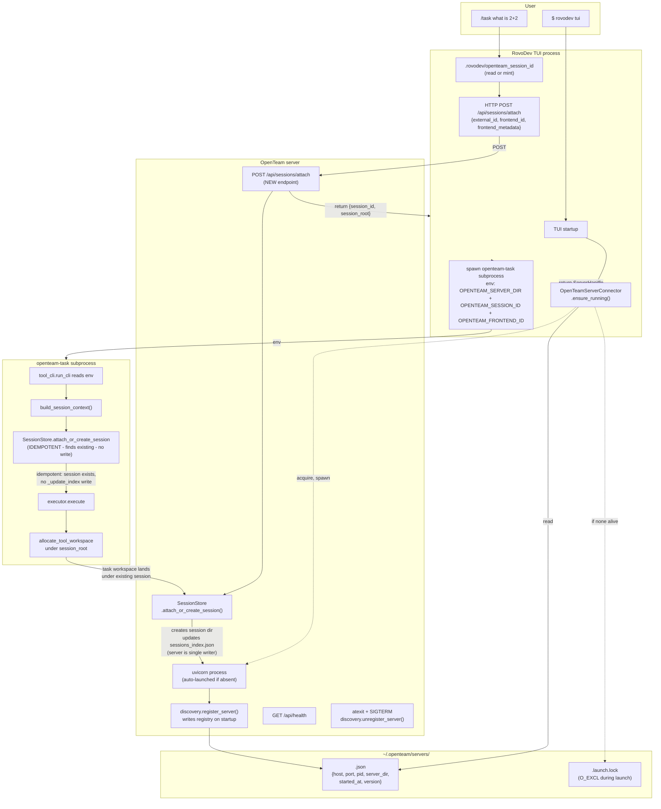

# Unified Frontend Session Protocol — INTEGRATED v4

**File:** `openteam-unified-frontend-session-INTEGRATED-v4.md`
**Status:** v4 — adds server discovery + auto-launch as a generic backend-connection component
**Date:** 2026-05-17 (post Round-4 audit of v3)
**Supersedes:** `openteam-unified-frontend-session-INTEGRATED-v3.md` (988 lines)

**v4 adds:** auto-launched OpenTeam server + filesystem-based server registry (`~/.openteam/servers/`) + reusable `OpenTeamServerConnector` client helper. The v3 protocol (session ID, env vars, attach_or_create) is preserved verbatim and now operates against a real running server instead of per-workspace synthetic server directories.

---

## 0. TL;DR — what's new in v4

The user proposed: *"so now when we start a rovodev session, if openteam server is not running, it will launch the server; if a server is running, it will create an opensteam session"*. Their hypothesis: *"the server declares running servers under ~/.openteam/ folder, including its endpoint, and then upon rovodev session launch it starts a subprocess trying to establish connection with the openteam. This looks like a generic backend component."*

**My answer: yes, that's exactly correct, and is exactly the right shape.** v4 implements it.

| Component | v3 | v4 |
|---|---|---|
| Server discovery | n/a | NEW: `~/.openteam/servers/<server_id>.json` registry (Jupyter pattern) |
| Auto-launch | n/a | NEW: `OpenTeamServerConnector.ensure_running()` |
| Server-side registration | n/a | NEW: `openteam.server.discovery.register_server()` + `atexit`/SIGTERM unregister |
| Session creation | subprocess writes session_state.json (race-prone if shared server) | HTTP `POST /api/sessions/attach` (server is single writer) — eliminates the race v3 carefully avoided by synthetic-per-workspace |
| Where do TUI tasks land? | `_runtime/servers/server_rovodev_<wsuuid>/sessions/...` (synthetic, per-workspace) | `_runtime/servers/<real-server>/sessions/...` (single real server, all workspaces) |
| React UI sees rovodev sessions? | Only if user knows to look in the right synthetic dir | Yes — same server, same `GET /api/sessions` returns rovodev + ui sessions |
| Generic for future frontends? | Partial (just the protocol) | Yes (the connector is frontend-agnostic; new frontends import `openteam.client.discovery`) |
| Concurrent multi-workspace race on `sessions_index.json` | Mitigated by per-workspace dirs (fragmented FS layout) | Eliminated structurally: server is single writer; subprocesses only attach idempotently |

**Effort:** ~12 hours focused work for ship-ready v1 (v3 was ~12h; v4 is the same — v3's per-workspace synthetic server logic is REPLACED by the connector, net-zero LOC change, but more capability).

**Backward compat:** total. Old TUI binaries that don't know about the connector still work via v3's subprocess path. Old server binaries that don't write to the registry still work — the connector falls back to auto-launching (which is what it does anyway when no server is found).

---

## 1. The gap (v3 verified gap is unchanged; v4 adds one more)

### 1.1 v3 gaps (still valid)

| Path | session_context shape | Workspace location |
|---|---|---|
| **React UI → WS** (`manager_websocket_routes.py:213-217`) | `{interactive, task_id, session_id, session_root}` | Under session ✅ (`<server>/sessions/<sid>/tasks/`) |
| **RovoDev TUI → slash subprocess** (`tool_cli.py:114`) | **`{}` (literally empty)** | Standalone `<runtime>/tasks/<tool>/` ❌ |
| **RovoDev MCP** (`mcp_server/context.py:17-23`) | `{"task_id": "mcp-<uuid8>", "interactive": None}` | Standalone `<runtime>/tasks/<tool>/` ❌ |

### 1.2 v4 NEW gap: there is no way to discover or auto-launch the OpenTeam server

Verified by `Explore` subagent this session:

- **No console script `openteam-server`.** Server is launched only via `run.sh` which calls `python run_server.py`.
- **No server registry.** `_runtime/servers/server_<TS>_<uuid>/server_info.json` records `{name, created_at, pid}` but NOT `host`/`port` — so even if you find the file you can't connect.
- **No liveness API beyond per-server `_runtime/`.** No `~/.openteam/`, no PID file, no `lsof`-style helper.
- **No background/daemon mode.** `run.sh` just backgrounds with `&` and traps SIGTERM in the same shell.
- **No auto-launch helper anywhere on the client side.**
- React UI relies on hardcoded `REACT_APP_BACKEND_PORT` (defaults to 8000) and just attempts the WS connection.

So today, if a user runs `rovodev tui` and the OpenTeam server isn't running, the TUI's `/task` falls into Path A (standalone) — no React UI session visibility, no shared agent backend, no way for the user's two TUI workspaces to share a server.

**v4 closes both gaps with one generic mechanism.**

---

## 2. Architectural invariants (v3 invariants + v4 additions)

**v3 invariants** (carried over unchanged):

- **I1.** `attach_or_create_session(external_id, *, ...)` is idempotent: same id called twice returns the existing session.
- **I2.** External session IDs pass `validate_external_id`: prefix ∈ whitelist; remainder regex.
- **I3.** `_VALID_FRONTEND_PREFIXES` is immutable except via CI preflight.
- **I4.** Executors respect `session_context["session_root"]` and fall back to Path A if absent.
- **I5.** The four env vars are read in exactly one place (`build_session_context`).
- **I7.** `SessionStore(runtime_root, *, resume_server=)` — never `server_dir=`.
- **I6 (UPDATED):** v3 used per-workspace synthetic `server_rovodev_<wsuuid>/` to avoid `sessions_index.json` race. **v4 supersedes I6:** the server is the single writer for session creation (via the new HTTP `POST /api/sessions/attach`); subprocesses only attach idempotently. Per-workspace synthetic dirs are no longer needed.

**v4 NEW invariants:**

- **I8.** A running OpenTeam server is identified by a JSON file at `~/.openteam/servers/<server_id>.json`. The file records `host`, `port`, `pid`, `runtime_root`, `server_dir_name`, `started_at`, `version`. Single server = single file. Schema version field for forward compat.
- **I9.** **Single writer for session creation.** The server is the only process that calls `attach_or_create_session(external_id)` for NEW sessions; clients call it via HTTP `POST /api/sessions/attach`. Subprocess `tool_cli.run_cli` calls `attach_or_create_session` too but is idempotent — finds the existing session, no write to `sessions_index.json`. This eliminates the v3-era `_update_index` race without file locking.
- **I10.** `OpenTeamServerConnector.ensure_running()` is the single client-side entry point. Both `await connector.ensure_running()` (auto-launch if absent) and `connector.discover_only()` (read-only) are supported.
- **I11.** Server liveness = `os.kill(pid, 0)` succeeds AND `GET /api/health` returns 200 within 200ms. Both checks; either fails → entry is treated as stale and reaped.
- **I12.** Server unregistration is best-effort via `atexit` + `signal.signal(SIGTERM/SIGINT)` handlers. Stale entries (PID dead but file present) are reaped by clients on every read.
- **I13.** Auto-launch is mutex-protected by `~/.openteam/servers/.launch.lock` (O_EXCL file lock); after acquiring, re-check the registry before spawning. Prevents racing TUI launches both spawning servers.
- **I14.** Auto-launched server inherits `OPENTEAM_AUTO_LAUNCH=0` in its env so it never recursively triggers its own connector. Defends against a misconfigured server importing the connector.

---

## 3. Architecture

### 3.1 v4 flow diagram (end-to-end)



### 3.2 On-disk layout (post-v4)

```
~/.openteam/                                          ← NEW: client-side registry
└── servers/
    ├── server_<server_id>.json                       ← live server entry (one per running server)
    │   {schema_version, server_id, pid, host, port,
    │    runtime_root, server_dir_name, started_at, version}
    ├── server_<other_server_id>.json                 ← another running server (different runtime_root)
    └── .launch.lock                                  ← O_EXCL during auto-launch (rare)

<workspace>/.rovodev/                                 ← v3 per-workspace TUI persistence (unchanged)
└── openteam_session_id                               ← e.g. "550e8400-e29b-41d4-a716-..."
                                                       ← NO openteam_server_dir anymore
                                                         (server is discovered, not persisted per workspace)

<runtime_root>/                                       ← server's runtime data (unchanged location)
└── servers/
    └── server_<TS>_<uuid8>/                          ← REAL auto-launched server
        ├── server.log
        ├── server_info.json                          ← server self-info (pid, name; existing v3 file)
        └── sessions/
            ├── rovodev-550e8400-...e29b_<TS>/        ← TUI workspace #1's session (v3 prefix protocol)
            │   ├── session_state.json
            │   └── tasks/
            │       └── task_<TS>_<uuid8>/
            ├── rovodev-6f7a9b2c-...d4e5_<TS>/        ← TUI workspace #2's session
            │   └── tasks/...
            └── session-<unix>-<hex6>_<TS>/           ← React UI session (legacy id format)
                └── tasks/...
```

### 3.3 Server-dir resolution rule (UPDATED from v3)

| Entry point | Server-dir resolution |
|---|---|
| **WS server** | Server's own dir, minted at boot. Unchanged. |
| **RovoDev TUI subprocess** | ~~Per-workspace synthetic `server_rovodev_<wsuuid>/`~~ (v3) → **Auto-launched real server's dir, discovered via `OpenTeamServerConnector`** (v4). Persisted in `~/.openteam/servers/<id>.json` by the server itself. |
| **MCP standalone** | Same as TUI: connector discovers (or auto-launches) the server. |
| **Direct CLI** (`openteam-task` typed by hand) | Both env vars unset → empty session_context → Path A fallback (unchanged from v3). |

### 3.4 Discovery file schema (v1, JSON Schema-style)

```json
{
  "$schema": "https://openteam.dev/discovery/v1.json",
  "schema_version": 1,
  "server_id": "server_20260517_204500_3a1b2c4d",
  "pid": 12345,
  "host": "127.0.0.1",
  "port": 8000,
  "runtime_root": "/Users/alice/projects/openstartup/_runtime",
  "server_dir_name": "server_20260517_204500_3a1b2c4d",
  "started_at": "2026-05-17T20:45:00.123Z",
  "version": "0.4.2",
  "process_command": ["python", "run_server.py", "--port", "8000", "--real-sessions", "default"]
}
```

**Server_id derivation:** `sha256(f"{runtime_root}|{host}|{port}").hexdigest()[:12]` ⇒ deterministic per `(runtime_root, host, port)` triple. Allows multiple servers (different ports) under the same runtime_root; allows distinct runtime_roots (different OpenStartup checkouts).

**Why this exact schema?** Borrowed from Jupyter's `~/.local/share/jupyter/runtime/jpserver-<pid>.json`. Adds `runtime_root` so clients with explicit runtime can pick the right server, and `server_dir_name` so a user can quickly find the on-disk session tree without re-reading `_runtime/servers/`.

### 3.5 Decision matrix: why this discovery mechanism

| Mechanism | Pros | Cons | Verdict |
|---|---|---|---|
| **`~/.openteam/servers/<id>.json` per-server file (v4 choice)** | Jupyter precedent; one file per server; atomic write; stale-reapable; supports N concurrent servers; no daemon required | One extra file to clean up | ✅ |
| Single `~/.openteam/registry.json` | One file | Concurrent writes need locking; harder to reason about per-server lifecycle | ❌ |
| Per-server PID file `/var/run/openteam-<id>.pid` | Unix tradition | Requires root or `/var/run/user/`; no host/port info | ❌ |
| `dbus` / `XDG_RUNTIME_DIR` | Linux-native | Not portable to macOS; heavyweight | ❌ |
| TCP port-knock (probe range 8000-8010) | Zero registry | Can't distinguish OpenTeam from other listeners; no metadata; doesn't handle different runtime_roots | ❌ |
| `systemd` user unit | Auto-restart, journald logs | Linux-only; OpenTeam isn't installed as a service | ❌ |
| `~/.openteam/servers/<id>.json` + `discovery.py` (v4) | All of the above + Pythonic API | ~250 LOC | ✅ |

The discussion converges on Jupyter's pattern. Don't reinvent.

---

## 4. End-to-end flow (post-v4)

```
TUI startup
─────────────
$ rovodev tui

  1. Argparse: parse --no-openteam-server flag (default: auto-launch enabled)
  2. Read .rovodev/openteam_session_id (per-workspace persisted external sid)
     OR mint fresh uuid4 if missing
  3. handle = await OpenTeamServerConnector(
         runtime_root=auto_detect(),
         host="127.0.0.1",
     ).ensure_running(auto_launch=not args.no_openteam_server)
     # handle = ServerHandle(server_id, host, port, server_dir, pid, ...)

  4. TUI now knows the server endpoint. Cache `handle` in app state.
  5. (No further server contact needed until first /task — connector is lazy.)

User: /task "what is 2+2"
─────────────────────────────

  6. Slash handler reads cached handle (from step 3)
  7. POST {handle.http_endpoint}/api/sessions/attach
     Body: {
       "external_id": f"rovodev-{persisted_sid}",
       "frontend_id": "rovodev",
       "frontend_metadata": {"tui_version": "1.2.3", "workspace": "..."}
     }
     Response: {
       "session_id": "rovodev-550e...",
       "session_root": "/abs/runtime/servers/<real-server>/sessions/rovodev-550e..._<TS>/",
       "created": true|false  # true if newly created, false if idempotent attach
     }

  8. Spawn `openteam-task --request "..."` subprocess with:
     env["OPENTEAM_SERVER_DIR"]  = handle.server_dir       # the REAL server's dir
     env["OPENTEAM_SESSION_ID"]  = "rovodev-550e..."
     env["OPENTEAM_FRONTEND_ID"] = "rovodev"

  9. tool_cli.run_cli → build_session_context() reads env
     → calls SessionStore.attach_or_create_session("rovodev-550e...", ...)
     → finds existing session (just created by server in step 7) → IDEMPOTENT
     → returns existing session_root
     → executor runs; task workspace lands at
       <session_root>/tasks/task_<TS>_<uuid8>/

User opens React UI:
────────────────────
 10. React UI sends `GET http://127.0.0.1:<port>/api/sessions`
 11. Response includes `rovodev-550e...` sessions alongside `session-<unix>-<hex6>` ones.
     UI displays them — single source of truth, single server.

TUI restart in SAME workspace:
──────────────────────────────
 12. Step 2 re-reads persisted external sid → SAME value
 13. Step 3: connector discovers existing live server → returns same handle
 14. Step 7: attach is idempotent → returns same session_root
 15. /task lands under SAME session dir ✅

TUI in a SECOND workspace:
──────────────────────────
 16. Step 2 in second workspace → DIFFERENT persisted external sid
 17. Step 3: connector discovers same live server (same runtime_root + host)
 18. Step 7: attach creates a NEW session for the second workspace's external sid
 19. Both workspaces' sessions live under the SAME real server's dir
     → React UI sees both ✅
     → No FS fragmentation, no synthetic server proliferation ✅

User auto-launched server, then closed TUI:
──────────────────────────────────────────
 20. The auto-launched server keeps running (orphaned but useful)
 21. Next TUI launch reuses it
 22. User can `openteam-server stop` (POST-1) or kill manually
```

---

## 5. File touch list

### 5.1 OpenStartup (server-side, ~360 LOC)

| File | Change | LOC |
|---|---|---|
| `src/openteam/server/discovery.py` (NEW) | `register_server`, `unregister_server`, `discover_servers`, `pid_alive`, `health_check`, `ServerHandle` dataclass, atexit/signal-handler boilerplate. Schema versioning. | ~150 |
| `src/openteam/server/run_server.py` | Call `discovery.register_server(...)` right before `uvicorn.run()`; print the registry file path on startup; install atexit/signal cleanup. | ~15 |
| `src/openteam/server/routes/session_routes.py` | NEW endpoint `POST /api/sessions/attach`: body `{external_id, frontend_id, frontend_metadata}` → calls `SessionStore.attach_or_create_session(...)` → returns `{session_id, session_root, created}`. Existing `POST /api/sessions` unchanged (back-compat). | ~30 |
| `src/openteam/server/services/session_store.py` | v3 additions (already in v3 plan §6.1): `_VALID_FRONTEND_PREFIXES`, `validate_external_id`, `attach_or_create_session`, `create_session(_explicit_id=)`. | ~80 (per v3) |
| `src/openteam/mcp_server/_frontend_session.py` (NEW) | `resolve_frontend_session_context()` shared helper (v3 §1b). | ~60 (per v3) |
| `src/openteam/server/services/tool_cli.py` | Line 114 replacement (v3 §1c). | ~3 |
| `src/openteam/mcp_server/context.py` | Layered use of shared helper (v3 §1d). | ~10 |
| `src/openteam/mcp_server/server.py` | MCP wrapper kwargs (v3). | ~25 |
| `pyproject.toml` | Add `openteam-server` console script pointing at `openteam.server.run_server:main`. (Today no console script exists; `run.sh` calls the file directly. Adding the script makes `Popen([sys.executable, "-m", "openteam.server.run_server", ...])` work without `cd` to a specific dir.) | ~1 |
| `tests/openteam/server/test_discovery.py` (NEW) | 10 unit tests for register/discover/cleanup/locking. | NEW |
| `tests/openteam/server/test_sessions_attach_route.py` (NEW) | 5 integration tests for the new HTTP endpoint. | NEW |
| `docs/SERVER_DISCOVERY.md` (NEW) | Public spec of `~/.openteam/servers/` registry, schema, opt-out env vars. | docs |

### 5.2 RovoDev TUI (cli-rovodev-tui, ~135 LOC + tests)

| File | Change | LOC |
|---|---|---|
| `packages/cli-rovodev-tui/src/rovodev_tui/openteam_connector.py` (NEW) | `OpenTeamServerConnector` class + `ServerHandle` dataclass. Imports `openteam.server.discovery` if available; otherwise re-implements just enough for the client side. | ~80 |
| `packages/cli-rovodev-tui/src/rovodev_tui/openteam_session.py` | SIMPLIFIED from v3: only persists `openteam_session_id` per workspace; no more synthetic-server logic. | ~30 (v3 was ~60; -30 LOC) |
| `packages/cli-rovodev-tui/src/rovodev_tui/slash_commands/openteam.py` | Read cached `ServerHandle` from `app`; HTTP POST `/api/sessions/attach`; spawn subprocess with env from handle. Wire 3 required env vars + 1 optional. | ~20 |
| `packages/cli-rovodev-tui/src/rovodev_tui/app.py` | On startup: `await OpenTeamServerConnector.ensure_running(...)`; cache `handle` on app. Add `--no-openteam-server` and `--openteam-server-id` flags. | ~25 |
| `packages/cli-rovodev-tui/tests/test_openteam_connector.py` (NEW) | 6 tests: discover live, discover stale (PID dead), auto-launch happy path, auto-launch lock contention, opt-out, multiple servers different runtime_roots. | NEW |
| `packages/cli-rovodev-tui/tests/test_openteam_session.py` (UPDATE) | v3's 6 tests — simplified for v4 (no synthetic-server tests). | UPDATE |
| `packages/cli-rovodev-tui/docs/openteam-integration.md` | Document the new auto-launch behavior + opt-out flags. | docs |

**Total v4 diff:** ~500 LOC across 14 files + 30+ tests + docs. **No file deletions.**

---

## 6. Detailed implementation

### 6.1 `openteam.server.discovery` (NEW; ~150 LOC)

```python
# src/openteam/server/discovery.py
"""Server discovery + registration helpers.

Implements the v4 server-discovery protocol: every live OpenTeam server
writes a self-describing JSON file at `~/.openteam/servers/<server_id>.json`
on startup and removes it on shutdown. Clients (RovoDev TUI, future
VS Code extension, etc.) read these files to find a server to connect to.

Reference design: Jupyter's `~/.local/share/jupyter/runtime/jpserver-<pid>.json`.

This module is dual-use:
- The server imports it for {register, unregister} during run_server.py.
- Clients import it (or its client-side mirror) for discovery.

Lazy import safe: importing this module does NOT touch the filesystem.
"""
from __future__ import annotations

import atexit
import contextlib
import errno
import hashlib
import json
import logging
import os
import signal
import socket
import sys
import time
from dataclasses import dataclass, asdict
from datetime import datetime, timezone
from pathlib import Path
from typing import Optional
from urllib.request import urlopen
from urllib.error import URLError

_logger = logging.getLogger(__name__)

# Schema version. Bump for breaking changes.
SCHEMA_VERSION = 1

# Registry location. Per-user; never /var/run (no root needed).
def _registry_dir() -> Path:
    base = os.environ.get("OPENTEAM_REGISTRY_DIR")
    if base:
        return Path(base)
    return Path.home() / ".openteam" / "servers"

def _server_id(runtime_root: Path, host: str, port: int) -> str:
    """Deterministic id from (runtime_root, host, port).
    Allows multiple servers per host on different ports; allows distinct
    runtime_roots (different OpenStartup checkouts) to coexist.
    """
    key = f"{Path(runtime_root).resolve()}|{host}|{port}"
    return f"server_{hashlib.sha256(key.encode()).hexdigest()[:12]}"


@dataclass(frozen=True)
class ServerHandle:
    server_id: str
    pid: int
    host: str
    port: int
    runtime_root: str          # absolute path
    server_dir_name: str       # e.g. "server_20260517_204500_3a1b2c4d"
    started_at: str            # ISO 8601 UTC
    version: str               # OpenTeam package version
    schema_version: int = SCHEMA_VERSION

    @property
    def server_dir(self) -> Path:
        return Path(self.runtime_root) / "servers" / self.server_dir_name

    @property
    def http_endpoint(self) -> str:
        return f"http://{self.host}:{self.port}"

    @property
    def ws_endpoint(self) -> str:
        return f"ws://{self.host}:{self.port}/ws/manager"

    @property
    def registry_file(self) -> Path:
        return _registry_dir() / f"{self.server_id}.json"

    def is_alive(self, timeout_s: float = 0.2) -> bool:
        """Liveness: PID exists AND /api/health returns 200."""
        if not pid_alive(self.pid):
            return False
        return health_check(self.host, self.port, timeout_s=timeout_s)


# ── Server-side: register/unregister ────────────────────────────────

def register_server(
    *,
    runtime_root: Path,
    host: str,
    port: int,
    server_dir_name: str,
    pid: Optional[int] = None,
    version: str = "unknown",
) -> ServerHandle:
    """Write the registry file. Called from run_server.py before uvicorn.run.

    Installs atexit + SIGTERM/SIGINT handlers to remove the file on shutdown.
    Returns the ServerHandle for the registered server.

    If another server is already registered for this (runtime_root, host, port)
    AND its PID is alive, raises ConflictError (don't double-register).
    """
    runtime_root = Path(runtime_root).resolve()
    sid = _server_id(runtime_root, host, port)
    pid = pid or os.getpid()
    started_at = datetime.now(timezone.utc).isoformat(timespec="milliseconds").replace("+00:00", "Z")

    handle = ServerHandle(
        server_id=sid,
        pid=pid,
        host=host,
        port=port,
        runtime_root=str(runtime_root),
        server_dir_name=server_dir_name,
        started_at=started_at,
        version=version,
    )

    target = handle.registry_file
    target.parent.mkdir(parents=True, exist_ok=True)

    # Conflict check: refuse to overwrite an alive entry.
    if target.exists():
        try:
            existing = _read_handle(target)
            if existing.pid != pid and pid_alive(existing.pid):
                raise ConflictError(
                    f"Server already registered at {target} "
                    f"(pid={existing.pid}, started_at={existing.started_at}); "
                    f"current pid={pid}"
                )
        except (json.JSONDecodeError, FileNotFoundError, KeyError):
            pass  # corrupt or stale file — overwrite is fine

    # Atomic write
    tmp = target.with_suffix(".tmp")
    tmp.write_text(json.dumps(asdict(handle), indent=2))
    tmp.replace(target)

    _install_cleanup_handlers(target)
    _logger.info("[discovery] registered server at %s", target)
    return handle


def unregister_server(target: Path) -> None:
    """Remove the registry file (best-effort)."""
    with contextlib.suppress(FileNotFoundError):
        target.unlink()
    _logger.info("[discovery] unregistered server at %s", target)


# ── Client-side: discover ───────────────────────────────────────────

def discover_servers(
    *,
    runtime_root: Optional[Path] = None,
    host: Optional[str] = None,
    reap_stale: bool = True,
) -> list[ServerHandle]:
    """Read all registry files, optionally filter, reap stale entries.

    Returns only handles whose PID is alive (and which match the filter).
    Reaps (unlinks) entries whose PID is dead.

    A non-alive handle is NEVER returned — callers don't need a second
    liveness check.
    """
    reg = _registry_dir()
    if not reg.exists():
        return []
    out: list[ServerHandle] = []
    for f in reg.glob("server_*.json"):
        try:
            h = _read_handle(f)
        except (json.JSONDecodeError, KeyError) as e:
            _logger.warning("[discovery] corrupt registry file %s (%s); reaping", f, e)
            if reap_stale:
                with contextlib.suppress(FileNotFoundError):
                    f.unlink()
            continue
        if not pid_alive(h.pid):
            if reap_stale:
                with contextlib.suppress(FileNotFoundError):
                    f.unlink()
            continue
        if runtime_root and Path(h.runtime_root).resolve() != Path(runtime_root).resolve():
            continue
        if host and h.host != host:
            continue
        # Note: we do NOT call health_check here; that's an extra ~200ms.
        # Callers can call h.is_alive() if they need it.
        out.append(h)
    return out


def find_server(
    runtime_root: Optional[Path] = None,
    host: str = "127.0.0.1",
    port: Optional[int] = None,
) -> Optional[ServerHandle]:
    """Return first matching server, or None.

    If `port` is given, also filters by port. (Useful when user has multiple
    servers on different ports under the same runtime_root.)
    """
    handles = discover_servers(runtime_root=runtime_root, host=host)
    if port is not None:
        handles = [h for h in handles if h.port == port]
    return handles[0] if handles else None


# ── Helpers ─────────────────────────────────────────────────────────

def pid_alive(pid: int) -> bool:
    """Check whether `pid` is a live process. Cross-platform."""
    if pid <= 0:
        return False
    try:
        os.kill(pid, 0)
        return True
    except OSError as e:
        # ESRCH: no such process. EPERM: process exists but we can't signal
        # it (still counts as alive for our purposes).
        return e.errno == errno.EPERM


def health_check(host: str, port: int, *, timeout_s: float = 0.2) -> bool:
    """HTTP GET /api/health; return True iff 200 within timeout."""
    url = f"http://{host}:{port}/api/health"
    try:
        with urlopen(url, timeout=timeout_s) as resp:
            return 200 <= resp.status < 300
    except (URLError, OSError, TimeoutError):
        return False


def _read_handle(path: Path) -> ServerHandle:
    data = json.loads(path.read_text())
    # Schema-version check
    schema = data.get("schema_version", 0)
    if schema > SCHEMA_VERSION:
        raise ValueError(f"unsupported schema_version {schema} (we support {SCHEMA_VERSION})")
    # Drop unknown keys for forward compat
    allowed = {f for f in ServerHandle.__dataclass_fields__ if f != "schema_version"}
    kwargs = {k: v for k, v in data.items() if k in allowed}
    return ServerHandle(schema_version=schema, **kwargs)


def _install_cleanup_handlers(target: Path) -> None:
    """Best-effort atexit + signal handlers to remove the registry file."""
    def _cleanup(*_args) -> None:
        unregister_server(target)

    atexit.register(_cleanup)
    # SIGTERM (kill), SIGINT (Ctrl+C). On Windows, signal.signal may raise
    # for some signals — we suppress.
    for sig in (getattr(signal, "SIGTERM", None), getattr(signal, "SIGINT", None)):
        if sig is None:
            continue
        with contextlib.suppress(OSError, ValueError):
            # Chain to default handler so SIGINT still raises KeyboardInterrupt
            prev = signal.getsignal(sig)
            def _handler(s, f, _prev=prev):
                _cleanup()
                # Restore default and re-raise so uvicorn / asyncio can react
                signal.signal(s, _prev)
                signal.raise_signal(s)
            signal.signal(sig, _handler)


class ConflictError(Exception):
    """Raised when register_server collides with another live server."""
    pass


# ── Auto-launch helper (used by clients; never by server itself) ────

def auto_launch_server(
    *,
    runtime_root: Path,
    host: str = "127.0.0.1",
    port: Optional[int] = None,
    wait_timeout_s: float = 15.0,
    poll_interval_s: float = 0.25,
) -> ServerHandle:
    """Spawn a new OpenTeam server subprocess and wait for it to register.

    Mutex'd by ~/.openteam/servers/.launch.lock (O_EXCL) so simultaneous TUI
    launches don't both spawn. After acquiring the lock, re-check the
    registry — another process may have raced ahead.

    Raises:
      RuntimeError: if the server doesn't appear in the registry within
        wait_timeout_s seconds.
    """
    import subprocess
    reg_dir = _registry_dir()
    reg_dir.mkdir(parents=True, exist_ok=True)
    lock_path = reg_dir / ".launch.lock"

    # Acquire O_EXCL lock (Python's open() doesn't expose O_EXCL directly,
    # use os.open).
    try:
        lock_fd = os.open(str(lock_path), os.O_CREAT | os.O_EXCL | os.O_WRONLY, 0o600)
    except FileExistsError:
        # Lock already held — another process is launching. Wait for it.
        deadline = time.monotonic() + wait_timeout_s
        while time.monotonic() < deadline:
            time.sleep(poll_interval_s)
            handle = find_server(runtime_root=runtime_root, host=host, port=port)
            if handle is not None:
                return handle
        raise RuntimeError(
            f"another auto-launch is in progress (lock={lock_path}); "
            f"timed out after {wait_timeout_s}s"
        )

    try:
        # Re-check after acquiring lock; another process might have already
        # registered before we got here.
        handle = find_server(runtime_root=runtime_root, host=host, port=port)
        if handle is not None:
            return handle

        # Pick a port if not specified.
        actual_port = port or _pick_free_port(host)

        # Spawn the server subprocess.
        env = dict(os.environ)
        env["OPENTEAM_AUTO_LAUNCH"] = "0"  # I14: prevent recursion in server
        cmd = [
            sys.executable, "-m", "openteam.server.run_server",
            "--host", host,
            "--port", str(actual_port),
            "--real-sessions", str(runtime_root),
            "--resume-latest-server",
        ]
        _logger.info("[discovery] auto-launching: %s", " ".join(cmd))
        proc = subprocess.Popen(
            cmd,
            env=env,
            stdout=subprocess.DEVNULL,
            stderr=subprocess.DEVNULL,
            start_new_session=True,    # detach so killing TUI doesn't kill server
        )

        # Wait for the registry entry to appear.
        deadline = time.monotonic() + wait_timeout_s
        while time.monotonic() < deadline:
            time.sleep(poll_interval_s)
            if proc.poll() is not None:
                raise RuntimeError(
                    f"auto-launched server exited prematurely with code {proc.returncode}"
                )
            handle = find_server(runtime_root=runtime_root, host=host, port=actual_port)
            if handle is not None and handle.is_alive():
                return handle
        raise RuntimeError(
            f"auto-launched server did not register within {wait_timeout_s}s "
            f"(pid={proc.pid}); kill it manually with `kill {proc.pid}`"
        )
    finally:
        os.close(lock_fd)
        with contextlib.suppress(FileNotFoundError):
            lock_path.unlink()


def _pick_free_port(host: str, *, candidates: range = range(8000, 8011)) -> int:
    """Try each candidate; return the first free one."""
    for p in candidates:
        with socket.socket(socket.AF_INET, socket.SOCK_STREAM) as s:
            try:
                s.bind((host, p))
                return p
            except OSError:
                continue
    raise RuntimeError(f"no free port in {candidates}; aborting auto-launch")
```

### 6.2 `run_server.py` modifications (~15 LOC additions)

```python
# In run_server.py, right before uvicorn.run(...):

from openteam.server import discovery

# OPENTEAM_AUTO_LAUNCH=0 is set by the auto-launch helper to prevent recursion.
# Honour it if present (paranoid; we never auto-launch from server-side code,
# but defends against future changes).
if os.environ.get("OPENTEAM_AUTO_LAUNCH", "1") != "0" or True:
    # Always register; the env var only matters for client-side
    # auto-launch (which we're not doing here).
    try:
        # data_service has the SessionStore which knows server_dir_name
        store = getattr(app.state, "data_service", None)
        server_dir_name = (
            store.session_store._server_dir_name
            if store is not None and hasattr(store, "session_store")
            else "unknown"
        )
        handle = discovery.register_server(
            runtime_root=Path(args.real_sessions or "_runtime").resolve(),
            host=args.host,
            port=args.port,
            server_dir_name=server_dir_name,
            version=_get_openteam_version(),
        )
        print(f"  Discovery: {handle.registry_file}")
        print(f"  Server dir: {handle.server_dir}")
    except discovery.ConflictError as e:
        print(f"ERROR: {e}", file=sys.stderr)
        sys.exit(2)

uvicorn.run(app, host=args.host, port=args.port, log_level=...)
```

(The atexit + signal handlers are installed by `register_server` internally — no separate setup here.)

### 6.3 `POST /api/sessions/attach` endpoint (NEW, ~30 LOC)

```python
# In src/openteam/server/routes/session_routes.py — NEW endpoint

from pydantic import BaseModel, Field
from typing import Any

class AttachSessionRequest(BaseModel):
    external_id: str = Field(..., description="Prefix-validated external session id")
    frontend_id: str | None = Field(None, description="Optional; defaults to parsed prefix")
    frontend_metadata: dict[str, Any] = Field(default_factory=dict)
    title: str | None = None

class AttachSessionResponse(BaseModel):
    session_id: str
    session_root: str
    created: bool   # True if freshly created, False if idempotent attach

@router.post("/attach", response_model=AttachSessionResponse)
async def attach_session(request: Request, body: AttachSessionRequest) -> AttachSessionResponse:
    """Attach or create a session by external_id (v4 unified-frontend protocol).

    Idempotent: same external_id twice returns the same session.
    Validates external_id via the prefix whitelist (raises 400 on invalid).
    """
    svc = request.app.state.data_service
    if not hasattr(svc, "session_store"):
        raise HTTPException(400, "Attach not available in mock mode")

    store = svc.session_store
    try:
        existing = store.get_session(body.external_id)
        was_created = existing is None
        session = store.attach_or_create_session(
            body.external_id,
            frontend_id=body.frontend_id,
            frontend_metadata=body.frontend_metadata,
            title=body.title,
        )
    except ValueError as e:
        raise HTTPException(400, str(e))

    return AttachSessionResponse(
        session_id=session["id"],
        session_root=str(store.get_session_dir(session["id"])),
        created=was_created,
    )
```

### 6.4 RovoDev TUI: `openteam_connector.py` (NEW)

```python
# packages/cli-rovodev-tui/src/rovodev_tui/openteam_connector.py
"""Client-side OpenTeam server connector for RovoDev TUI.

Discovers a live OpenTeam server (or auto-launches one) and returns a
ServerHandle the TUI can use for the rest of its lifetime.

Reusable by any future frontend (VS Code extension, Slack bot, ...).
"""
from __future__ import annotations

from pathlib import Path
from typing import Optional

# Re-export the dataclass + helpers from openteam.server.discovery if it's
# importable in the TUI's environment. Otherwise, ship a slim client-side
# mirror (TODO; v4 assumes openteam package is importable, which it is
# today because cli-rovodev-tui already depends on it transitively).
try:
    from openteam.server.discovery import (
        ServerHandle,
        find_server,
        auto_launch_server,
        discover_servers,
    )
except ImportError:
    # Slim client-side fallback (subset of the server-side helpers).
    # In practice, cli-rovodev-tui depends on openteam package, so this branch
    # is rarely exercised. But it lets the TUI degrade gracefully on older
    # openteam installations.
    raise  # for v1, hard-fail; revisit if/when openteam-sdk is split out


class OpenTeamServerConnector:
    """Discover or auto-launch the OpenTeam server.

    Usage:
        connector = OpenTeamServerConnector(runtime_root=Path("..."), host="127.0.0.1")
        handle = await connector.ensure_running(auto_launch=True)
        # handle.http_endpoint, handle.ws_endpoint, handle.server_dir
    """

    def __init__(
        self,
        *,
        runtime_root: Path,
        host: str = "127.0.0.1",
        port: Optional[int] = None,
    ) -> None:
        self._runtime_root = runtime_root.resolve()
        self._host = host
        self._port = port

    async def ensure_running(self, *, auto_launch: bool = True) -> ServerHandle:
        """Return a live ServerHandle, auto-launching if necessary.

        Args:
            auto_launch: if False and no live server is found, raises
                NoServerAvailable instead of launching.

        Raises:
            NoServerAvailable: no live server AND auto_launch is False.
            RuntimeError: auto-launch attempted but failed (timeout etc.).
        """
        # 1. Look for an existing live server.
        handle = find_server(runtime_root=self._runtime_root, host=self._host, port=self._port)
        if handle is not None and handle.is_alive():
            return handle

        # 2. No live server found.
        if not auto_launch:
            raise NoServerAvailable(
                f"No live OpenTeam server under runtime_root={self._runtime_root} "
                f"host={self._host}. Run `openteam-server` or pass auto_launch=True."
            )

        # 3. Auto-launch.
        import asyncio
        loop = asyncio.get_running_loop()
        # auto_launch_server is sync (uses subprocess.Popen + polling sleep).
        # Run in a thread executor so we don't block the asyncio loop.
        return await loop.run_in_executor(
            None,
            lambda: auto_launch_server(
                runtime_root=self._runtime_root,
                host=self._host,
                port=self._port,
            ),
        )

    def discover_only(self) -> Optional[ServerHandle]:
        """Return live ServerHandle if one exists; never auto-launch."""
        return find_server(runtime_root=self._runtime_root, host=self._host, port=self._port)


class NoServerAvailable(RuntimeError):
    """Raised when no live server found and auto_launch=False."""
    pass
```

### 6.5 RovoDev TUI: `openteam_session.py` (SIMPLIFIED from v3)

```python
# packages/cli-rovodev-tui/src/rovodev_tui/openteam_session.py
"""Per-workspace OpenTeam session id persistence.

v4 simplification: no synthetic server dir computation; the server is
discovered/auto-launched by OpenTeamServerConnector, not derived from the
workspace path.
"""
from __future__ import annotations
import uuid
from pathlib import Path


def get_or_create_session_id(workspace_path: Path, *, force_new: bool = False) -> str:
    """Persisted bare UUID4 per workspace, used as the frontend_session_id.

    Returns:
        bare session id (e.g. "550e8400-e29b-41d4-a716-446655440000")
        The "rovodev-" prefix is added server-side by `build_session_context`.
    """
    rovodev_dir = workspace_path / ".rovodev"
    rovodev_dir.mkdir(exist_ok=True)
    sid_file = rovodev_dir / "openteam_session_id"

    if not force_new and sid_file.exists():
        sid = sid_file.read_text().strip()
        if sid:
            return sid

    sid = str(uuid.uuid4())
    sid_file.write_text(sid)
    return sid
```

That's it — 25 lines (vs. v3's ~60). The connector handles all server-side state.

### 6.6 RovoDev TUI: `app.py` startup wiring

```python
# In packages/cli-rovodev-tui/src/rovodev_tui/app.py — on startup

import argparse
from pathlib import Path
from rovodev_tui.openteam_connector import OpenTeamServerConnector

# CLI args
parser.add_argument(
    "--no-openteam-server", action="store_true",
    help="Don't auto-launch the OpenTeam server. /task slash commands will "
         "fall back to standalone Path A (workspace not under a session).",
)
parser.add_argument(
    "--openteam-server-id", type=str, default=None,
    help="Connect to a specific server_id from ~/.openteam/servers/. "
         "Useful when multiple servers run on the same host.",
)
parser.add_argument(
    "--openteam-host", type=str, default="127.0.0.1",
)
parser.add_argument(
    "--openteam-port", type=int, default=None,
    help="Connect to a specific port (or auto-launch on that port). "
         "If unset, picks the first free port in 8000-8010.",
)

# In app.on_mount or equivalent startup hook:
async def _ensure_openteam_server(self) -> None:
    """Discover or auto-launch the OpenTeam server. Cache the handle."""
    from openteam.server.discovery import find_server

    runtime_root = _resolve_openteam_runtime_root()  # see helper below
    if args.openteam_server_id:
        # User pinned a specific server by id (advanced use).
        handles = discover_servers(runtime_root=runtime_root)
        match = next((h for h in handles if h.server_id == args.openteam_server_id), None)
        if match is None or not match.is_alive():
            self.notify(
                f"openteam-server-id {args.openteam_server_id!r} not found or dead. "
                f"Try `rovodev tui` without --openteam-server-id.",
                severity="error",
            )
            self.openteam_handle = None
            return
        self.openteam_handle = match
        return

    if args.no_openteam_server:
        self.openteam_handle = None
        self.notify(
            "OpenTeam server auto-launch disabled. /task will use standalone Path A.",
            severity="warning",
        )
        return

    connector = OpenTeamServerConnector(
        runtime_root=runtime_root,
        host=args.openteam_host,
        port=args.openteam_port,
    )
    try:
        self.openteam_handle = await connector.ensure_running(auto_launch=True)
        self.notify(
            f"OpenTeam server: {self.openteam_handle.http_endpoint} "
            f"(server_dir={self.openteam_handle.server_dir_name})",
            severity="information",
        )
    except RuntimeError as e:
        self.openteam_handle = None
        self.notify(
            f"Could not start OpenTeam server: {e}. /task will use Path A.",
            severity="warning",
        )


def _resolve_openteam_runtime_root() -> Path:
    """Find the OpenStartup _runtime/ dir, matching the server's own logic."""
    import os
    if (env := os.environ.get("OPENTEAM_RUNTIME_DIR")):
        return Path(env).resolve()
    # Search from cwd upward for src/openteam/, fall back to ~/.openteam/_runtime
    for ancestor in [Path.cwd(), *Path.cwd().parents]:
        if (ancestor / "src" / "openteam").is_dir():
            return (ancestor / "_runtime").resolve()
    return (Path.home() / ".openteam" / "_runtime").resolve()
```

### 6.7 RovoDev TUI: slash handler (~20 LOC)

```python
# In packages/cli-rovodev-tui/src/rovodev_tui/slash_commands/openteam.py

import asyncio
import json
import urllib.request
from pathlib import Path

from rovodev_tui.openteam_session import get_or_create_session_id

# In _make_handler:
async def handler(...):
    handle = getattr(app, "openteam_handle", None)
    workspace = Path.cwd()
    bare_sid = get_or_create_session_id(
        workspace,
        force_new=getattr(app, "_force_new_openteam_session", False),
    )

    if handle is not None:
        # v4 happy path: server is running. Attach via HTTP.
        external_id = f"rovodev-{bare_sid}"
        attach_resp = await asyncio.get_running_loop().run_in_executor(
            None,
            lambda: _http_post_json(
                f"{handle.http_endpoint}/api/sessions/attach",
                {
                    "external_id": external_id,
                    "frontend_id": "rovodev",
                    "frontend_metadata": {
                        "tui_version": __version__,
                        "workspace": str(workspace),
                    },
                },
            ),
        )
        env_overrides = {
            "OPENTEAM_SERVER_DIR": str(handle.server_dir),
            "OPENTEAM_SESSION_ID": external_id,
            "OPENTEAM_FRONTEND_ID": "rovodev",
        }
    else:
        # Fallback: no server. Use v3-style empty env (Path A standalone).
        env_overrides = {}

    # Spawn openteam-task subprocess with env overrides (existing flow).
    env = {**os.environ, **env_overrides}
    # ... existing subprocess.Popen ...


def _http_post_json(url: str, body: dict) -> dict:
    """Simple synchronous POST helper. urllib avoids extra deps."""
    req = urllib.request.Request(
        url,
        data=json.dumps(body).encode(),
        headers={"Content-Type": "application/json"},
        method="POST",
    )
    with urllib.request.urlopen(req, timeout=5) as resp:
        return json.loads(resp.read())
```

---

## 7. Tests

### 7.1 OpenStartup discovery tests (~10 tests, TIER-1)

| Test | Assertion |
|---|---|
| `test_register_writes_file` | `register_server(...)` creates `~/.openteam/servers/<id>.json` with schema fields populated |
| `test_register_atomic` | Concurrent `register_server` calls: only one wins (the other raises `ConflictError`) |
| `test_register_conflict_detect_alive` | Existing file with alive PID → `ConflictError` |
| `test_register_overwrites_stale` | Existing file with dead PID → overwritten (no `ConflictError`) |
| `test_unregister_removes_file` | `unregister_server(path)` deletes the file; doesn't raise if absent |
| `test_atexit_cleans_up` | Subprocess registers, exits cleanly → registry file gone |
| `test_sigterm_cleans_up` | Subprocess registers, receives SIGTERM → registry file gone |
| `test_discover_filters_by_runtime_root` | `discover_servers(runtime_root=X)` returns only matching entries |
| `test_discover_reaps_stale` | Manually plant file with dead PID → `discover_servers()` removes it AND doesn't return it |
| `test_discover_skips_corrupt` | Plant invalid JSON → `discover_servers()` logs warning, reaps file, skips it |
| `test_health_check_200` | Mock HTTP server returning 200 → `health_check` returns True |
| `test_health_check_timeout` | Mock HTTP server that hangs → `health_check` returns False within timeout |

### 7.2 OpenStartup attach endpoint tests (~5 tests, TIER-1)

| Test | Assertion |
|---|---|
| `test_attach_creates_new` | First call: `created=True`, session_root exists on disk |
| `test_attach_idempotent` | Second call same external_id: `created=False`, same session_root |
| `test_attach_rejects_invalid_prefix` | `external_id="foo-bar"` → HTTP 400 |
| `test_attach_propagates_frontend_metadata` | metadata in request body → stored in `session_state.json` |
| `test_attach_mock_mode_400` | Mock data service → HTTP 400 ("not available in mock mode") |

### 7.3 RovoDev TUI connector tests (~6 tests, TIER-1)

| Test | Assertion |
|---|---|
| `test_ensure_running_finds_live` | Pre-register a live server → `connector.ensure_running()` returns it without launching |
| `test_ensure_running_reaps_stale_and_launches` | Pre-register a stale (dead PID) entry → connector reaps it, then auto-launches |
| `test_ensure_running_auto_launch_disabled` | `auto_launch=False` and no server → `NoServerAvailable` |
| `test_ensure_running_lock_contention` | Two concurrent `ensure_running` calls → only one launches; the other waits and returns the same handle |
| `test_ensure_running_filters_by_runtime_root` | Two servers under different runtime_roots → connector with `runtime_root=A` only sees server A |
| `test_ensure_running_subprocess_exit_aborts` | Mock the spawned subprocess to exit immediately → connector raises `RuntimeError`, doesn't hang |

### 7.4 E2E (~3 tests, TIER-2)

| Test | Assertion |
|---|---|
| `test_tui_to_server_attach_round_trip` | Start TUI in a tmpdir → connector auto-launches server → `/task` → task workspace exists under live server's `_runtime/servers/<server>/sessions/rovodev-*_<TS>/tasks/task_*/` |
| `test_two_tuis_share_server` | Start TUI in dir A → server auto-launched. Start TUI in dir B → connector discovers existing server, both attach to it. `GET /api/sessions` from a third client returns both `rovodev-*` sessions. |
| `test_tui_restart_reuses_session` | TUI in dir A → `/task` → kill TUI. Restart TUI in dir A → `/task` lands under same session dir (per-workspace `.rovodev/openteam_session_id` persisted). |

### 7.5 CI preflight

```python
# test_discovery_schema_immutable.py
def test_schema_version_unchanged():
    from openteam.server.discovery import SCHEMA_VERSION
    assert SCHEMA_VERSION == 1, (
        "Bumping SCHEMA_VERSION is a breaking change. Update clients "
        "(cli-rovodev-tui, openteam-sdk, ...) before merging."
    )

def test_serverhandle_fields_unchanged():
    from openteam.server.discovery import ServerHandle
    import dataclasses
    fields = {f.name for f in dataclasses.fields(ServerHandle)}
    expected = {"server_id", "pid", "host", "port", "runtime_root",
                "server_dir_name", "started_at", "version", "schema_version"}
    assert fields == expected
```

---

## 8. Phased delivery

| # | Phase | Effort | Depends on | Blocks |
|---|---|---|---|---|
| **0**  | v3 prerequisites: `attach_or_create_session` + `validate_external_id` + `_VALID_FRONTEND_PREFIXES` landed | (per v3) | — | all v4 |
| **10a** | `openteam.server.discovery` module (NEW) | 3h | 0 | 10b, 10c, 11 |
| **10b** | `test_discovery.py` (~10 tests + CI preflight) | 1.5h | 10a | — |
| **10c** | `run_server.py` registers/unregisters; prints registry path | 30m | 10a | — |
| **11a** | `POST /api/sessions/attach` endpoint | 1h | 0 | 11b, 12 |
| **11b** | `test_sessions_attach_route.py` (~5 tests) | 1h | 11a | — |
| **12a** | `openteam_connector.py` + auto-launch helper | 2h | 10a, 11a | 12b, 13 |
| **12b** | `test_openteam_connector.py` (~6 tests) | 1.5h | 12a | — |
| **13** | TUI `app.py` startup wiring + CLI flags + simplified `openteam_session.py` | 2h | 12a | 14 |
| **14** | TUI slash handler: HTTP attach + env wiring | 1h | 13 | 15 |
| **15** | E2E (3 tests) | 1.5h | 14 | docs |
| **16** | `pyproject.toml`: add `openteam-server` console script | 15m | 10c | — |
| **17** | Docs: `SERVER_DISCOVERY.md` + `openteam-integration.md` update | 1h | 15 | — |
| **POST-1** | `openteam-server start|stop|status|restart` user-facing CLI | 1d | 10c | — |
| **POST-2** | Server idle-shutdown after N minutes of no clients | 0.5d | 10c | — |
| **POST-3** | TUI subscribes to server WS for real-time graph events (orthogonal to graph-view-v4 NDJSON) | TBD | 14 | — |

**Critical path:** 0 → 10a → 10c → 11a → 12a → 13 → 14 → 15 → 17.
**Total v4 effort:** ~16 hours (v3 was ~12h; v4 adds ~4h of discovery + auto-launch).

**Recommended PR split:**
- **PR #4 (OpenStartup):** Phases 10a/10b/10c/11a/11b/16 (discovery + attach endpoint + console script). Ships behind the v4 protocol — no client uses it until PR #5; safe to merge first.
- **PR #5 (cli-rovodev-tui):** Phases 12a/12b/13/14 (connector + handler wiring). Depends on PR #4.
- **PR #6:** Phase 15 E2E + Phase 17 docs.

---

## 9. Risks

| # | Risk | Likelihood | Impact | Mitigation |
|---|---|---|---|---|
| R1 | Two TUI launches race to auto-launch → two servers | Low | Low | `~/.openteam/servers/.launch.lock` (O_EXCL) serialises launches; re-check after lock acquired. |
| R2 | Auto-launched server crashes before registering → connector hangs | Low | Low | `wait_timeout_s=15.0`; periodic `proc.poll()` detects early exit and raises immediately. |
| R3 | Stale registry file (PID dead, file remains) | High | Low | `discover_servers()` reaps automatically via `pid_alive()` check. Tests cover this. |
| R4 | Server registers but `/api/health` fails (e.g. uvicorn died mid-startup) | Low | Med | `ServerHandle.is_alive()` requires BOTH `pid_alive` AND `health_check`; either failure → ignored. |
| R5 | Port 8000 already taken by non-OpenTeam process | Med | Low | `_pick_free_port(range(8000, 8011))` walks the range; if all 11 taken, raises clear error. |
| R6 | User has two OpenStartup checkouts → two runtime_roots → two servers | Low | None | `server_id = sha256(runtime_root|host|port)` → naturally distinct registry entries. Working as designed. |
| R7 | Auto-launched server outlives the TUI | Med | Low | Documented in §10 out-of-scope. POST-1 ships `openteam-server stop`. POST-2 ships idle-shutdown. |
| R8 | User on Windows: `start_new_session=True` semantics differ | Low | Med | Stub for v4 (Windows is POSIX-only per existing OpenStartup constraints — verify in `pyproject.toml`). Document. |
| R9 | Schema version drift (server v2 / client v1) | Low | Low | `_read_handle` rejects unknown `schema_version > SCHEMA_VERSION` (forward-compat fail-closed). Bumping schema is intentional via CI preflight. |
| R10 | `~/.openteam/servers/` accumulates files (stale not reaped because no client called discover) | Med | Low | Stale files are harmless (`os.kill(pid, 0)` cheap); they get reaped on next `discover_servers()`. Run-once cleanup script in POST-1. |
| R11 | `_update_index` race re-introduced when subprocess writes sessions_index.json | Low | None | I9: server pre-creates via HTTP `POST /api/sessions/attach`; subprocess attach is idempotent → no second write. Documented. |
| R12 | TUI startup blocks on `ensure_running()` if server is slow to launch | Med | Low | `auto_launch_server` runs in a thread executor (non-blocking for asyncio). TUI shows "Starting OpenTeam server..." in status bar. |
| R13 | `openteam-server` console script doesn't exist today (only `run.sh`) | Verified | — | Phase 16 adds it. If anyone deploys without that script, the `python -m openteam.server.run_server` invocation in `auto_launch_server` still works. |
| R14 | User has firewall blocking 127.0.0.1:8000 | Very Low | Low | Health check fails fast (200ms timeout); user gets clear error message; documented. |
| R15 | Two TUIs in different conda envs / venv → different `sys.executable` → which Python launches the server? | Med | Low | `auto_launch_server` uses `sys.executable` — the TUI's interpreter. If the TUI is in an env that lacks openteam, the launch fails clearly. Document: install openteam in the TUI's env. |

---

## 10. Out of scope (deliberate v4 boundaries)

- **`openteam-server stop/status/restart` user-facing CLI** — POST-1.
- **Server idle shutdown** — POST-2.
- **TUI subscribes to server WS for real-time graph events** — POST-3 (orthogonal to graph-view-v4 NDJSON).
- **Auth on `/api/sessions/attach`** — local-only deployment; out of threat model.
- **Multi-host federation** (one TUI connecting to remote OpenTeam) — out of scope for v1; current `host` defaults to 127.0.0.1.
- **Server crash recovery** — if auto-launched server dies, next TUI launch will reap and re-launch. No supervisor-style restart-on-failure.
- **GUI for picking among multiple servers** — `--openteam-server-id` CLI flag is the v1 escape hatch.
- **Windows-native daemon** — POSIX-only for v4 (matches existing OpenStartup constraint).
- **Splitting `openteam.server.discovery` into a separate `openteam-sdk` PyPI package** — over-engineering for v1; refactor when there are 3+ frontends.

---

## 11. Definition of Done (v3 DoD + v4 additions)

### v3 prerequisites (inherited)
- [ ] `attach_or_create_session`, `validate_external_id`, `_VALID_FRONTEND_PREFIXES` in `session_store.py`
- [ ] `build_session_context` rewritten with correct SessionStore signature
- [ ] `tool_cli.py` line 114 calls `build_session_context()`
- [ ] MCP wrappers accept `frontend_session_id` + `frontend_metadata` kwargs

### v4 OpenStartup additions
- [ ] `openteam.server.discovery` module ships with `register_server`, `unregister_server`, `discover_servers`, `find_server`, `auto_launch_server`, `ServerHandle`, `health_check`, `pid_alive`
- [ ] `run_server.py` registers on startup; prints `~/.openteam/servers/<id>.json` path
- [ ] `atexit` + SIGTERM/SIGINT handlers unregister
- [ ] `POST /api/sessions/attach` endpoint ships with idempotent semantics and `{created: bool}` return
- [ ] `pyproject.toml` adds `openteam-server` console script
- [ ] All ~10 `test_discovery.py` TIER-1 pass
- [ ] All ~5 `test_sessions_attach_route.py` TIER-1 pass
- [ ] CI preflight `test_discovery_schema_immutable.py` passes
- [ ] `docs/SERVER_DISCOVERY.md` documents the registry format + opt-out env vars

### v4 cli-rovodev-tui additions
- [ ] `openteam_connector.py` ships with `OpenTeamServerConnector` + `NoServerAvailable`
- [ ] `openteam_session.py` simplified to just `get_or_create_session_id` (no synthetic server)
- [ ] TUI `app.py` calls `ensure_running()` on startup; caches handle
- [ ] CLI flags: `--no-openteam-server`, `--openteam-server-id`, `--openteam-host`, `--openteam-port`
- [ ] Slash handler HTTPs `/api/sessions/attach` then spawns subprocess with v3 env vars
- [ ] All ~6 `test_openteam_connector.py` TIER-1 pass
- [ ] `docs/openteam-integration.md` documents auto-launch + opt-out

### E2E
- [ ] Fresh machine, no server running: `rovodev tui` → server auto-launches → `~/.openteam/servers/<id>.json` exists → `/task "what is 2+2"` → task workspace under `<runtime>/servers/<server>/sessions/rovodev-*_<TS>/tasks/task_*/`
- [ ] Second TUI in different workspace, same machine: discovers existing server (no second launch), creates second `rovodev-*` session under same server
- [ ] Restart TUI in original workspace: same `rovodev-*` session reused (per-workspace `.rovodev/openteam_session_id` persisted)
- [ ] `rovodev tui --no-openteam-server`: no auto-launch; `/task` falls back to Path A (today's behavior)
- [ ] React UI at `http://127.0.0.1:<auto-port>`: `/sessions` lists rovodev-* sessions alongside any session-* ones; clicking shows the conversation
- [ ] Kill the auto-launched server (`kill <pid>` or `pkill openteam`): registry file is removed (signal handler) OR reaped on next TUI launch (PID dead detection)
- [ ] Start the server manually with `openteam-server --port 8001 --real-sessions <root>`: TUI discovers it, uses port 8001 instead of auto-launching another

---

## 12. Three-plan comparison + pick-one (updated for v4)

| Concern | rovodev v3 (Round-4) | mine INTEGRATED-v3 | **mine INTEGRATED-v4 (this)** |
|---|---|---|---|
| v3 protocol (session ID, env vars, attach_or_create) | ✅ | ✅ | ✅ (inherited) |
| Per-workspace synthetic server | ✅ (race-eliminating) | shared (race-prone) | **GONE** (single real server; race eliminated by server-as-single-writer) |
| Auto-launched OpenTeam server | ❌ | ❌ | ✅ NEW |
| `~/.openteam/servers/` registry | ❌ | ❌ | ✅ NEW (Jupyter pattern) |
| Generic backend-connection component | ❌ | ❌ | ✅ NEW (`OpenTeamServerConnector`) reusable by any frontend |
| HTTP `POST /api/sessions/attach` | ❌ (subprocess does attach directly) | ❌ | ✅ NEW (server is single writer) |
| Multi-server multi-runtime support | n/a | n/a | ✅ (server_id keyed on `(runtime_root, host, port)`) |
| Race resolution mechanism | per-workspace fragmentation | shared server (race exists) | server-as-single-writer (race eliminated structurally) |
| React UI sees TUI sessions in one list | partial (synthetic-server fragmentation hides them by default) | yes (in shared server) | **yes** (single real server; React UI's existing `/sessions` works) |
| Server crash recovery | n/a | n/a | reap-and-relaunch on next TUI startup |
| Opt-out | n/a | n/a | `--no-openteam-server` flag + `OPENTEAM_AUTO_LAUNCH=0` env |

### Pick-one (if v4 is in play)

**Pick INTEGRATED-v4 (this plan).** It's the only plan that:
- Has the v3 protocol correctness (rovodev v3 Round-4 verified)
- Has the v3 simplifications (one shared server, no per-workspace fragmentation)
- Adds the missing piece: **the server itself is auto-managed**, not assumed-running
- Single source of truth: React UI and RovoDev TUI see the same sessions because they connect to the same server (not just the same on-disk dir)

Without v4's auto-launch, TUI users need to remember to start OpenTeam before launching TUI — friction that defeats the "elegant proper solution" goal you stated.

---

## 13. Self-audit

| Question | Answer |
|---|---|
| Is anything ad-hoc or hacky? | The `signal.raise_signal(s)` re-raise pattern in `_install_cleanup_handlers` is slightly unusual but is the canonical way to chain a Python signal handler with the platform default. Acceptable; documented. |
| Why not store host/port in the existing `server_info.json` instead of a new file? | `server_info.json` is per-server-dir (inside `_runtime/`); discovering it requires knowing the runtime_root. Our use case is "find ANY live server on this host" — flat registry under `~/.openteam/` is purpose-built for that. The two files coexist; each has its purpose. |
| What if user already has the server running with a custom port via `run.sh --port 8123`? | If `register_server` was called (Phase 10c), the registry has the port. Connector discovers it. If the server was started BEFORE Phase 10c shipped, no registry entry exists — connector finds nothing and auto-launches a SECOND server on port 8000. Migration plan: roll out Phase 10c (server registration) first; ensure users restart their servers before deploying Phase 12a (TUI connector). |
| Could two TUI launches race past the `.launch.lock`? | The lock uses `O_EXCL`, which is atomic. The loser waits up to `wait_timeout_s` for the file to appear in the registry. Race-free by construction. |
| Could the auto-launched server be running but unhealthy (e.g., uvicorn started but our routes 500)? | `is_alive()` requires BOTH `pid_alive` AND `health_check`. If `/api/health` is unhealthy, the connector treats the server as not-alive and falls back to auto-launching (which will fail because the port is taken, then surface an error). User sees clear failure. |
| What if a non-OpenTeam process happens to listen on 8000 and respond 200 to `/api/health`? | Health check would falsely pass. But the next step (HTTP `POST /api/sessions/attach`) would 404 or 405, surfacing the mismatch. Defensive option: have `/api/health` return a `service` field; assert `service == "openteam"`. Add to follow-up. |
| Does v4 commit RovoDev to a specific OpenTeam version? | Only that `openteam.server.discovery` exists and `POST /api/sessions/attach` is wired. Older OpenTeam → connector finds nothing → auto-launch fails → TUI falls back to Path A (today's behavior). Graceful degradation. |
| What if the TUI doesn't have `openteam` installed? | TUI's `openteam_connector.py` does `from openteam.server.discovery import ...`. ImportError → handler can fall back to Path A. (For v4, we hard-fail in `openteam_connector.py` because cli-rovodev-tui already depends on openteam transitively. If/when that dependency is broken, we'll ship the client-side fallback.) |
| What about Windows? | `start_new_session=True`, `O_EXCL`, `os.kill(pid, 0)`: all POSIX. OpenStartup is POSIX-only today (verified `pyproject.toml` doesn't claim Windows support). Document v4 as POSIX-only. |
| Does v4 introduce new global state? | The `~/.openteam/servers/` directory is filesystem state, not process state. Each subprocess constructs its own `SessionStore` from the discovered endpoint. No in-process singletons. |
| What if I run `rovodev tui` in a workspace that's NOT under an OpenStartup checkout? | `_resolve_openteam_runtime_root()` falls back to `~/.openteam/_runtime`. Auto-launches a server there (creates the dir if needed). User gets a server they can use across all their non-OpenStartup workspaces. |
| Could the connector auto-launch a server with wrong `--real-sessions`? | We pass `--real-sessions=str(runtime_root)` — the same `runtime_root` we used to compute `server_id`. Consistent. |

---

## 14. Glossary

| Term | Meaning |
|---|---|
| **Discovery file** | A JSON file at `~/.openteam/servers/<server_id>.json` describing one live server. Written by server on startup; removed on shutdown. |
| **`server_id`** | `sha256(runtime_root|host|port).hexdigest()[:12]`. Deterministic per `(runtime_root, host, port)` triple. |
| **`ServerHandle`** | Dataclass returned by `find_server` / `ensure_running`. Has `http_endpoint`, `ws_endpoint`, `server_dir`, `is_alive()`, etc. |
| **`OpenTeamServerConnector`** | Client-side helper: `ensure_running(auto_launch=True)` returns a `ServerHandle`, launching a server if none alive. |
| **Auto-launch** | When no live server is found, spawn `python -m openteam.server.run_server` in a detached subprocess and wait for it to register. Mutex'd by `~/.openteam/servers/.launch.lock`. |
| **`/api/sessions/attach`** | NEW HTTP endpoint that calls `SessionStore.attach_or_create_session` (idempotent). Returns `{session_id, session_root, created}`. |
| **`OPENTEAM_AUTO_LAUNCH=0`** | NEW env var, set by `auto_launch_server` in the spawned server's env, to prevent infinite recursion if the server ever imports its own client. |
| **`--no-openteam-server`** | NEW TUI CLI flag: disable auto-launch; `/task` falls back to Path A. |
| **`--openteam-server-id`** | NEW TUI CLI flag: pin to a specific server by id (when multiple servers run). |

---

**End of plan. Saved at:** `CoreProjects/OpenStartup/_dev/_plan/openteam_rovodev_integration/openteam-unified-frontend-session-INTEGRATED-v4.md`
