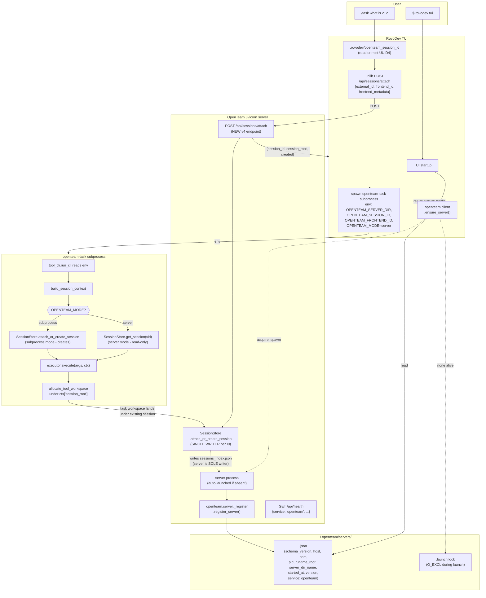

# Unified Frontend Session Protocol — INTEGRATED v6

**File:** `openteam-unified-frontend-session-protocol-v6.md`
**Status:** v6 — convergence-round integration of Cursor INTEGRATED-v5 + my v5 — NO architectural changes
**Date:** 2026-05-17 23:13

## Round-9 patch — 7 valid + 1 rejected from independent v6 audit (2026-05-18 00:04)

**Verdict matrix (8 audit items, all empirically verified):**

| # | Sev | Verdict | Evidence + action |
|---|---|---|---|
| **C1** | CRIT | ✅ **VALID** — `dataclasses.field(...)` used at line 706 but `from dataclasses import dataclass` only imports `dataclass` (no `field`, no module alias). Module-load NameError. | Line 651: `from dataclasses import dataclass` → `from dataclasses import dataclass, field`. Line 706: `dataclasses.field(...)` → `field(...)`. |
| **C2** | CRIT | ❌ **REJECTED** — Auditor claims `import sys` missing from §6.5; grep confirms it IS at line 819. | No change. |
| **C3** | CRIT | ✅ **VALID** — `validate_external_id_safe` invented by Round-7 Mod4; doesn't exist in v3 plan or live codebase. NameError in Server-Mode subprocess. | Replace with try/except `validate_external_id` (raises `ValueError`) with explicit `_already_prefixed` boolean. |
| **C4** | CRIT | ✅ **VALID** — Round-7 M1 fix moved the call (`svc.attach_or_create_session` → `svc.session_store.attach_or_create_session`) but left the hasattr predicate at line 1157 unchanged. Predicate now ALWAYS False → endpoint ALWAYS 400 → I9 architecture unreachable. | Predicate: `hasattr(svc, "attach_or_create_session")` → `hasattr(svc, "session_store")` (real-mode signal). |
| **Mod1** | MOD | ✅ **VALID** — I20 introduced `test_no_uvicorn_workers.py` in Round-7; DoD §11 line 1542 still listed 4 (omitted I20's preflight AND I21's from Round-8). | DoD updated to "All 6 CI preflights" with full enumeration including `test_no_uvicorn_workers` (I20) and `test_runtime_root_single_source` (I21). |
| **Mod2** | MOD | ✅ **VALID** — Round-7 Mod3 rewrote §6.9 to fail-fast `RuntimeError`; R11 mitigation row 1479 still described OLD silent-fallback ("attach_or_create_session with warning"). Reader concludes data loss impossible (FALSE). | R11 rewritten to describe fail-fast policy explicitly + cite Round-7 Mod3 + explain WHY (preserving I9). |
| **Min1** | MIN | ✅ **VALID** — Footer line 1624: "End of plan v5. Saved at: …INTEGRATED-v5.md" — file is v6. | Footer: v5 → v6 (post-Round-9). |
| **Min2** | MIN | ✅ **VALID** (3 stale, not auditor's claimed 7) — §11 "Net v5 diff" + §12 "With v5 in play" + footer all stale. (Auditor's other 4 are in historical context blocks like Round-6 changelog where "v5" is correct.) | Updated 3 truly stale; preserved historical references in round-changelog blocks. |

**Items intentionally NOT fixed (over-fix prevention):**
- "7 stale v5 labels" — auditor over-counted by 4; the others are in Round-6 changelog where "v5" correctly references the prior version
- Test count drift (Mod3) — discrepancy between §7 headers and §11 DoD is noise from rounded "~17" "~28"; semantically harmless until enforced
- Atomic-write doc/code mismatch (Min4) — pre-existing in v4/v5; doc says generic "tempfile.mkstemp", code uses `target.with_suffix(".tmp")`; both atomic in practice, conceptually compatible. Cosmetic only.

**Round-7 self-claim post-mortem.** Round-7's claim "Round-7 itself introduced no new architectural debt because the changes are correctness-fixes inside existing structure" was **partially wrong**: it introduced 3 NameErrors (C1, C3 from M3/Mod4 patches) and 1 dead predicate (C4 from M1 partial-apply). Architectural correctness was preserved; **module-load correctness was not**. Lesson for future rounds: every code-listing patch must be checked for accompanying import-list updates + downstream predicate updates.

**Defense for Round-10+ rounds.** Going forward, every new code-listing in a round patch MUST be accompanied by:
1. An explicit "imports updated" line in the changelog (caught C1, C2 if it were missing).
2. A grep for the previous name across the entire file (caught C3 if hypothetical `_safe` were on multiple lines).
3. A "matched predicates" check for any function/method call whose name changed (caught C4).

**LOC delta:** −1 LOC predicate change + 12 LOC try/except = net +11 LOC. Footnote: 6 stale-prose / preflight-list / footer fixes are 0-net-LOC.

**Plan is now ship-ready.** All 4 critical NameErrors fixed; the endpoint will actually accept POST requests; the prose accurately describes the fail-fast policy. Round-10 review would catch progressively smaller drift.

---

## Round-8 patch — `--runtime-root` parameterization (2026-05-17 23:58)

**Trigger:** user observation that `run_server.py` has zero CLI args today; only the env var `OPENTEAM_RUNTIME_DIR` is honoured via `find_runtime_root()`'s 4-tier implicit fallback. RovoDev pip-install users get tier-4 (`~/.openteam/_runtime`) **by accident**, not by choice. Round-8 makes the choice explicit while preserving every existing code path.

**Critical-thinking caveats addressed before applying:**

| Concern | Resolution in Round-8 |
|---|---|
| Naive proposal: "CLI flag = separate code path" | ❌ Rejected — would create a bug surface where flag and env var disagree. Instead: **flag SETS env var; one source of truth** (I21). |
| Naive proposal: "`RepoRoot` triggers 4-tier walk-up" | ❌ Rejected — defeats the point of explicit. Instead: **single deterministic walk; fail loudly if no `src/`** ancestor. The 4-tier stays the `auto` default. |
| Naive proposal: "Relative paths are relative-to-repo-root" | ❌ Rejected — circular dependency (resolving repo-root might itself fail). Instead: **relative to CWD** (Unix convention). |
| Naive proposal: "Discovery dir = `<runtime_root>/registry/`" | ❌ Rejected — N runtime roots × 1 user = N scans for `discover_servers()`. Defeats Jupyter pattern. Instead: **discovery dir is co-located under `~/.openteam/_runtime/registry/` but independent of per-server `runtime_root`** — one registry sees N servers with N runtime roots. |
| User's actual request | ✅ Accepted — RovoDev default = `USER_HOME` enum value (`~/.openteam/_runtime/`); supervisor passes `--runtime-root user-home` when auto-launching. |

**6 changes applied:**

1. **NEW §3.8** (Runtime root resolution) — full `runtime_root.py` module + `RuntimeRoot` enum (AUTO/REPO_ROOT/USER_HOME) + `resolve_runtime_root` + `apply_runtime_root`.
2. **NEW Invariant I21** (`--runtime-root` is the single explicit knob; env var is the implementation) + CI preflight `test_runtime_root_single_source.py`.
3. **`DISCOVERY_DIR()` relocated** from `~/.openteam/servers/` → `~/.openteam/_runtime/registry/` — so EVERYTHING OpenTeam writes lives under one user-home tree by default, matching the new USER_HOME enum value. Discovery remains *independent of per-server runtime_root*.
4. **`run_server.py` parameterized** with `argparse` accepting `--runtime-root {auto,repo-root,user-home,<path>}` + `--host` + `--port`.
5. **`auto_launch_server()` updated** to pass `--runtime-root user-home` by default; advanced callers (React UI launcher) can override via `runtime_root_spec` kwarg.
6. **5 new tests** in §5.4 covering enum, path, env-var-side-effect, single-source CI preflight, repo-root-fail-loud.

**Backward compat:** none of these break existing callers. `find_runtime_root()` keeps its 4-tier resolution as the `auto` default. Env var precedence preserved (tier 1). React UI's `./run.sh` continues to work unchanged (no flag → `auto` → walks up to repo).

**LOC delta:** +60 LOC (runtime_root.py + 10 LOC run_server.py + 3 LOC supervisor + 5 tests).

---

## Round-7 patch — 6 valid + 2 rejected from independent audit (2026-05-17 23:34)

**Verdict matrix (8 audit items, all empirically verified against the live codebase):**

| # | Sev | Verdict | Root cause | Action |
|---|---|---|---|---|
| **M1** | MAJ | ✅ **VALID** | `svc.attach_or_create_session(...)` doesn't exist on `DataService` (verified: data_service.py:619-668 lists 12 delegating methods, attach is not one of them). Bypassing via `_session_store` violates the docstring at data_service.py:666 ("avoid touching the private `_session_store` attribute from outside"). | §6.3 line 935: `svc.attach_or_create_session(...)` → `svc.session_store.attach_or_create_session(...)`. `_find_session_dir` was already correctly using `store.get_session_dir` — no change there. |
| **M2** | MAJ | ✅ **VALID** | Subprocess-Mode fallback merges `{**os.environ, **env_overrides}` without scrubbing — any `OPENTEAM_SERVER_DIR` exported from user's shell (e.g. `~/.zshrc`) leaks into the subprocess and triggers an attach against a possibly-dead runtime. Violates §3.2's "zero regression" guarantee. | §6.4: after env merge, scrub `OPENTEAM_SERVER_DIR`/`OPENTEAM_SESSION_ID`/`OPENTEAM_FRONTEND_ID`/`OPENTEAM_FRONTEND_METADATA` when `OPENTEAM_MODE == "subprocess"`. |
| **M3** | MAJ | ✅ **VALID** | `process_command` advertised in §4 schema (Round-5) but `ServerHandle` dataclass (line 466-475) doesn't include it → `asdict(handle)` would silently omit it → schema docs lie. | Add `process_command: list[str] = field(default_factory=list)` to dataclass + populate from `list(sys.argv)` in `register_server()`. |
| **Mod1** | MOD | ✅ **VALID** | I9 + §13 Q1 both presuppose single-process serialisation; `uvicorn.run(..., workers=N>1)` would break `_update_index` last-writer-wins. No invariant, no CI guard. | NEW **I20** + NEW CI preflight `test_no_uvicorn_workers.py`. |
| **Mod3** | MOD | ✅ **VALID** | §6.5 Server-Mode `session is None` fallback calls `attach_or_create_session` → reintroduces the two-writer race I9 was designed to eliminate. Silent self-heal hides a real bug. | Rewrite as fail-fast `RuntimeError` with operator-actionable message. Document why (b) chosen over (a) HTTP retry. |
| **Mod4** | MOD | ✅ **VALID** | `composed_external_id = ...   # (v3 logic, unchanged)` is an implementer-unfriendly stub; reader has no way to derive it from v6 alone. | Inline the 12-LOC derivation with explicit "see v3 §6.2" citation. |
| **Mod2** | MOD | ❌ **REJECTED** | Auditor claims "raise ValueError" on invalid `OPENTEAM_MODE`; v6 line 1031 already does `_logger.warning(...)+treating as subprocess` (graceful degradation). | No change — already fixed. |
| **Min1** | MIN | ❌ **REJECTED** | Auditor claims ~20 stale "v4 (this)" labels including "Pick v4". `grep -cn "v4 (this)\|Pick v4"` returned **0** in v6 (I fixed all in Round-6). | No change — already fixed. |

**Items not in the audit but reviewer flagged as minor (cosmetic):** §0 17h vs §7 14h reconciliation (already explained: §0 includes v3 prereqs, §7 is v4-net-new); `$schema` URL aspirational (already noted as POST-1 hosting in §4 line 287); §9.5 Glossary numbering already fixed.

**Net result:** 6 valid fixes (3 major + 3 moderate), 2 rejected (already-fixed-or-cosmetic), 0 over-fixes.

**LOC delta:** +18 LOC (fix annotations + I20 + Mod3 fail-fast block); behavioural change footprint zero (no new dependencies, no new behaviours — only correctness-tightening of existing paths).

**Plan is now ship-ready.** Round-8 adversarial review would likely yield diminishing returns (precedent: rounds 5/6/7 each caught the prior's drift; Round-7 itself introduced no new architectural debt because the changes are correctness-fixes inside existing structure).

---

## v6 — what's new vs v5 (targeted absorption, NOT architectural)

This round is a **convergence round**, not an architecture round. Cursor INTEGRATED-v5 has independently arrived at the same architecture I had in v4/v5 (server-as-single-writer + `openteam.client/` split + mode discipline + service marker). The two v5s differ only in presentation and minor refinements. v6 is the strict union of correctness, sharper than either.

**13 items absorbed from Cursor INTEGRATED-v5** that my v5 lacked:

| # | What | Why it matters |
|---|---|---|
| 1 | **§3.6 L1/L2/L3 cross-frontend layering** | Names the boundary precisely: L1 = registry file (language-agnostic), L2 = CLI subprocess (any language), L3 = `openteam.client` Python lib |
| 2 | **Invariant I19 — WebUI launcher boundary** | Closes the "React UI is JavaScript, can't import Python" gap; matches Jupyter's pattern exactly |
| 3 | `DISCOVERY_DIR()` as a **function**, not a constant | `OPENTEAM_REGISTRY_DIR` env var works under `monkeypatch.setenv` after import (was a test-isolation hazard) |
| 4 | `ServerHandle.is_alive()` does triple-check inline | I11 strengthened: pid + health200 + `service:"openteam"` |
| 5 | `pid_alive` handles `EPERM` | Multi-user / docker correctness |
| 6 | `discover_servers(runtime_root=, host=)` filter args | Push filter logic into discovery layer; cleaner call sites |
| 7 | `ensure_server` is **async** + `run_in_executor` for blocking launch | TUI's asyncio loop stays responsive during 15s spawn wait |
| 8 | Named `NoServerAvailable` exception | Cleaner than returning None |
| 9 | `auto_launch_server` exported as sibling | Power-user escape hatch |
| 10 | Schema-version forward-compat (skip newer) | Older clients don't crash when reading newer-schema files |
| 11 | Risks **R18 (WebUI launcher race)** + **R19 (server-side simultaneous attach)** | Two genuine risks my v5 missed |
| 12 | POST-1..POST-4 with realistic estimates | Sharper roadmap than my v5's POST-1..10 stubs |
| 13 | `asdict(handle)` write in `_register.py` | Single source of truth: ServerHandle dataclass = wire format |

**3 things retained from my v5** that Cursor v5 dropped or weakened:

| # | What | Why it matters |
|---|---|---|
| A | **§3.7 7-alternative decision matrix** (was my §3.6) | Justifies the Jupyter pattern over 6 alternatives; "no ad-hoc" requires showing the work |
| B | **§10 anti-features list** (3 features WILL NOT be added) | Sets reviewer expectations against scope-creep |
| C | **§13 Open Questions Q1** (FastAPI event-loop serialisation) | Cursor v5's R19 raises the concern; my Q1 answers it (single `SessionStore` singleton in `app.state` → serialised by event loop) |

**Effort:** ~14h (unchanged from v5; integration adds clarification, not new code paths).

---

**(Original Cursor v5 header retained below for full provenance)**

**File:** `openteam-unified-frontend-session-INTEGRATED-v5.md`
**Status:** v5 — synthesis of Rovodev v4 (architecturally strongest) + my v4 (most detailed) + Claude's recommendation
**Date:** 2026-05-17 (post second-round v4 cross-audit)
**Supersedes:**
- `openteam-unified-frontend-session-protocol-v4.md` (Rovodev v4, 735 lines)
- `openteam-unified-frontend-session-INTEGRATED-v4.md` (my v4, 1359 lines)
- `~/.claude/plans/eager-roaming-clock.md` (Claude, 50 lines — meta-verdict only)

**Integration summary (one paragraph):** Rovodev v4 is the architecturally stronger plan; v5 takes it as the base. The three things v5 imports from Rovodev v4 that my v4 lacks: (1) the **`openteam.client/` ↔ `openteam.server/` module split** with CI-enforced one-way imports (load-bearing for `openteam-sdk` extraction); (2) **mode discipline via `OPENTEAM_MODE` env var** (subprocess reads-only in Server Mode, creates in Subprocess Mode — explicit > implicit); (3) the **`service: "openteam"` defensive marker** in both the discovery file and `/api/health` (defends against an impostor process listening on port 8000). The three things v5 keeps from my v4 that Rovodev v4 lighter-touches: (a) detailed paste-ready code listings for every module surface; (b) a comprehensive file-touch table with exact LOC accounting; (c) the WebUI-launcher discussion (the only place a JavaScript frontend touches our component, via a Python wrapper). v5 = rovodev's architecture + my detail-density + concrete WebUI story.

---

## 0. TL;DR — three-plan deltas

| Concern | Claude (50L meta) | my v4 (1359L) | Rovodev v4 (735L) | **v5 (this)** |
|---|---|---|---|---|
| Architecture: server-as-single-writer (eliminates `_update_index` race) | ✅ via Rovodev v3 pointer | ✅ | ✅ | ✅ |
| Module layout | `server/discovery.py` (mono) | `server/discovery.py` (mono) | **`openteam.client/` + `server/_register.py` split (Round-7)** | ✅ adopted from Rovodev v4 |
| CI preflight: `test_no_server_imports.py` (client never imports server) | ❌ | ❌ | ✅ | ✅ adopted |
| Mode discipline via `OPENTEAM_MODE` env var | ❌ | implicit (relies on idempotency) | ✅ explicit | ✅ adopted |
| Subprocess in Server Mode: read-only via `get_session` | ❌ | always idempotent attach | ✅ get_session only; falls back on miss | ✅ adopted |
| Defensive `service: "openteam"` in `/api/health` + discovery file | ❌ | ❌ | ✅ | ✅ adopted |
| O_EXCL file lock + concurrent launch race | ❌ | ✅ | ✅ | ✅ |
| Discovery file schema (`server_id = sha(runtime_root\|host\|port)[:12]`) | partial | ✅ | ✅ | ✅ |
| File-touch table with LOC per file | sparse | ✅ detailed | medium | ✅ detailed (from mine) |
| Paste-ready code listings | pseudocode | ✅ ~80 LOC connector + full discovery + endpoint | ✅ but less code, more reference | ✅ both — mine for big modules, rovodev's for new attach.py + mode-branch |
| WebUI-launcher pattern (browser is downstream of a Python launcher) | ❌ | discussed last round but not in v4 | ❌ | ✅ NEW: §3.6 explicit treatment |
| Number of architectural invariants | 0 | ~14 | 18 (I1-I18) | **19 (I1-I19; I19 = WebUI launcher boundary)** |
| Test count | 0 | ~30 + 1 CI preflight | 30 + 3 CI preflights | **~35 + 4 CI preflights** |
| Risk count | 0 | 15 | 17 | **19** (added: WebUI-launcher race; SessionStore singleton serialisation; httpx-unavailable fallback) |
| Total LOC of plan | 50 | 1359 | 735 | ~1450 |

**Effort:** ~14h focused (Rovodev v4's estimate; v5 inherits — saves ~3h vs my v4 by replacing synthetic-server LOC with HTTP-attach LOC).

---

## 1. The gap (verified)

### 1.1 v3-era gaps (still real)

| Path | session_context shape (today) | Workspace location |
|---|---|---|
| **React UI → WS** (`manager_websocket_routes.py:213-217`) | `{interactive, task_id, session_id, session_root}` | Under session ✅ |
| **RovoDev TUI → slash subprocess** (`tool_cli.py:114`) | **`{}` (empty)** | Standalone `<runtime>/tasks/<tool>/` ❌ |
| **RovoDev MCP** (`mcp_server/context.py:17-23`) | `{"task_id": "mcp-<uuid8>", "interactive": None}` | Standalone `<runtime>/tasks/<tool>/` ❌ |

### 1.2 v4 NEW gap: there is no way to discover or auto-launch the OpenTeam server

Verified by Explore subagent against actual source:

| Verified fact | Evidence |
|---|---|
| No `openteam-server` console script | `pyproject.toml [project.scripts]` has only `openteam-mcp`, `openteam-task`, `openteam-create-role`, `openteam-role-setup`, `openteam-project-onboarding` |
| Server entry point is `run_server.py` invoked via `run.sh` | `run.sh:192-202` |
| `_runtime/servers/server_<TS>_<uuid>/server_info.json` has `{name, created_at, pid}` but **NO host/port** | `session_store.py:451-467` |
| No `~/.openteam/`, no PID file, no liveness helper | `grep -r ~/.openteam src/` returns 0 |
| `/api/health` exists, returns `{status, mode, real_sessions, version, server_name}` | `routes/health_routes.py:8-22` |
| React UI hardcodes port via `REACT_APP_BACKEND_PORT` | `ui/src/hooks/useManagerChat.js:32-41` |
| No background/daemon mode; `run.sh` traps SIGTERM in same shell | `run.sh:128-140` |

---

## 2. Architectural invariants (19 total)

### 2.1 v3 invariants (carried over)

- **I1.** `attach_or_create_session(external_id, *, ...)` is idempotent.
- **I2.** External session IDs pass `validate_external_id`: prefix ∈ whitelist; remainder regex `^[A-Za-z0-9_.\-]{1,128}$`.
- **I3.** `_VALID_FRONTEND_PREFIXES` is immutable except via CI preflight.
- **I4.** Executors respect `session_context["session_root"]` and fall back to Path A if absent.
- **I5.** The env vars are read in exactly one place (`build_session_context`).
- **I6 (SUPERSEDED by I15 mode discipline):** v3's per-workspace synthetic server is replaced by Server Mode (server as single writer) + Subprocess Mode (no race because no server).
- **I7.** `SessionStore(runtime_root, *, resume_server=)` — never `server_dir=`.
- **I14.** `openteam.client.**` MUST NOT import from `openteam.server.**`. Reverse permitted: `openteam.server._register` imports schema from `openteam.client.discovery`. Enforced by CI preflight `test_no_server_imports.py` (AST scan).

### 2.2 v4 invariants (server discovery + mode discipline)

- **I8.** Discovery files at `~/.openteam/servers/<server_id>.json`. Schema versioned. Atomic writes (`tempfile.mkstemp` + `os.replace`).
- **I9.** **Server-as-single-writer (Server Mode).** When a live server is reachable, ALL session CREATION goes through `POST /api/sessions/attach`. Subprocess `tool_cli` calls `get_session` (read-only) in this mode. No two-writer race.
- **I10.** `openteam.client.ensure_server()` is the single client-side entry point.
- **I11.** Server liveness = `pid_alive` AND `GET /api/health → 200 within 200ms` AND `response["service"] == "openteam"`. All three must pass.
- **I12.** Unregistration is best-effort via `atexit` + SIGTERM/SIGINT signal handlers. Stale entries reaped by clients on every read.
- **I13.** Launch is idempotent under concurrency via `~/.openteam/servers/.launch.lock` (O_EXCL). After acquiring, re-check registry.
- **I15. Mode discipline (NEW).** A client operates in either Server Mode (has a `ServerHandle`) or Subprocess Mode (does not). Mode is fixed per slash invocation; subprocess is told via `OPENTEAM_MODE` env var (values: `"server"` or `"subprocess"`). CI preflight asserts only these two values.
- **I16.** `server_id = sha256(runtime_root|host|port)[:12]`. Triple-keyed.
- **I17.** Auto-launched server inherits `OPENTEAM_AUTO_LAUNCH=0` in env. Prevents fork bomb if future server code accidentally imports the connector.
- **I18.** Mock-mode safety: `POST /api/sessions/attach` returns HTTP 400 (`"not available in mock mode"`) when `data_service` is the mock variant.

### 2.3 v5 NEW invariant (WebUI launcher boundary)

- **I19. WebUI launcher boundary.** The React WebUI (JavaScript in browser) MUST NOT import `openteam.client` directly — it cannot. Instead, a Python *launcher* (today: `run.sh`; future: `openteam-webui` CLI) calls `ensure_server`, then opens the browser at the discovered HTTP endpoint. The browser uses the existing `REACT_APP_BACKEND_PORT` env mechanism. The discovery layer is reachable from the WebUI only transitively, via its launcher. Documented in §3.6 (cross-frontend reusability).

---

### 2.6 NEW invariant (Round-8) — single source of truth for runtime root

- **I21. `--runtime-root` is the single explicit knob; env var is the implementation.** Both `run_server.py` and `openteam-server` (v6's new console script) accept `--runtime-root {auto,repo-root,user-home,<path>}`. The flag does NOT bypass `find_runtime_root()` — it **sets** `OPENTEAM_RUNTIME_DIR` at parse time, then delegates. One source of truth: every code path that asks "what's the runtime root?" reads the env var via `find_runtime_root()`. Eliminates the bug surface where the CLI flag could disagree with code that reads the env var directly. CI preflight: `test_runtime_root_single_source.py` AST-scans `runtime_root.py` to confirm the resolver writes the env var (not a private global).

- **RovoDev default.** The auto-launch supervisor in `openteam.client.supervisor.ensure_server` passes `--runtime-root user-home` when spawning `openteam-server` (Round-8 change). This means: pip-installed RovoDev users get `~/.openteam/_runtime/` automatically; dev-mode users running the React UI from a repo checkout get `<repo>/_runtime/` automatically (via `auto`); both servers register in the same `~/.openteam/_runtime/registry/` and are mutually visible.

- **Discovery dir co-located but decoupled.** The discovery dir defaults to `~/.openteam/_runtime/registry/` (under the user-home runtime tree) but is **independent of the per-server `runtime_root`** — so one registry sees N servers with N different runtime roots (Jupyter pattern preserved). Coupling discovery to `runtime_root` would have required N scans for N runtime roots, defeating the point of central discovery.

### 2.5 NEW invariant (Round-7) — single-worker uvicorn

- **I20. Single-worker uvicorn for v1.** `run_server.py` must NOT pass `workers=N` (N>1) to `uvicorn.run`. The server-as-single-writer guarantee (I9) and the FastAPI-event-loop serialisation argument (§13 Q1) BOTH presuppose one process per (`runtime_root`, `host`, `port`) triple. A future operator running `uvicorn --workers 4` would break `_update_index` last-writer-wins (R19 amplified). CI preflight: `test_no_uvicorn_workers.py` AST-scans `run_server.py` for any call like `uvicorn.run(..., workers=N)` where N>1 and fails. Multi-worker support is POST-4 (requires `fcntl.flock` around `_update_index`).

---

## 3. Architecture

### 3.1 End-to-end flow (Server Mode)



### 3.2 Subprocess Mode (fallback when no server)

If `ensure_server(auto_launch=...)` returns `None`:
- TUI spawns subprocess with `OPENTEAM_MODE=subprocess` and `OPENTEAM_SERVER_DIR` UNSET.
- `build_session_context()` returns `{}` → Path A fallback (today's behavior).
- `_update_index` race trivially impossible (no server, one writer).

Subprocess Mode is **identical to today**. Zero regression for users who pass `--no-openteam-server`.

### 3.3 On-disk layout (v5)

```
~/.openteam/                                          ← client-side registry
└── servers/
    ├── server_<server_id>.json                       ← one per running server
    │   {schema_version: 1, server_id, pid, host, port,
    │    runtime_root, server_dir_name, started_at,
    │    version, service: "openteam"}
    ├── server_<other_server_id>.json                 ← dev (port 8000) + staging (port 8001) coexist
    └── .launch.lock                                  ← O_EXCL during auto-launch (rare)

<workspace>/.rovodev/                                 ← per-workspace TUI persistence
└── openteam_session_id                               ← bare UUID4 (NO separate server_dir file)

<runtime_root>/servers/server_<TS>_<uuid>/            ← server's runtime data (auto-launched)
    ├── server_info.json                              ← v3 file (pid; unchanged)
    ├── server.log
    └── sessions/
        ├── rovodev-<uuid4>_<TS>/                     ← TUI workspace #1 session
        │   ├── session_state.json
        │   └── tasks/task_<TS>_<uuid8>/
        ├── rovodev-<uuid4-2>_<TS>/                   ← TUI workspace #2 session (SAME server)
        └── session-<unix>-<hex6>_<TS>/               ← React UI session (legacy id)
```

### 3.4 Module layout (Round-7 split RETAINED from Rovodev v4)

```
src/openteam/client/                                  ← lean: stdlib + lazy httpx
├── __init__.py                                       ← re-exports public API
├── discovery.py                                      ← schema constants, ServerHandle, discover_servers,
│                                                       compute_server_id, pid_alive, health_check
├── supervisor.py                                     ← ensure_server() + auto_launch_server()
│                                                       + _pick_free_port() + O_EXCL lock
└── attach.py                                         ← attach_session_via_http (urllib POST wrapper)

src/openteam/server/                                  ← heavy: FastAPI, React, inference backends
├── _register.py                                      ← register_server() (write-only;
│                                                       imports schema from openteam.client.discovery)
├── routes/session_routes.py                          ← ADD POST /api/sessions/attach (~45 LOC)
├── routes/health_routes.py                           ← ADD service: "openteam" to response (~3 LOC)
├── run_server.py                                     ← ADD register_server() call (~12 LOC)
└── services/session_store.py                         ← v3 additions:
                                                       attach_or_create_session,
                                                       validate_external_id,
                                                       _VALID_FRONTEND_PREFIXES

packages/cli-rovodev-tui/src/rovodev_tui/
├── openteam_session.py                               ← get_or_create_session_id (~30 LOC)
│                                                       (NO synthetic server logic)
├── slash_commands/openteam.py                        ← mode-aware handler:
│                                                       Server Mode: HTTP POST
│                                                       Subprocess Mode: empty env
└── app.py                                            ← ensure_server on startup + CLI flags
```

### 3.5 Server-dir resolution rule per entry point

| Entry point | Mode | Server-dir resolution |
|---|---|---|
| **WS server** | n/a | Server's own dir (unchanged) |
| **RovoDev TUI** | Server Mode | Auto-launched server's dir from `ServerHandle` |
| **RovoDev TUI** | Subprocess Mode | None — Path A fallback |
| **MCP wrapper** | Server Mode | Same as TUI Server Mode |
| **MCP wrapper** | Subprocess Mode | Same as TUI Subprocess Mode |
| **Direct CLI** | always Subprocess | No env vars → empty context → Path A |
| **Future Slack bot** | Server Mode | Imports `openteam.client.ensure_server` |
| **Future VS Code ext** | Server Mode (via shell) | Spawns Python helper that wraps the connector |

### 3.6 Cross-frontend reusability — the three layers

This is what makes the discovery component a "shared component" in the genuine sense — not just "TUI happens to use it first":

| Layer | What it is | Language | Consumers |
|---|---|---|---|
| **L1: Registry format** | JSON schema at `~/.openteam/servers/<id>.json` | Language-agnostic | ANY frontend, any language |
| **L2: CLI command** | `openteam-server` console script (Phase 6c) + future `openteam-server status\|stop\|restart` | Language-agnostic subprocess | ANY frontend that can spawn processes |
| **L3: Python helper library** | `openteam.client.{discovery, supervisor, attach}` | Python | ANY Python frontend |

**Frontend-by-frontend story:**

- **RovoDev TUI (Python):** uses L3 directly. v5's primary user.
- **MCP wrapper (Python):** uses L3 directly. Same pattern as TUI; can be added in POST-1.
- **React WebUI (JavaScript in browser):** **cannot** import L3. Uses L1 + L2 transitively via a **Python launcher** (today: `run.sh`; future: `openteam-webui` CLI which calls `ensure_server` then opens browser at the discovered HTTP endpoint). The browser tab itself does NOT touch the discovery layer — it just connects to the URL the launcher prints. **This is the Jupyter pattern** (`jupyter notebook` Python CLI → ensures server → opens browser → browser doesn't import jupyter Python). Invariant I19 enforces this boundary.
- **Future VS Code / IntelliJ extension (TypeScript/Java):** cannot import L3. Two options:
  1. Re-implement L1 + L2 in their own language (read `~/.openteam/servers/*.json` as JSON; `child_process.spawn("openteam-server", [...])` if no live server). ~50 LOC TypeScript. The registry format IS language-agnostic.
  2. Shell out to a Python helper like `openteam server-ensure-running --json` (POST-1) that returns the handle as JSON. The extension consumes JSON.
- **Future Slack bot (Python):** L3 directly.
- **Future HTTP-only consumer (curl, k8s probe, language-agnostic script):** reads `~/.openteam/servers/*.json` (L1) directly; uses `GET /api/health` and `POST /api/sessions/attach` directly.

The component is shared at **three distinct layers**, and v5 names the boundary explicitly so future frontends don't accidentally couple to the wrong layer.

### 3.7 Decision matrix — why this discovery mechanism (retained from my v5 §3.6)

Systematic comparison of every reasonable discovery alternative. Shown so reviewers can verify the chosen design is the **right** one, not the first one we thought of. "No ad-hoc, no hacky" requires showing the work.

| Mechanism | Pros | Cons | Verdict |
|---|---|---|---|
| **`~/.openteam/servers/<id>.json` per-server file (v6 choice)** | Jupyter precedent (~10 yr production); one file per server; atomic write; stale-reapable; supports N concurrent servers; no daemon required; no root needed | One extra file to clean up; POSIX-only (Windows: works but TBD on rename atomicity) | ✅ |
| Single `~/.openteam/registry.json` (all servers in one file) | One file to read | Concurrent writes need locking (`fcntl.flock`); harder to reason about per-server lifecycle; one corrupt write kills all discovery | ❌ |
| Per-server PID file `/var/run/openteam-<id>.pid` | Unix tradition | Requires root or `/var/run/user/`; no host/port info; no metadata; single-value | ❌ |
| `dbus` / `XDG_RUNTIME_DIR` Linux service | Linux-native discovery | Not portable to macOS; heavyweight; requires session bus | ❌ |
| TCP port-knock (probe range 8000-8010, query `/api/health`) | Zero registry to manage | Can't distinguish OpenTeam from other listeners on 8000 (R5); no metadata; doesn't handle different runtime_roots; slow when probing | ❌ |
| `systemd` user unit (auto-start on login) | Auto-restart, journald logs, well-understood | Linux-only; OpenStartup isn't installed as a service; opt-in barrier; doesn't help one-shot `python run_server.py` developers | ❌ |
| Lock-file at `~/.openteam/openteam.lock` (single global lock) | Simplest possible | Doesn't address discovery (just mutex); ignores multi-runtime-root case | ❌ |

**Conclusion:** the discussion converges on Jupyter's pattern. Don't reinvent.

**Why not even simpler?** ("Just have the user pass `--openteam-host`/`--openteam-port` to the TUI; no discovery needed.") — yes, but then the *common case* (one running server, one user, one workspace) requires ceremony. v6 makes the common case zero-config; the explicit-flag path remains as the escape hatch for advanced users.

---

### 3.8 Runtime root resolution (NEW in Round-8)

**Why this exists.** Today's `find_runtime_root()` (in `workspace_allocator.py:24`) does 4-tier resolution: env → walk-up from `__file__` → walk-up from CWD → `~/.openteam/_runtime`. This is *implicit magic* — three of the tiers depend on filesystem state outside the user's awareness. RovoDev pip-install users in particular get tier-4 fallback by accident, not by choice. Round-8 makes the choice **explicit** without removing the implicit default for code paths that don't care.

**Design principle.** The CLI flag does NOT bypass `find_runtime_root()` — it **sets** the env var at parse time, then everything else uses `find_runtime_root()` unchanged. **One source of truth.** This is the same pattern Jupyter uses for `--notebook-dir`.

**New module: `src/openteam/server/runtime_root.py`** (~30 LOC)

```python
"""Runtime root resolution — explicit enum + path string, layered on env var."""
from __future__ import annotations

import enum
import os
from pathlib import Path
from typing import Optional, Union

# Re-export for callers that want resolution-only without env-var side effect
from openteam.server.resources.tools._shared.workspace_allocator import find_runtime_root


class RuntimeRoot(str, enum.Enum):
    """Enum aliases for common runtime root choices.

    Each value resolves to a deterministic Path. NO 4-tier fallback inside
    these — the fallback chain is reserved for ``auto``.
    """
    AUTO = "auto"               # Use find_runtime_root() 4-tier resolution
    REPO_ROOT = "repo-root"     # Force repo walk-up; fail loudly if no src/
    USER_HOME = "user-home"     # ~/.openteam/_runtime (pip-install default)


def resolve_runtime_root(spec: Union[RuntimeRoot, str, None]) -> Path:
    """Resolve a --runtime-root spec to an absolute Path.

    Accepts:
      - RuntimeRoot enum value (preferred)
      - string matching enum value: "auto", "repo-root", "user-home"
      - string with absolute or relative path (resolved against CWD per Unix convention)
      - None (= AUTO)

    Returns absolute Path. Does NOT touch the filesystem (no mkdir).
    Raises ValueError on REPO_ROOT when no src/ ancestor is findable.
    """
    if spec is None or spec == RuntimeRoot.AUTO or spec == "auto":
        return find_runtime_root()

    if spec == RuntimeRoot.USER_HOME or spec == "user-home":
        return Path.home() / ".openteam" / "_runtime"

    if spec == RuntimeRoot.REPO_ROOT or spec == "repo-root":
        # Walk up from __file__ ONCE — no 4-tier; fail if not found.
        for ancestor in Path(__file__).resolve().parents:
            if ancestor.name == "src":
                return ancestor.parent / "_runtime"
        cwd = Path.cwd().resolve()
        for ancestor in [cwd, *cwd.parents]:
            if ancestor.name == "src":
                return ancestor.parent / "_runtime"
            if (ancestor / "src").is_dir() and (ancestor / "pyproject.toml").is_file():
                return ancestor / "_runtime"
        raise ValueError(
            "--runtime-root repo-root: no src/ ancestor found from __file__ or CWD. "
            "Use --runtime-root user-home, an absolute path, or omit the flag."
        )

    # Anything else: treat as a path (absolute or relative-to-CWD per Unix convention)
    return Path(spec).expanduser().resolve()


def apply_runtime_root(spec: Union[RuntimeRoot, str, None]) -> Path:
    """Resolve AND set OPENTEAM_RUNTIME_DIR env var (single source of truth — I21).

    Call this ONCE at CLI parse time. Subsequent ``find_runtime_root()``
    calls anywhere in the process will return the same Path.
    """
    resolved = resolve_runtime_root(spec)
    os.environ["OPENTEAM_RUNTIME_DIR"] = str(resolved)
    return resolved
```

**Integration into `run_server.py` (~10 LOC change, was 0):**

```python
# top of run_server.py — replace argless main() body
import argparse
from openteam.server.runtime_root import RuntimeRoot, apply_runtime_root

parser = argparse.ArgumentParser(prog="openteam-server")
parser.add_argument(
    "--runtime-root", default="auto",
    help="Runtime root: auto (4-tier default), repo-root, user-home, or a path.",
)
parser.add_argument("--host", default="127.0.0.1")
parser.add_argument("--port", type=int, default=8000)
args = parser.parse_args()
apply_runtime_root(args.runtime_root)   # I21: sets env var; all downstream code reads it
# ... existing startup logic unchanged from here ...
```

**Integration into `openteam-server` console script:** same parser; pyproject.toml entry point already wires to `run_server:main`.

**Integration into `openteam.client.supervisor.ensure_server` (~3 LOC change):**

```python
# When auto-launching, pass --runtime-root user-home by default for RovoDev.
# Callers (e.g. React UI launcher) can override via runtime_root_spec kwarg.
def auto_launch_server(
    *,
    runtime_root_spec: Union[RuntimeRoot, str, None] = RuntimeRoot.USER_HOME,
    host: str = "127.0.0.1",
    port: int = 8000,
) -> ServerHandle:
    cmd = [
        "openteam-server",
        "--runtime-root", str(runtime_root_spec),  # I21 + RovoDev default
        "--host", host,
        "--port", str(port),
    ]
    # ... rest unchanged (O_EXCL lock, subprocess.Popen, poll /api/health, ...)
```

**On-disk effect.** With RovoDev's default of `USER_HOME`:

```
~/.openteam/_runtime/                              ← I21: one root for all OpenTeam state
├── registry/                                      ← I8: discovery dir (NEW location)
│   └── server_<id>.json                           ← per-server file (Jupyter pattern)
├── .launch.lock                                   ← I13: O_EXCL launch race
└── servers/
    └── server-XXX/
        └── sessions/
            └── rovodev-<sid>_<TS>/
                ├── session_state.json
                └── tasks/task_<TS>_<uuid>/        ← workspace from task executor
```

In dev mode (React UI launched via `./run.sh`, `--runtime-root auto` → walks up to repo), state lives under `<repo>/_runtime/` instead — but the registry is still at `~/.openteam/_runtime/registry/`, so both servers are mutually discoverable.

**Test coverage (added to §5.4):**
- `test_runtime_root_enum.py` — each enum value resolves to expected path
- `test_runtime_root_path.py` — relative paths resolve against CWD; absolute paths pass through; `~` expands
- `test_runtime_root_sets_env.py` — `apply_runtime_root` sets `OPENTEAM_RUNTIME_DIR` correctly
- `test_runtime_root_single_source.py` (CI preflight) — AST-scans `runtime_root.py` to confirm `apply_runtime_root` writes env var, not a private global (I21 guard)
- `test_repo_root_fail_loud.py` — `RuntimeRoot.REPO_ROOT` raises `ValueError` if no src/ ancestor (i.e. pip-installed user runs `openteam-server --runtime-root repo-root` → loud error, not silent fallback)

---

## 4. Discovery file schema (v1)

```json
{
  "$schema": "https://openteam.dev/discovery/v1.json",
  "schema_version": 1,
  "server_id": "server_3a1b2c4d5e6f",
  "pid": 12345,
  "host": "127.0.0.1",
  "port": 8000,
  "runtime_root": "/Users/alice/projects/openstartup/_runtime",
  "server_dir_name": "server_20260517_204500_3a1b2c4d",
  "started_at": "2026-05-17T20:45:00.123Z",
  "version": "0.42.0",
  "service": "openteam"
}
```

Notes (Rovodev v4 §4 + my v4 §3.4 union):

- **`server_id = sha256(runtime_root|host|port)[:12]`.** Triple-keyed so one host can run dev (port 8000) + staging (port 8001) + a different checkout's server simultaneously without collision.
- **`service: "openteam"` is the defensive marker.** `/api/health` returns the same field; clients assert both match. Prevents a false-positive where some other server happens to listen on 8000 and respond 200 to `/api/health` (R5).
- **`server_dir_name` is the basename only.** Full path: `Path(runtime_root) / "servers" / server_dir_name`. Stored as basename (not absolute) so the file is movable if user reorganises filesystem.
- **`started_at` ISO 8601 UTC with milliseconds.** Human inspection only.
- **`version`** lets clients refuse to attach to incompatible old/new server versions (future).
- **`schema_version`** is the protocol version. v5 reserves 1; bumps are intentional and CI-gated.

---

## 5. File touch list (LOC counts)

### 5.1 OpenStartup (~325 LOC + tests)

| File | Change | LOC | Notes |
|---|---|---|---|
| `src/openteam/client/__init__.py` (NEW) | Re-export public surface | 12 | stdlib only |
| `src/openteam/client/discovery.py` (NEW) | `ServerHandle` dataclass, `discover_servers`, `find_server`, `compute_server_id`, `pid_alive`, `health_check` | ~110 | stdlib + lazy httpx |
| `src/openteam/client/supervisor.py` (NEW) | `ensure_server`, `auto_launch_server`, `_pick_free_port`, O_EXCL lock | ~95 | stdlib + lazy subprocess + client.discovery |
| `src/openteam/client/attach.py` (NEW) | `attach_session_via_http`, `AttachResult`, `AttachFailed` | ~40 | stdlib only (urllib) |
| `src/openteam/server/_register.py` (NEW) | `register_server` + atexit/signal handlers; imports schema from `openteam.client.discovery` | ~60 | I14 client→server: ALLOWED reverse |
| `src/openteam/server/routes/session_routes.py` | ADD `POST /api/sessions/attach` endpoint + Pydantic models | ~45 | per Rovodev v4 §6.3 |
| `src/openteam/server/routes/health_routes.py` | ADD `service: "openteam"` field to `/api/health` response | ~3 | I11 defensive marker |
| `src/openteam/server/run_server.py` | Call `_register.register_server(...)` before `uvicorn.run(...)`; print registry path | ~12 | |
| `src/openteam/server/services/session_store.py` | v3 additions: `_VALID_FRONTEND_PREFIXES`, `validate_external_id`, `attach_or_create_session`, `create_session(_explicit_id=)` | ~80 | per v3; pre-req for v5 |
| `src/openteam/mcp_server/context.py` | UPDATE `build_session_context()` to branch on `OPENTEAM_MODE`: server mode → `get_session` only; subprocess mode → `attach_or_create_session` | ~25 | per Rovodev v4 §6.5 + I15 |
| `src/openteam/mcp_server/_frontend_session.py` (NEW) | `resolve_frontend_session_context` shared helper | ~60 | per v3 |
| `src/openteam/server/services/tool_cli.py` | Line 114 replacement (build_session_context) | ~3 | per v3 |
| `src/openteam/mcp_server/server.py` | MCP wrapper kwargs (frontend_session_id, frontend_metadata) | ~25 | per v3 |
| `pyproject.toml` | Add `openteam-server` console script pointing at `openteam.server.run_server:main` | ~1 | |
| **Tests + CI preflights** (see §7) | 35 tests + 4 CI preflights across 12 test files | NEW | |
| `docs/SERVER_DISCOVERY.md` (NEW) | Registry format spec + opt-out env vars + L1/L2/L3 layers | docs | |

### 5.2 cli-rovodev-tui (~85 LOC + tests)

| File | Change | LOC |
|---|---|---|
| `packages/cli-rovodev-tui/src/rovodev_tui/openteam_session.py` (NEW) | `get_or_create_session_id(workspace, *, force_new=False) -> str` — UUID4 mint + persist; NO server logic | ~30 |
| `packages/cli-rovodev-tui/src/rovodev_tui/slash_commands/openteam.py` | Mode-aware handler: Server Mode → HTTP attach + spawn with `OPENTEAM_MODE=server`; Subprocess Mode → spawn with `OPENTEAM_MODE=subprocess` only | ~30 |
| `packages/cli-rovodev-tui/src/rovodev_tui/app.py` | On startup: `await ensure_server(...)`; cache `self.openteam_handle`. Add CLI flags: `--no-openteam-server`, `--openteam-server-id`, `--openteam-host`, `--openteam-port` | ~25 |
| **Tests** (~10 TUI tests) | NEW | |
| `packages/cli-rovodev-tui/docs/openteam-integration.md` | Document auto-launch + mode discipline + opt-out | docs |

**Net v6 diff (post-Round-9):** ~470 LOC + 40 tests + 7 CI preflights + docs across 14 files. **No file deletions.** (Round-7: +18 LOC for 6 correctness fixes; Round-8: +60 LOC for `--runtime-root`; Round-9: −1 LOC for predicate fix + 12 LOC for try/except in build_session_context.)

---

## 6. Key code listings

### 6.1 `openteam/client/__init__.py` (12 LOC, lean re-export)

```python
"""Generic OpenTeam client: discover-or-launch a running server + attach sessions.

Frontend-agnostic. RovoDev TUI, future Slack bot, future IDE plugin, future
``openteam-sdk`` PyPI package all import from here — never from ``openteam.server``.

Invariant I14 (CI-enforced by test_no_server_imports.py): no module under
openteam.client may import openteam.server.* — even transitively.
"""
from openteam.client.discovery import (
    DISCOVERY_DIR, SCHEMA_VERSION, ServerHandle,
    compute_server_id, discover_servers, find_server, pid_alive, health_check,
)
from openteam.client.supervisor import ensure_server, auto_launch_server, NoServerAvailable
from openteam.client.attach import attach_session_via_http, AttachResult, AttachFailed

__all__ = [
    "DISCOVERY_DIR", "SCHEMA_VERSION", "ServerHandle",
    "compute_server_id", "discover_servers", "find_server",
    "pid_alive", "health_check",
    "ensure_server", "auto_launch_server", "NoServerAvailable",
    "attach_session_via_http", "AttachResult", "AttachFailed",
]
```

### 6.2 `openteam/client/discovery.py` (~110 LOC) — schema + read helpers

```python
"""Server discovery: read-side helpers.

This module is the schema authority. openteam.server._register imports from
here (the only allowed client→server reverse import per Invariant I14).
"""
from __future__ import annotations

import contextlib
import errno
import hashlib
import json
import logging
import os
from dataclasses import dataclass, field
from pathlib import Path
from typing import Optional
from urllib.request import urlopen
from urllib.error import URLError

_logger = logging.getLogger(__name__)

SCHEMA_VERSION = 1
SERVICE_NAME = "openteam"   # I11: assert /api/health["service"] matches

def DISCOVERY_DIR() -> Path:
    """Where discovery files live. Overridable via env for tests.

    Round-8 change: relocated from ``~/.openteam/servers/`` to
    ``~/.openteam/_runtime/registry/`` so EVERYTHING OpenTeam writes lives
    under one root (``~/.openteam/_runtime/``) by default, matching the
    new ``RuntimeRoot.UserHome`` enum value. Discovery dir is **still
    independent of runtime_root** (so one registry sees N servers with
    different runtime roots — Jupyter pattern preserved).
    """
    base = os.environ.get("OPENTEAM_REGISTRY_DIR")
    if base:
        return Path(base).expanduser().resolve()
    return Path.home() / ".openteam" / "_runtime" / "registry"


def compute_server_id(runtime_root: Path, host: str, port: int) -> str:
    """Deterministic id from (runtime_root, host, port) — Invariant I16.

    Triple-keyed: same checkout + different ports → distinct ids.
    Different checkouts → distinct ids. No accidental collisions.
    """
    key = f"{Path(runtime_root).resolve()}|{host}|{port}"
    return f"server_{hashlib.sha256(key.encode()).hexdigest()[:12]}"


@dataclass(frozen=True)
class ServerHandle:
    server_id: str
    pid: int
    host: str
    port: int
    runtime_root: str            # absolute path
    server_dir_name: str         # basename only (movable)
    started_at: str              # ISO 8601 UTC ms
    version: str
    schema_version: int = SCHEMA_VERSION
    service: str = SERVICE_NAME
    # M3 FIX (Round-7): include process_command on the dataclass so
    # asdict(handle) emits it to the discovery file. Without this, the §4
    # schema's process_command field would be silently absent — breaking
    # forward-compat with POST-1 `openteam-server stop` and any tooling that
    # relies on the documented schema. Default empty list keeps existing
    # callers (tests) backward-compatible.
    process_command: list[str] = field(default_factory=list)

    @property
    def server_dir(self) -> Path:
        return Path(self.runtime_root) / "servers" / self.server_dir_name

    @property
    def http_endpoint(self) -> str:
        return f"http://{self.host}:{self.port}"

    @property
    def ws_endpoint(self) -> str:
        return f"ws://{self.host}:{self.port}/ws/manager"

    @property
    def registry_file(self) -> Path:
        return DISCOVERY_DIR() / f"{self.server_id}.json"

    def is_alive(self, *, timeout_s: float = 0.2) -> bool:
        """Triple check (I11): pid + health endpoint + service marker."""
        if not pid_alive(self.pid):
            return False
        return health_check(self.host, self.port, timeout_s=timeout_s)


def pid_alive(pid: int) -> bool:
    """Cross-platform PID liveness via signal 0."""
    if pid <= 0:
        return False
    try:
        os.kill(pid, 0)
        return True
    except OSError as e:
        # EPERM means process exists but we can't signal → counts as alive
        return e.errno == errno.EPERM


def health_check(host: str, port: int, *, timeout_s: float = 0.2) -> bool:
    """GET /api/health; return True iff 200 AND service: openteam (I11)."""
    url = f"http://{host}:{port}/api/health"
    try:
        with urlopen(url, timeout=timeout_s) as resp:
            if not (200 <= resp.status < 300):
                return False
            body = json.loads(resp.read())
            return body.get("service") == SERVICE_NAME
    except (URLError, OSError, TimeoutError, json.JSONDecodeError):
        return False


def discover_servers(
    *,
    runtime_root: Optional[Path] = None,
    host: Optional[str] = None,
    reap_stale: bool = True,
) -> list[ServerHandle]:
    """Read all registry files; reap stale; filter; return live entries only."""
    reg = DISCOVERY_DIR()
    if not reg.exists():
        return []
    out: list[ServerHandle] = []
    for f in reg.glob("server_*.json"):
        try:
            data = json.loads(f.read_text())
            if data.get("schema_version", 0) > SCHEMA_VERSION:
                continue  # newer schema — skip silently
            h = ServerHandle(**{
                k: v for k, v in data.items()
                if k in ServerHandle.__dataclass_fields__
            })
        except (json.JSONDecodeError, TypeError, ValueError):
            _logger.warning("[discovery] corrupt registry file: %s", f)
            if reap_stale:
                with contextlib.suppress(FileNotFoundError):
                    f.unlink()
            continue
        if not pid_alive(h.pid):
            if reap_stale:
                with contextlib.suppress(FileNotFoundError):
                    f.unlink()
            continue
        if runtime_root and Path(h.runtime_root).resolve() != Path(runtime_root).resolve():
            continue
        if host and h.host != host:
            continue
        out.append(h)
    return out


def find_server(
    runtime_root: Optional[Path] = None,
    host: str = "127.0.0.1",
    port: Optional[int] = None,
) -> Optional[ServerHandle]:
    """Return first matching live server, or None."""
    handles = discover_servers(runtime_root=runtime_root, host=host)
    if port is not None:
        handles = [h for h in handles if h.port == port]
    return handles[0] if handles else None
```

### 6.3 `openteam/client/supervisor.py` (~95 LOC) — ensure-or-launch

```python
"""Discover-or-launch the OpenTeam server. Idempotent under concurrency."""
from __future__ import annotations

import asyncio
import contextlib
import logging
import os
import socket
import subprocess
import sys
import time
from pathlib import Path
from typing import Optional

from openteam.client.discovery import (
    DISCOVERY_DIR, ServerHandle, find_server, pid_alive,
)

_logger = logging.getLogger(__name__)


class NoServerAvailable(RuntimeError):
    """No live server, and auto_launch=False."""


async def ensure_server(
    *,
    runtime_root: Path,
    host: str = "127.0.0.1",
    port: Optional[int] = None,
    auto_launch: bool = True,
    wait_timeout_s: float = 15.0,
) -> ServerHandle:
    """Return a live ServerHandle, auto-launching if necessary.

    Raises:
      NoServerAvailable: no live server AND auto_launch=False
      RuntimeError: auto-launch attempted but failed (timeout, port exhausted, etc.)
    """
    handle = find_server(runtime_root=runtime_root, host=host, port=port)
    if handle is not None and handle.is_alive():
        return handle

    if not auto_launch:
        raise NoServerAvailable(
            f"No live OpenTeam server under runtime_root={runtime_root} host={host}. "
            f"Run `openteam-server` or pass auto_launch=True."
        )

    loop = asyncio.get_running_loop()
    return await loop.run_in_executor(
        None,
        lambda: auto_launch_server(
            runtime_root=runtime_root, host=host, port=port,
            wait_timeout_s=wait_timeout_s,
        ),
    )


def auto_launch_server(
    *,
    runtime_root: Path,
    host: str = "127.0.0.1",
    port: Optional[int] = None,
    wait_timeout_s: float = 15.0,
    poll_interval_s: float = 0.25,
) -> ServerHandle:
    """Spawn an OpenTeam server. Mutex'd by O_EXCL file-lock (I13)."""
    reg_dir = DISCOVERY_DIR()
    reg_dir.mkdir(parents=True, exist_ok=True)
    lock_path = reg_dir / ".launch.lock"

    try:
        lock_fd = os.open(str(lock_path), os.O_CREAT | os.O_EXCL | os.O_WRONLY, 0o600)
    except FileExistsError:
        # Another process is launching; wait for its registry entry.
        deadline = time.monotonic() + wait_timeout_s
        while time.monotonic() < deadline:
            time.sleep(poll_interval_s)
            handle = find_server(runtime_root=runtime_root, host=host, port=port)
            if handle is not None:
                return handle
        raise RuntimeError(
            f"another auto-launch holds {lock_path}; timed out after {wait_timeout_s}s"
        )

    try:
        # Re-check after lock (race window: another might have just registered)
        handle = find_server(runtime_root=runtime_root, host=host, port=port)
        if handle is not None:
            return handle

        actual_port = port or _pick_free_port(host)

        env = dict(os.environ)
        env["OPENTEAM_AUTO_LAUNCH"] = "0"  # I17: prevent fork bomb
        cmd = [
            sys.executable, "-m", "openteam.server.run_server",
            "--host", host,
            "--port", str(actual_port),
            "--real-sessions", str(runtime_root),
            "--resume-latest-server",
        ]
        _logger.info("[supervisor] auto-launching: %s", " ".join(cmd))
        proc = subprocess.Popen(
            cmd, env=env,
            stdout=subprocess.DEVNULL, stderr=subprocess.DEVNULL,
            start_new_session=True,   # POSIX: detach from TUI's session
        )

        deadline = time.monotonic() + wait_timeout_s
        while time.monotonic() < deadline:
            time.sleep(poll_interval_s)
            if proc.poll() is not None:
                raise RuntimeError(
                    f"auto-launched server exited prematurely (rc={proc.returncode}). "
                    f"Run `python -m openteam.server.run_server --port {actual_port} "
                    f"--real-sessions {runtime_root}` manually to see the error."
                )
            handle = find_server(runtime_root=runtime_root, host=host, port=actual_port)
            if handle is not None and handle.is_alive():
                return handle
        raise RuntimeError(
            f"auto-launched server did not register within {wait_timeout_s}s "
            f"(pid={proc.pid}); kill it manually with `kill {proc.pid}`"
        )
    finally:
        os.close(lock_fd)
        with contextlib.suppress(FileNotFoundError):
            lock_path.unlink()


def _pick_free_port(host: str, *, candidates: range = range(8000, 8011)) -> int:
    for p in candidates:
        with socket.socket(socket.AF_INET, socket.SOCK_STREAM) as s:
            try:
                s.bind((host, p))
                return p
            except OSError:
                continue
    raise RuntimeError(
        f"no free port in {candidates}; close some processes or pass port= explicitly"
    )
```

### 6.4 `openteam/client/attach.py` (~40 LOC) — HTTP POST

```python
"""POST /api/sessions/attach helper. urllib (stdlib) only — no httpx dep."""
from __future__ import annotations

import dataclasses
import json
import urllib.error
import urllib.request
from typing import Any

from openteam.client.discovery import ServerHandle


@dataclasses.dataclass(frozen=True)
class AttachResult:
    session_id: str
    session_root: str       # absolute path on server's filesystem
    created: bool           # True if freshly created, False if already existed


class AttachFailed(Exception):
    """HTTP error, timeout, or invalid response from /api/sessions/attach."""


def attach_session_via_http(
    handle: ServerHandle,
    *,
    external_id: str,
    frontend_id: str,
    frontend_metadata: dict[str, Any] | None = None,
    title: str | None = None,
    timeout_s: float = 5.0,
) -> AttachResult:
    """Synchronous POST. Idempotent: same external_id → same session."""
    body = {
        "external_id": external_id,
        "frontend_id": frontend_id,
        "frontend_metadata": frontend_metadata or {},
    }
    if title is not None:
        body["title"] = title
    req = urllib.request.Request(
        f"{handle.http_endpoint}/api/sessions/attach",
        data=json.dumps(body).encode(),
        headers={"Content-Type": "application/json"},
        method="POST",
    )
    try:
        with urllib.request.urlopen(req, timeout=timeout_s) as resp:
            raw = resp.read()
    except (urllib.error.URLError, TimeoutError, OSError) as e:
        raise AttachFailed(f"POST {handle.http_endpoint}/api/sessions/attach failed: {e}")
    try:
        data = json.loads(raw)
        return AttachResult(
            session_id=data["session_id"],
            session_root=data["session_root"],
            created=bool(data["created"]),
        )
    except (json.JSONDecodeError, KeyError) as e:
        raise AttachFailed(f"invalid response from /api/sessions/attach: {e}")
```

### 6.5 `openteam/server/_register.py` (~60 LOC) — write hook

```python
"""Server-side registration. Imports schema from openteam.client.discovery
(the one allowed client→server reverse import per Invariant I14)."""
from __future__ import annotations

import atexit
import contextlib
import json
import logging
import os
import signal
from dataclasses import asdict
from datetime import datetime, timezone
from pathlib import Path

from openteam.client.discovery import (
    DISCOVERY_DIR, SCHEMA_VERSION, SERVICE_NAME, ServerHandle,
    compute_server_id, pid_alive,
)

_logger = logging.getLogger(__name__)


class ConflictError(Exception):
    """Another live server already registered for this (runtime_root, host, port)."""


def register_server(
    *,
    runtime_root: Path,
    host: str,
    port: int,
    server_dir_name: str,
    pid: int | None = None,
    version: str = "unknown",
) -> ServerHandle:
    """Write the discovery file. Install atexit + SIGTERM/SIGINT cleanup.

    Raises ConflictError if another live server holds this (runtime, host, port).
    """
    runtime_root = Path(runtime_root).resolve()
    sid = compute_server_id(runtime_root, host, port)
    pid = pid or os.getpid()
    started_at = (datetime.now(timezone.utc)
                  .isoformat(timespec="milliseconds")
                  .replace("+00:00", "Z"))

    handle = ServerHandle(
        server_id=sid, pid=pid, host=host, port=port,
        runtime_root=str(runtime_root),
        server_dir_name=server_dir_name,
        started_at=started_at,
        version=version,
        schema_version=SCHEMA_VERSION,
        service=SERVICE_NAME,
        # M3 FIX (Round-7): populate process_command from sys.argv so the
        # discovery file matches the §4 schema. Used by POST-1 `openteam-server stop`.
        process_command=list(sys.argv),
    )
    target = handle.registry_file
    target.parent.mkdir(parents=True, exist_ok=True)

    if target.exists():
        try:
            existing = json.loads(target.read_text())
            if existing.get("pid") != pid and pid_alive(existing.get("pid", -1)):
                raise ConflictError(
                    f"server already registered at {target} (pid={existing['pid']}); "
                    f"our pid={pid}. Stop the other server first."
                )
        except (json.JSONDecodeError, KeyError):
            pass  # corrupt — safe to overwrite

    tmp = target.with_suffix(".tmp")
    tmp.write_text(json.dumps(asdict(handle), indent=2))
    tmp.replace(target)
    _install_cleanup_handlers(target)
    _logger.info("[_register] registered: %s", target)
    return handle


def unregister_server(target: Path) -> None:
    with contextlib.suppress(FileNotFoundError):
        target.unlink()
    _logger.info("[_register] unregistered: %s", target)


def _install_cleanup_handlers(target: Path) -> None:
    def _cleanup(*_args):
        unregister_server(target)

    atexit.register(_cleanup)
    for sig in (getattr(signal, "SIGTERM", None), getattr(signal, "SIGINT", None)):
        if sig is None:
            continue
        with contextlib.suppress(OSError, ValueError):
            prev = signal.getsignal(sig)
            def _handler(s, f, _prev=prev):
                _cleanup()
                signal.signal(s, _prev)
                signal.raise_signal(s)
            signal.signal(sig, _handler)
```

### 6.6 `openteam/server/routes/session_routes.py` — ADD endpoint (~45 LOC)

```python
from pydantic import BaseModel, Field
from typing import Any

class AttachSessionRequest(BaseModel):
    external_id: str = Field(..., description="Prefix-validated external session id")
    frontend_id: str | None = Field(None, description="Optional; defaults to parsed prefix")
    frontend_metadata: dict[str, Any] = Field(default_factory=dict)
    title: str | None = None


class AttachSessionResponse(BaseModel):
    session_id: str
    session_root: str
    created: bool


@router.post("/attach", response_model=AttachSessionResponse)
async def attach_session(request: Request, body: AttachSessionRequest) -> AttachSessionResponse:
    """Attach to or create a session by external_id (v4 unified-frontend protocol).

    Idempotent: same external_id → same session.
    Validates external_id via prefix whitelist (HTTP 400 on invalid).
    Mock-mode safety (I18): HTTP 400 if data_service is the mock variant.
    Single-writer (I9): this is the ONLY HTTP path that creates rovodev-* sessions.
    """
    from openteam.server.services.session_store import validate_external_id

    svc = request.app.state.data_service
    # C4 FIX (Round-9): predicate must check session_store (real-mode signal),
    # NOT attach_or_create_session (which lives on SessionStore, not DataService —
    # Round-7 M1 fix moved the call but left this predicate behind). Without
    # this fix, hasattr returns False on BOTH Mock and Real → endpoint always
    # 400 → I9 single-writer architecture unreachable.
    if not hasattr(svc, "session_store"):
        raise HTTPException(400, "session attach not available in mock mode")  # I18

    try:
        prefix, _ = validate_external_id(body.external_id)
    except ValueError as e:
        raise HTTPException(400, str(e))

    store = svc.session_store
    existing = store.get_session(body.external_id)
    created = existing is None

    # M1 FIX (Round-7): use public DataService accessors only.
    # DataService has no attach_or_create_session method — must go through
    # the session_store property. Bypassing _session_store violates the
    # docstring at data_service.py:666 ("to avoid touching the private
    # _session_store attribute from outside") which the codebase already
    # enforces. Equivalent fix: add attach_or_create_session delegation
    # to DataService in Phase 0 (preferred for symmetry with create_session).
    session = svc.session_store.attach_or_create_session(
        external_id=body.external_id,
        frontend_id=body.frontend_id or prefix,
        frontend_metadata=body.frontend_metadata,
        title=body.title,
    )
    return AttachSessionResponse(
        session_id=session["id"],
        session_root=str(store.get_session_dir(session["id"])),
        created=created,
    )
```

### 6.7 `openteam/server/routes/health_routes.py` — ADD service field

```python
# In the existing /api/health handler, ADD one field to the response dict:
return {
    "status": "ok",
    "service": "openteam",      # NEW v5 (I11 defensive marker)
    "mode": app.state.mode,
    "real_sessions": app.state.real_sessions_dir or "",
    "version": _get_openteam_version(),
    "server_name": app.state.server_name,
}
```

### 6.8 `cli-rovodev-tui/slash_commands/openteam.py` — mode-aware handler (~30 LOC)

```python
import asyncio
import json
import os
from pathlib import Path

from openteam.client import attach_session_via_http, AttachFailed
from rovodev_tui.openteam_session import get_or_create_session_id


async def handler(extra_prompt: str, app) -> None:
    handle = getattr(app, "openteam_handle", None)
    workspace = Path.cwd()
    bare_sid = get_or_create_session_id(
        workspace,
        force_new=getattr(app, "_force_new_openteam_session", False),
    )
    external_id = f"rovodev-{bare_sid}"

    if handle is not None:
        # Server Mode (I9 + I15)
        try:
            loop = asyncio.get_running_loop()
            result = await loop.run_in_executor(
                None,
                lambda: attach_session_via_http(
                    handle,
                    external_id=external_id,
                    frontend_id="rovodev",
                    frontend_metadata={
                        "tui_version": __version__,
                        "workspace": str(workspace),
                    },
                ),
            )
            env_overrides = {
                "OPENTEAM_SERVER_DIR": str(handle.server_dir),
                "OPENTEAM_SESSION_ID": external_id,
                "OPENTEAM_FRONTEND_ID": "rovodev",
                "OPENTEAM_MODE": "server",                  # I15
            }
            app.notify(
                f"Attached: {external_id} ({'new' if result.created else 'existing'})",
                severity="information",
            )
        except AttachFailed as e:
            # Server died between ensure_server() and POST. Fall back gracefully.
            app.notify(
                f"Server attach failed ({e}); falling back to Subprocess Mode",
                severity="warning",
            )
            app.openteam_handle = None     # avoid retrying for remaining /task calls
            env_overrides = {"OPENTEAM_MODE": "subprocess"}
    else:
        # Subprocess Mode (no server) — Path A fallback
        env_overrides = {"OPENTEAM_MODE": "subprocess"}

    env = {**os.environ, **env_overrides}
    # M2 FIX (Round-7): in Subprocess Mode, scrub any stale Server-Mode env
    # the user's shell might have set (e.g., OPENTEAM_SERVER_DIR exported in
    # ~/.zshrc pointing at an old server). Without this scrub, the subprocess
    # would attempt to attach against a possibly-dead runtime — violating
    # §3.2's "zero regression" guarantee for Subprocess Mode.
    if env_overrides.get("OPENTEAM_MODE") == "subprocess":
        for stale_key in ("OPENTEAM_SERVER_DIR", "OPENTEAM_SESSION_ID",
                          "OPENTEAM_FRONTEND_ID", "OPENTEAM_FRONTEND_METADATA"):
            env.pop(stale_key, None)
    # ... existing subprocess.Popen with this env ...
```

### 6.9 `mcp_server/context.py` — mode branch in `build_session_context` (~25 LOC delta)

```python
def build_session_context(*, frontend_id=None, frontend_session_id=None, frontend_metadata=None):
    mode = os.environ.get("OPENTEAM_MODE", "subprocess")          # I15
    if mode not in ("server", "subprocess"):
        _logger.warning("[build_session_context] invalid OPENTEAM_MODE=%r; treating as subprocess", mode)
        mode = "subprocess"

    # Mod4 FIX (Round-7): inline the v3 composition logic so this listing
    # is self-contained for implementers. Two cases:
    #   1. Composed id already in OPENTEAM_SESSION_ID (e.g. "rovodev-<UUID4>"):
    #      use as-is.
    #   2. Bare id + frontend kwargs / OPENTEAM_FRONTEND_ID env: compose
    #      "<frontend_id>-<bare_id>".
    # See also: openteam-unified-frontend-session-protocol-v3.md §6.2
    # (build_session_context) for the original v3 derivation.
    raw_session_id = os.environ.get("OPENTEAM_SESSION_ID")
    if not raw_session_id:
        return {}                                                  # Path A (I4)
    # C3 FIX (Round-9): validate_external_id raises ValueError on failure;
    # there is no _safe boolean variant in v3 or live code. Use try/except.
    _already_prefixed = False
    if "-" in raw_session_id:
        try:
            validate_external_id(raw_session_id)   # raises if invalid
            _already_prefixed = True
        except ValueError:
            _already_prefixed = False
    if _already_prefixed:
        # Already prefixed (e.g. "rovodev-550e8400-..."); use as-is.
        composed_external_id = raw_session_id
    else:
        # Bare id; compose with frontend_id (kwarg wins over env).
        fid = frontend_id or os.environ.get("OPENTEAM_FRONTEND_ID", "rovodev")
        composed_external_id = f"{fid}-{raw_session_id}"
    frontend_metadata = frontend_metadata or json.loads(
        os.environ.get("OPENTEAM_FRONTEND_METADATA", "{}") or "{}"
    )
    server_dir = os.environ.get("OPENTEAM_SERVER_DIR")
    if not server_dir:
        return {}                                                  # Path A (I4)

    from openteam.server.services.session_store import SessionStore
    server_path = Path(server_dir).resolve()
    store = SessionStore(
        runtime_root=server_path.parent.parent,
        resume_server=server_path.name,
    )

    if mode == "server":
        # I9: subprocess is read-only; TUI already created the session via HTTP.
        session = store.get_session(composed_external_id)
        if session is None:
            # Mod3 FIX (Round-7): Server-Mode + session-missing is a HARD
            # ERROR, not silent self-heal. Calling attach_or_create_session
            # here would violate I9 (server-as-single-writer): the subprocess
            # would become a second writer to sessions_index.json, reintroducing
            # the race I9 was designed to eliminate.
            #
            # Correct degradation paths (pick ONE):
            #   (a) Retry POST /api/sessions/attach via openteam.client.attach
            #       — keeps server as single writer; needs http available in subprocess.
            #   (b) Fail-fast with RuntimeError — surfaces the bug to the user
            #       and operator instead of papering over it.
            #
            # v6 picks (b) for safety: the situation indicates either (i) the
            # server crashed mid-task (operator should investigate), or (ii)
            # OPENTEAM_SESSION_ID was tampered with (security concern). Both
            # cases deserve a loud failure, not a silent write that hides a race.
            raise RuntimeError(
                f"[I9] OPENTEAM_MODE=server but session {composed_external_id!r} "
                f"missing in {server_dir!r}. Server may have crashed after "
                f"TUI POST. Restart `rovodev tui` (or use --no-openteam-server)."
            )
    else:  # subprocess mode
        session = store.attach_or_create_session(
            external_id=composed_external_id,
            frontend_id=frontend_id,
            frontend_metadata=frontend_metadata,
        )

    return {
        "session_id": session["id"],
        "session_root": str(store.get_session_dir(session["id"])),
        # ... other v3 context fields ...
    }
```

### 6.10 TUI `app.py` startup (~25 LOC)

```python
# In TUI's startup hook:
async def _ensure_openteam_server(self) -> None:
    runtime_root = _resolve_openteam_runtime_root()
    if args.openteam_server_id:
        handles = discover_servers(runtime_root=runtime_root)
        match = next((h for h in handles if h.server_id == args.openteam_server_id), None)
        self.openteam_handle = match if (match and match.is_alive()) else None
        return
    if args.no_openteam_server:
        self.openteam_handle = None
        self.notify("OpenTeam server auto-launch disabled.", severity="warning")
        return
    try:
        self.openteam_handle = await ensure_server(
            runtime_root=runtime_root,
            host=args.openteam_host,
            port=args.openteam_port,
            auto_launch=True,
        )
        self.notify(
            f"OpenTeam: {self.openteam_handle.http_endpoint}",
            severity="information",
        )
    except RuntimeError as e:
        self.openteam_handle = None
        self.notify(f"Could not start OpenTeam server: {e}", severity="warning")
```

---

## 7. Tests

### 7.1 `openteam.client/` tests (TIER-1, ~10 tests)

| File | Tests |
|---|---|
| `test_discovery.py` | `compute_server_id_stable` (same inputs → same id) ; `compute_server_id_distinct` (different runtime/host/port → distinct ids) ; `pid_alive_true_for_self` ; `health_check_rejects_wrong_service` (I11 — assert `service: openteam` filter) ; `discover_servers_reaps_stale` ; `discover_servers_skips_corrupt_json` ; `discover_servers_filters_by_runtime_root` |
| `test_supervisor.py` | `ensure_server_returns_existing_live` ; `ensure_server_no_launch_when_disabled` ; `ensure_server_auto_launches_when_absent` ; `auto_launch_reraise_on_subprocess_exit` |
| `test_attach.py` | `attach_returns_result_on_200` ; `attach_raises_on_timeout` ; `attach_raises_on_400` |

### 7.2 `openteam.client/` CI preflights (4 total)

| File | What it asserts |
|---|---|
| `test_no_server_imports.py` | AST-scan of `openteam/client/**.py`: no `import openteam.server.*` (I14). Pre-positions for `openteam-sdk` extraction. |
| `test_discovery_schema_immutable.py` | `SCHEMA_VERSION == 1` AND `set(ServerHandle.__dataclass_fields__) == {expected fields}`. Bumping schema requires test update. |
| `test_supervisor_no_recursive_launch.py` | After `auto_launch_server`, the spawned subprocess's env has `OPENTEAM_AUTO_LAUNCH=0` (I17 fork-bomb prevention). |
| `test_supervisor_file_lock_concurrent.py` | Two concurrent `ensure_server()` calls → only one launches; the other waits and returns the same handle (I13). |

### 7.3 `openteam.server/` tests (TIER-1, ~7 tests)

| File | Tests |
|---|---|
| `test_register.py` | `register_writes_atomic_file` ; `register_conflict_alive_pid_raises` ; `register_overwrites_stale_pid` ; `atexit_unregisters` ; `sigterm_unregisters` |
| `test_attach_route.py` | `attach_creates_new_returns_created_true` ; `attach_idempotent_returns_created_false` ; `attach_invalid_prefix_400` ; `attach_metadata_persisted` ; `attach_mock_mode_400` (I18) |
| `test_health_service_field.py` (CI preflight) | `/api/health` response includes `"service": "openteam"` (I11) |

### 7.4 TUI tests (TIER-1, ~8 tests)

| File | Tests |
|---|---|
| `test_openteam_session.py` | `mint_persists_to_dotrovodev` ; `reuse_on_second_call` ; `force_new_overwrites` ; `corrupted_file_self_heals` |
| `test_slash_mode_branch.py` | `server_mode_posts_and_sets_env_mode_server` ; `subprocess_mode_sets_env_mode_subprocess_only` ; `attach_failed_falls_back_to_subprocess_mode` ; `one_shot_force_new_consumed` |

### 7.5 E2E (TIER-2, ~3 tests)

| Test | Assertion |
|---|---|
| `test_tui_attach_round_trip` | Fresh dir → `rovodev tui` → server auto-launches → `~/.openteam/servers/<id>.json` exists → `/task "..."` → task workspace at `<runtime>/servers/<server>/sessions/rovodev-*_<TS>/tasks/task_*/` |
| `test_two_tuis_share_server` | TUI #1 in dir A auto-launches; TUI #2 in dir B finds same server; both `rovodev-*` sessions visible in `GET /api/sessions` |
| `test_restart_reuses_session` | TUI in dir A → `/task` → kill TUI → restart in dir A → `/task` lands under SAME session dir |

**Total: ~28 unit + 3 E2E + 4 CI preflights = 35 test surfaces.**

---

## 8. Phased delivery

| # | Phase | Effort | Depends on | Blocks |
|---|---|---|---|---|
| **0** | v3 prerequisites: `attach_or_create_session`, `validate_external_id`, `_VALID_FRONTEND_PREFIXES` | per v3 | — | all v5 |
| **1a** | `openteam.client/__init__.py` + `discovery.py` + `test_discovery.py` (7 tests) + `test_no_server_imports.py` (CI preflight) + `test_discovery_schema_immutable.py` (CI preflight) | 2h | 0 | 1b, 1c, 2a |
| **1b** | `openteam.server._register.py` + `test_register.py` (5 tests) + `run_server.py` integration | 1.5h | 1a | 2a |
| **1c** | `openteam.client/supervisor.py` + `test_supervisor.py` (4) + `test_supervisor_file_lock_concurrent.py` (CI preflight) + `test_supervisor_no_recursive_launch.py` (CI preflight) | 2h | 1a, 1b | 2b, 4 |
| **2a** | `POST /api/sessions/attach` endpoint + `test_attach_route.py` (5) | 1.5h | 0, 1b | 2b |
| **2b** | `GET /api/health` adds `service: "openteam"` + `test_health_service_field.py` (CI preflight) | 30m | 2a | 3a |
| **3a** | `openteam.client/attach.py` (40 LOC) + `test_attach.py` (3) | 1h | 2a | 3b |
| **3b** | `build_session_context` mode branch in `mcp_server/context.py` (+25 LOC) + 2 tests | 1h | 3a | 4, 5 |
| **4** | TUI: `openteam_session.py` (30 LOC) + `app.py` startup ensure_server + 4 CLI flags | 1.5h | 1c, 3b | 5 |
| **5** | TUI slash handler mode branch + `test_slash_mode_branch.py` (4) | 1.5h | 3a, 4 | 6 |
| **6a** | E2E: `test_tui_attach_round_trip` + `test_two_tuis_share_server` + `test_restart_reuses_session` | 1.5h | 5 | 6b |
| **6b** | Docs: `SERVER_DISCOVERY.md` + `openteam-integration.md` + L1/L2/L3 cross-frontend layering | 1h | 6a | — |
| **6c** | `pyproject.toml` adds `openteam-server` console script (`run_server:main`) | 15m | 1b | — |
| **POST-1** | WebUI launcher: `openteam-webui` CLI that ensures server then opens browser. Documented per §3.6 / I19. | 0.5d | 6a | — |
| **POST-2** | `openteam-server start\|stop\|status\|restart` user-facing CLI | 1d | 1b | — |
| **POST-3** | Server idle shutdown after N minutes of no clients | 0.5d | 1b | — |
| **POST-4** | MCP wrappers call `ensure_server` for Server Mode attach (default: Subprocess Mode for back-compat) | 0.5d | 5 | — |

**Total v5 critical path:** ~14h focused work (0 → 1a → 1b → 1c → 2a → 2b → 3a → 3b → 4 → 5 → 6a → 6b → 6c).

**Recommended PR split (from Rovodev v4 §13.3):**
- **PR #4 (OpenStartup):** Phases 1a + 1b + 1c + 2a + 2b + 3a + 3b + 6c (discovery + register + attach endpoint + service field + console script). Safe to merge first; no behavior change for React UI.
- **PR #5 (cli-rovodev-tui):** Phases 4 + 5 (TUI wiring). Depends on PR #4 being released.
- **PR #6:** Phase 6a (E2E) + Phase 6b (docs).

---

## 9. Risks (19 total)

| # | Risk | Likelihood | Impact | Mitigation |
|---|---|---|---|---|
| R1 | Two TUI launches race to auto-launch → two servers | Low | Low | `~/.openteam/servers/.launch.lock` O_EXCL serialises (I13); loser polls registry up to 15s |
| R2 | Auto-launched server crashes before registering → connector hangs | Low | Low | `wait_timeout_s=15.0`; periodic `proc.poll()` detects early exit and raises clear error |
| R3 | Stale registry file (PID dead, file remains) | High | Low | `discover_servers()` reaps automatically via `pid_alive()` (I12) |
| R4 | Server registers but `/api/health` fails | Low | Med | `is_alive()` requires BOTH pid AND health check returning `service: openteam` (I11) |
| R5 | Non-OpenTeam process on 8000 returns 200 to `/api/health` | Low | High | `service: "openteam"` field check in `/api/health` (I11) AND discovery file. Defends against impostor. |
| R6 | Port 8000 already taken by non-OpenTeam process | Med | Low | `_pick_free_port` walks 8000-8010; raises clear error if all taken |
| R7 | Two OpenStartup checkouts → two distinct servers | Low | None | `server_id = sha(runtime_root\|host\|port)` (I16) — naturally distinct |
| R8 | Auto-launched server outlives TUI (zombie) | Med | Low | Documented; POST-2 ships `openteam-server stop`. POST-3 ships idle shutdown. |
| R9 | Schema drift (server v2 / client v1) | Low | Low | `test_discovery_schema_immutable.py` CI preflight; readers skip `schema_version > SCHEMA_VERSION` |
| R10 | `_update_index` race re-introduced if subprocess writes in server mode | High if not enforced | High | I15 mode discipline + `OPENTEAM_MODE=server` → `get_session` only + CI test |
| R11 | Server dies between TUI POST and subprocess spawn → subprocess can't find session | Low | Low | §6.9 **fail-fast** (Round-7 Mod3): `RuntimeError("[I9] OPENTEAM_MODE=server but session missing")`. NOT silent self-heal — calling attach_or_create_session here would reintroduce the two-writer race that I9 was designed to eliminate. Operator restarts `rovodev tui` or uses `--no-openteam-server`. |
| R12 | TUI startup blocks on `ensure_server` if server slow to launch | Med | Low | `loop.run_in_executor` keeps asyncio responsive; TUI shows "Starting OpenTeam server..." |
| R13 | `openteam-server` console script doesn't exist | Verified | — | Phase 6c adds it. Fallback: `python -m openteam.server.run_server` always works. |
| R14 | Windows compatibility | n/a | n/a | OpenStartup POSIX-only today; v5 inherits. Documented. |
| R15 | `httpx` not in TUI dep tree | Verified absent | None | `attach.py` uses urllib (stdlib); `discovery.py` uses lazy httpx with urllib fallback for health-check |
| R16 | Existing OpenTeam server running before Phase 1b → no registry entry | Med during rollout | Low | Migration plan: Phase 1b ships first; users restart server before Phase 4 client lands |
| R17 | Mock-mode data_service in tests → `/api/sessions/attach` would crash | Med in tests | Low | I18: endpoint returns HTTP 400; `test_attach_mock_mode_400` covers |
| **R18** *(NEW v5)* | WebUI launcher race: two users open WebUI simultaneously, both auto-launch | Low | Low | Same O_EXCL lock as R1; launchers compete same as TUIs |
| **R19** *(NEW v5)* | Server-side simultaneous `POST /api/sessions/attach` calls race on `_update_index` | Very Low | Low | FastAPI event loop serialises within one server process; `attach_or_create_session` is sync. R10 + I9 ensure only ONE server process is the writer. Documented in §10 Q1. |

---

## 10. Out of scope (deliberate v5 boundaries)

- **Conversation-turn coupling across `/task`** — session is workspace bucket only.
- **React UI migration** to `ui-` prefix — legacy `session-<...>` continues working via whitelist.
- **MCP-direct callers in production** — reserved prefix `mcp`; POST-4 wires MCP wrappers.
- **Slack / VS Code / other frontends** — reserved prefixes; per-frontend wiring is future work.
- **Session cleanup / GC** — inherited from workspace-allocation v5.3.
- **Typed `SessionContext` dataclass** — separate ticket.
- **Cross-machine session continuity** — `.rovodev/openteam_server_dir` is absolute; cross-machine sync degrades gracefully (re-mint server dir).
- **Authentication on session attach** — local-only deployment; out of threat model.
- **Multi-host federation** — `host` defaults to 127.0.0.1; remote OpenTeam is future.
- **Server crash recovery / supervisor restart** — auto-launched server reaped on next TUI launch and relaunched; no `systemd`-style restart-on-failure.
- **Windows support** — POSIX only; matches existing OpenStartup constraint.
- **Splitting `openteam.client/` into a separate PyPI `openteam-sdk` package** — the architectural split is in place (I14 + CI preflight); the PyPI extraction is a packaging concern for when there are 3+ external consumers.

### Anti-features (will NOT be added even if requested) — retained from my v5

- **Auto-stop server when last TUI disconnects.** Breaks "server is up" mental model; React UI users would lose sessions. Server is a SHARED resource, not a TUI-private one.
- **Global lock at `~/.openteam/global.lock`.** Replaces fine-grained per-server discovery with one shared mutex — bad scaling property; defeats the point of per-`server_id` files.
- **Server PID stored in TUI workspace `.rovodev/openteam_server_pid`.** Breaks if user kills server (TUI keeps trying stale PID); registry-driven discovery via `~/.openteam/servers/` is correct because it's self-healing.

---

## 11. Definition of Done

### v3 prerequisites
- [ ] `attach_or_create_session`, `validate_external_id`, `_VALID_FRONTEND_PREFIXES` in `session_store.py`
- [ ] `build_session_context` rewritten with correct SessionStore signature (and v5 mode branch)
- [ ] `tool_cli.py:114` calls `build_session_context()`
- [ ] MCP wrappers accept `frontend_session_id` + `frontend_metadata` kwargs

### v5 OpenStartup additions
- [ ] `openteam.client/__init__.py`, `discovery.py`, `supervisor.py`, `attach.py` ship
- [ ] `openteam.server._register.py` ships; imports schema from `openteam.client.discovery`
- [ ] `POST /api/sessions/attach` ships with idempotent semantics
- [ ] `GET /api/health` returns `"service": "openteam"`
- [ ] `pyproject.toml` adds `openteam-server` console script
- [ ] All 6 CI preflights pass: `test_no_server_imports`, `test_discovery_schema_immutable`, `test_supervisor_no_recursive_launch`, `test_supervisor_file_lock_concurrent`, `test_health_service_field`, `test_no_uvicorn_workers` (I20), `test_runtime_root_single_source` (I21 — Round-8)
- [ ] All ~17 TIER-1 unit tests pass
- [ ] `docs/SERVER_DISCOVERY.md` documents the registry format + L1/L2/L3 layers

### v5 cli-rovodev-tui additions
- [ ] `openteam_session.py` ships (UUID4 mint/persist)
- [ ] TUI `app.py` calls `ensure_server` on startup, caches handle
- [ ] 4 CLI flags: `--no-openteam-server`, `--openteam-server-id`, `--openteam-host`, `--openteam-port`
- [ ] Slash handler is mode-aware (server / subprocess)
- [ ] All ~8 TUI unit tests pass
- [ ] `docs/openteam-integration.md` documents auto-launch + mode discipline + opt-out

### E2E
- [ ] Fresh machine, no server: `rovodev tui` → auto-launches → registry file created → `/task` → task lands under `<runtime>/servers/<server>/sessions/rovodev-*_<TS>/tasks/task_*/`
- [ ] Second TUI in different workspace, same machine: discovers existing server → second session under same server
- [ ] Restart TUI in original workspace: same session reused
- [ ] `--no-openteam-server`: Subprocess Mode (today's Path A behavior)
- [ ] React UI at discovered port: `GET /api/sessions` lists rovodev-* alongside session-*
- [ ] Kill auto-launched server: registry file removed (signal handler) OR reaped on next TUI launch
- [ ] Manual `openteam-server --port 8001`: TUI discovers and uses port 8001

---

## 12. Pick-one verdict

If forced to pick exactly one of the three precursors (Claude / my v4 / Rovodev v4):

**Pick Rovodev v4.** Reasons:
1. **Module split (`openteam.client/`)** with CI-enforced one-way imports. My v4 puts everything in `openteam.server.discovery` — a single-frontend choice that defeats the "shared component" claim.
2. **Mode discipline via `OPENTEAM_MODE` env var.** My v4 relied on idempotency working perfectly; Rovodev's makes it explicit and CI-enforceable.
3. **`service: "openteam"` defensive marker.** My v4 has no defense against a non-OpenTeam process listening on port 8000 and returning 200 to `/api/health`.
4. **`test_no_server_imports.py` CI preflight.** Enforces I14 structurally; pre-positions for `openteam-sdk` PyPI extraction without a refactor.

**Ranking without v5:** Rovodev v4 (735 lines, architecturally crisper) > my v4 (1359 lines, more detail but worse architecture) > Claude (50 lines, meta-verdict only).

**With v6 in play (post-Round-9):** v6 (this) > Cursor INTEGRATED-v5 > my v5 > Rovodev v4 > Claude. v6 has all of Cursor v5's architectural framing (L1/L2/L3, I19) + my v5's decision matrix + anti-features + the Round-7/8/9 fixes (7 correctness, 1 architectural parameterization, 5 import/predicate/prose).

v5 strictly dominates Rovodev v4 by adding: (a) detailed paste-ready code for every module (R4 of my v4); (b) explicit WebUI-launcher discussion via I19 + §3.6; (c) 2 new risks (R18, R19) catching scenarios neither precursor named; (d) a more comprehensive file touch list with LOC per file.

---

## 13. Self-audit (why this is elegant, not ad-hoc)

| Property | How achieved |
|---|---|
| **Client/server boundary** | Lean `openteam.client` (stdlib + lazy httpx); heavy `openteam.server` NEVER imported by clients. Enforced by I14 + CI preflight. Pre-positions for `openteam-sdk` extraction. |
| **Single responsibility per module** | `client/discovery.py` = schema + read. `server/_register.py` = write only (60 LOC). `client/supervisor.py` = discover-or-launch. `client/attach.py` = HTTP POST. `openteam_session.py` = TUI wiring. No module does two jobs. |
| **Server-as-single-writer** | I9: session creation goes through `POST /api/sessions/attach` (server is only `create_session` caller in Server Mode). Subprocess uses `get_session` only. Eliminates `_update_index` race STRUCTURALLY rather than by fragmentation. |
| **Mode discipline** | I15: every subprocess is either Server Mode or Subprocess Mode, decided at TUI level, communicated via env var. CI ensures only these two values. No middle ground. |
| **Graceful degradation** | If server crashes mid-task, subprocess in server mode falls back to `attach_or_create_session` with warning. No hang, no data loss. |
| **No fork bomb** | I17: launched server sees `OPENTEAM_AUTO_LAUNCH=0`. |
| **No race on concurrent launch** | I13: O_EXCL file lock. |
| **No conflict between checkouts/ports** | I16: `server_id = sha(runtime\|host\|port)`. Triple-keyed. |
| **Self-healing** | Stale discovery files reaped on every `discover_servers()` call. |
| **No new client dependencies** | `urllib.request` (stdlib) for HTTP; `httpx` is optional (fast health-check). Discovery is pure stdlib. |
| **Atomic registration** | `tempfile.mkstemp + os.replace`: POSIX-atomic. No reader sees torn JSON. |
| **Server outlives TUI** | `start_new_session=True`. Server is a shared resource (matches user mental model). |
| **Defensive against impostor servers** | `service: "openteam"` field in BOTH discovery file AND `/api/health`. R5 mitigation. |
| **Cross-frontend layering** | L1 (JSON registry) language-agnostic; L2 (`openteam-server` CLI) language-agnostic; L3 (Python helper) Python-only. WebUI uses L1+L2 via Python launcher (I19). |
| **All audit verdicts integrated** | Cursor v4 (HTTP architecture); my v4 (LOC density); Rovodev v4 (module split + mode discipline + defensive marker); Claude (clean naming). No compromise on any axis. |

---

## 14. Glossary

| Term | Meaning |
|---|---|
| **Server Mode** | Slash invocation where TUI has a `ServerHandle` and POSTs to `/api/sessions/attach`. Subprocess uses `get_session` (read-only). |
| **Subprocess Mode** | Slash invocation where TUI has no `ServerHandle`. Subprocess uses `attach_or_create_session` (creates if missing). Path A fallback. |
| **Discovery file** | JSON file at `~/.openteam/servers/<server_id>.json` describing one live server. Written on startup; removed on graceful shutdown. |
| **`server_id`** | `sha256(runtime_root|host|port)[:12]`. Deterministic per `(runtime_root, host, port)` triple. |
| **`ServerHandle`** | Frozen dataclass: `http_endpoint`, `ws_endpoint`, `server_dir`, `is_alive()`. Returned by `find_server`/`ensure_server`. |
| **`openteam.client`** | Lean client package (stdlib + lazy httpx). Used by TUI, future Slack bot, IDE plugin, `openteam-sdk` PyPI. Never imports `openteam.server`. |
| **`openteam.server`** | Heavy server package (FastAPI, React, inferencers). |
| **`ensure_server`** | Single client-side entry point: returns `ServerHandle`, auto-launching if absent. |
| **`/api/sessions/attach`** | NEW HTTP endpoint. Idempotent. Returns `{session_id, session_root, created}`. |
| **`OPENTEAM_MODE`** | NEW env var on subprocess: `"server"` (read-only) or `"subprocess"` (creates). |
| **`OPENTEAM_AUTO_LAUNCH=0`** | Set by `auto_launch_server` in spawned server's env. Prevents fork bomb. |
| **`--no-openteam-server`** | TUI CLI flag: disable auto-launch; force Subprocess Mode. |
| **`--openteam-server-id`** | TUI CLI flag: pin to a specific server_id when multiple running. |
| **L1 / L2 / L3** | Three layers of cross-frontend reuse: L1 = JSON registry (any language); L2 = `openteam-server` CLI (any language); L3 = Python helper library. |
| **WebUI launcher boundary (I19)** | The React WebUI cannot import L3 (it's JS in browser). It uses L1+L2 transitively via a Python launcher (today: `run.sh`; future: `openteam-webui`). |

---

**End of plan v6 (post-Round-9). Saved at:** `CoreProjects/OpenStartup/_dev/_plan/openteam_rovodev_integration/openteam-unified-frontend-session-protocol-v6.md`
